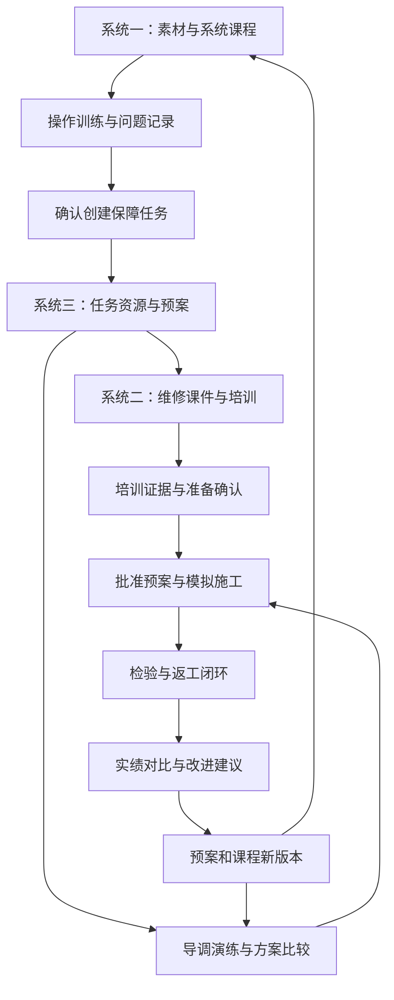
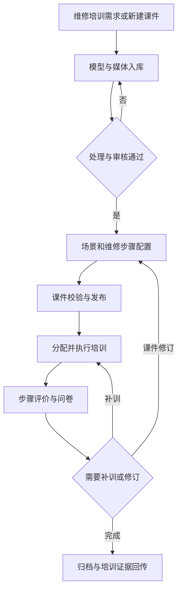

# 保障业务共性平台 Demo 建设实施方案

版本：1.0　日期：2026-09-21　适用对象：产品、设计、前后端开发、测试及演示人员

本方案指导建设一个可编辑、可运行、可追溯、可重复演示的业务 Demo，完整展示三个分系统各自的业务流程及跨系统协作。虚拟现实平台视为已具备能力的外部服务，通过统一的假设接口和状态化模拟器接入。Demo 的业务数据、流程、审批、计算、操作记录与报告必须真实关联、持久保存。

配套文档：

- [Demo数据与接口契约.md](Demo数据与接口契约.md)：数据字典、固定样例、计算规则、API、虚拟平台接口与错误处理。
- [Demo演示脚本与验收用例.md](Demo演示脚本与验收用例.md)：逐步演示、分支测试、预期结果、58项原始需求及新增流程映射。

三份文档共同构成开发基线。本文定义“做什么、页面如何操作、流程如何完成”；数据契约定义“数据与规则如何实现”；验收文档定义“怎样证明实现正确”。本次产出均为 Markdown，尚未实现软件。

## 1. 本次范围与材料分析

### 1.1 材料优先级

本轮用户要求优先：完整展示业务流程，假设虚拟平台能力，不进行供应商选型、引擎研发或真实设备适配。其次沿用原功能清单，并吸收新增两份文档的业务流程。此前《保障业务共性平台详细建设技术方案_V1.0.md》用于保持术语与数据标准连续，其 Demo 缩减范围、本机 XR 验证和采购门槛不作为本轮前置条件。

| 来源代号 | 材料 | 本次采用内容 |
| --- | --- | --- |
| X | 三系统功能列表.xlsx，Sheet1第1～71行 | 原始58个子模块，系统二的完整功能基线 |
| R1 | 9d7ae16c-cebc-494d-9177-b45daf144729.docx，正文《舰船装备使用及作战运用模拟训练构建分系统》 | 四模块24项能力，以及内容制作、系统演示、协同训练、课程运营流程 |
| R2 | 3f2b771b-8aa6-4ef5-956a-9b90ee379725.docx，正文《ZB保障任务筹划及行动演练分系统》 | 任务/资源/预案、专项计划、导调、指标评估、工程实施和归档流程及界面 |
| T | 上一版详细建设技术方案 | 统一标识、版本、事件、资产与业务分工 |

### 1.2 相比上一版的调整

1. 系统一按 R1 的完整链路展开，包括多设备通信规则、系统模板、多视角、台位模拟、多人自由/评审模式、三种训练模式和归档。原Excel七项仍保留，新增17项能力独立追踪，不修改原编号。
2. 系统二保留资产处理、场景制作、课程编排、培训组织、交互操作、过程评价、问卷反馈和课程修订全流程。图形及外设能力通过模拟服务提供。
3. 系统三增加 R2 中的五类专项计划、以换代修及出舱候选路径、工程下发与签收、报工、验收返工、数据清洗绑定和三级归档审核。
4. 虚拟平台能力统一假设，Demo 不要求真实 CAD 转换、千万面渲染、头显、手套、VRPN/TCP 设备联调、原生 exe 构建或高精度物理算法。
5. 所有核心业务环节都要有输入、可操作页面、校验、状态、持久化结果和下一步入口。复杂专业分析采用公开说明的简化算例或专家输入工作流，不能仅显示一个固定“分析成功”。

### 1.3 图片和流程的采用方式

| 参考位置 | 观察到的结构 | Demo落实方式 |
| --- | --- | --- |
| R1“应用案例”中的场景和控制台图片 | 场景主视口、操作端、全局/局部视角、协同角色 | C03编辑器、C05运行端设置场景区、对象卡片、动作、提示、视角和成员信息 |
| R2“任务体系组成”“典型任务剖面” | 多级任务树、活动与分支关系 | S301提供任务树和活动图，叶子任务绑定对象、前置关系和资源 |
| R2“维修资源界面示意图” | 左侧模型类型、中部组织关系、右侧实例属性 | S303采用组织关系图与实例属性联动；同一资源可切换表格查看 |
| R2“采购计划业务流程图”“进出库计划制定业务流程图” | 需求/库存对比、供应/到货计划、仓储和出库衔接 | S307缺口生成S308计划，审批后形成演练或施工工作区的单据 |
| R2“修理调试计划业务流程图”“设备出舱路径规划流程图” | 任务、参数、人员、技术步骤、检验、路径候选和审核 | S308技术与试验计划、S309专项规划，结果关联原任务 |
| R2“演练的事件主线和时间主线”“推演监控界面” | 仿真时钟、事件表、任务流程、开始暂停结束 | S310配置导调，S311按权威事件推进，流程/GIS/甘特同步 |
| R2指标管理、归一化、权重、AHP、评估结果页面 | 指标体系→绑定数据→归一化→赋权→计算→比较 | S312采用逐步向导，结果能够下钻原始记录，不复制界面中的无关示例值 |
| R2工程实施、效果对比和归档组成图 | 下发、进度、调度、检验，随后对比、修订、审核发布 | S314～S316形成业务闭环，三级审核有退回和重新提交 |

参考材料存在个别文图不一致：R1模块表中“课程设计制作”与UI编辑描述重复，按后文详细课程编排描述落实；R2部分组成图标签与标题重复，按对应正文的“效果对比、预案优化”落实。资料中的厂商宣传、算法示例阈值和具体工程参数不直接作为 Demo 的事实或计算依据。

### 1.4 交付边界

| 能力类别 | Demo实现标准 |
| --- | --- |
| 业务能力 | 真实创建、编辑、校验、审批、发布、运行、计算、归档、复用，数据库持久化 |
| 虚拟平台 | 用可配置模拟器提供对象、场景、动画、物理、环境、设备、多人视角和发布任务的接口结果 |
| 可视化 | 浏览器内交互示意场景，可选轻量模型视图；必须响应实体选择和状态变化，允许使用二维/示意三维表达 |
| 外部系统 | PLSE、台位、仓储、工程实绩均有明确标识的模拟数据或导入工作流，不连接外部生产系统 |
| 专业计算 | 完成本文明确的调度、评分、指标、敏感性和小样例评估算法；高级故障诊断/路径碰撞由参数输入和平台回执表达 |
| 报告与输出 | Demo业务报告采用Markdown；其他目标格式以“模拟发布记录/格式能力”说明，不生成假exe、假MP4或伪造真实工程报告 |

本轮“完整”指业务链路完整、每一子模块有可操作的代表实例与数据流。模型精度、硬件性能、格式实装和规模化算法能力仍属于正式系统验证范围。禁止将本Demo称为已通过原始性能验收的系统。

## 2. 整体业务故事与系统分工

### 2.1 统一演示项目

示例项目为“演示船A通用泵组维修保障与培训”，完全使用合成数据。装备包括泵组PUMP-01、阀门VALVE-01、控制单元CTRL-01、传感器SENSOR-01。使用状态和维修动作是演示业务信号，不用于真实设备控制或作业指导。

主线从系统一制作并运行“泵组操作与异常识别”课程开始，教员根据训练问题创建内容问题单。筹划人员另行创建同一装备的保障任务，复用资产和问题说明；系统三输出维修方案及培训需求，系统二制作并执行维修课件。随后演练资源短缺与加急调拨，批准方案，进入模拟施工、验收返工、实绩对比及版本修订。

训练中的一次错误不会自动生成真实故障或维修工单。跨系统转换必须由用户确认并留下来源引用。

### 2.2 三个系统的独立完成标准

系统一为“装备使用及作战运用模拟训练构建分系统”，系统二为“装备维修保障技能虚实培训构建分系统”，系统三为“保障任务筹划及行为演练分系统”，沿用Excel的系统边界。导航可采用“操作训练、维修培训、保障筹划演练”短名称。

| 系统 | 起点 | 必经流程 | 终点 |
| --- | --- | --- | --- |
| 系统一 | 新建素材工程 | 资产引用→动画/脚本→多设备组网→系统模板→课程/环境/UI→发布→三模式训练/协同→记录 | 可复用的素材/课程版本、训练报告、问题单及修订版本 |
| 系统二 | 新建维修课件或接收培训需求 | 模型导入→处理审核→场景/物理/UI→维修步骤→发布→培训任务→操作→评分/问卷→改进 | 已归档训练证据、课件评价及可再次发布的新版本 |
| 系统三 | 新建保障任务 | 履历/剖面→资源→寿期/多任务筹划→预案→准备/专项计划→导调→评估→模拟施工→对比→审核 | 可检索复用的已发布优化预案，关联全部过程证据 |

三个系统应支持从全新项目开始，也支持加载各自“进入本系统前”的检查点。检查点不包含本段流程的最终成绩或完成状态，最终结果必须由本次运行产生。

### 2.3 业务对象的归属

共用资产、编辑器、课程执行器和报告服务。课程通过`businessDomain=OPERATION/MAINTENANCE`区分系统一和系统二；二者分别拥有业务导航、步骤模板与统计口径，不能通过跨系统复用重复统计训练。

任务、预案和演练归系统三；训练会话属于对应课程。使用`projectId、equipmentId、componentId、courseVersionId、planVersionId、operationId、runId`关联，不以名称模糊关联。三维实体ID只映射业务对象，不能替代业务主键。

### 2.4 角色

| 角色 | Demo职责 | 关键限制 |
| --- | --- | --- |
| 制作员AUTHOR | 资产、素材、课程与场景制作 | 不能审批自己的待审内容 |
| 教员INSTRUCTOR | 课程审核、训练组织、回看及帮助 | 人工干预单独留痕 |
| 学员LEARNER_A/B | 加入分配课程、交互、问卷 | 不能改变评分规则或他人成绩 |
| 筹划员PLANNER | 任务、资源、预案、专项计划及改进 | 未通过校验不能发布可执行预案 |
| 导调员DIRECTOR | 仿真时间、事件注入、调度建议 | 只改变指定演练，不改变施工实绩 |
| 施工员WORKER | 签收、报工、领用、整改 | 只在模拟施工工作区提交记录 |
| 验收员INSPECTOR | 检查、判定、复查 | 不能用报工完成代替检验通过 |
| 项目/企业/专家审核员REVIEWER_L1/L2/L3 | 三级归档审核 | 每级可退回，发布前必须全部通过 |
| 演示管理员DEMO_ADMIN | 初始化、身份切换、检查点、故障配置 | 演示专用入口，所有操作显示当前工作区与身份 |

Demo采用内置身份和角色会话，角色切换不是单点登录能力验证。两浏览器协同必须使用不同身份，服务端按身份校验动作。

## 3. 产品结构与页面规格

### 3.1 统一界面规范

管理页面使用浅色背景、深色文本和明确主操作；编辑/运行场景可使用深色视口。顶部固定项目、工作区、身份、数据来源；左侧是三个系统及公共资源导航；面包屑显示当前对象及版本。

列表默认列出编号、名称、版本、状态、负责人、更新时间及操作。复杂对象用详情页或分步向导，轻量编辑用抽屉。提交后显示生成对象编号和下一步入口。空数据、加载、校验失败、无权限、处理中、失败重试均设计独立状态。

禁止只有仪表盘入口而找不到业务明细。任何工期、库存、成绩和综合分数都支持点击查看来源记录、计算口径及版本。

### 3.2 33个页面与路由

路径中的`:id`为业务对象ID；通用页面通过领域参数复用。

| 页面 | 路由 | 布局及核心内容 | 必须可用的动作 |
| --- | --- | --- | --- |
| C01 总工作台 | `/workbench` | 项目进度、三系统待办、最近记录、闭环节点 | 选择项目、进入待办、查看关联对象 |
| C02 资产库 | `/assets` | 分类树、列表/缩略图、版本、预览、权限 | 导入、分类、编辑、处理、审核、引用、停用 |
| C03 共用编辑器 | `/editor/:id` | 左层级、中视口、右属性、下时间轴/脚本、问题面板 | 拖入、分组、配置、连线、预览、保存、校验 |
| C04 发布中心 | `/releases` | 任务列表、目标格式、阶段日志、依赖、结果 | 发起构建、取消、故障重试、审核、发布 |
| C05 会话与运行端 | `/sessions/:id` | 场景、步骤、角色、设备、时钟、反馈 | 加入、开始、操作、帮助、暂停、继续、结束 |
| C06 记录与报告 | `/records/:id` | 事件时间轴、结果、明细、关联版本 | 回看、筛选、比较尝试、导出Markdown |
| C07 演示控制台 | `/demo` | 工作区、种子版本、检查点、故障配置 | 新建、克隆、重置、角色切换、查看校验结果 |
| S101 素材工程 | `/operation/projects` | 工程与模型、动画、脚本、角色、特效依赖 | 新建、复制、进入编辑、提交审核 |
| S102 系统组网 | `/operation/topologies/:id` | 设备节点/端口、连接规则、变量表、消息日志 | 连线、设置映射、注入测试值、校验、保存 |
| S103 系统模板 | `/operation/templates` | 多设备场景、视角、标签、引用次数 | 保存模板、复制实例、修改、预览 |
| S104 操作课程 | `/operation/courses/:id` | 基础信息、步骤、模式、UI、环境、评分 | 编排、配置三模式、校验、发布、创建训练 |
| S105 台位与外设 | `/operation/stations` | 协议配置、点位映射、设备状态、信号模拟器 | 新建台位、测试连接、发送信号、断开重连 |
| S106 操作资源与归档 | `/operation/library` | 素材/模板/课件及训练历史、问题单 | 分类检索、复用、查看记录、创建修订 |
| S201 维修场景 | `/maintenance/scenes` | 资产、部件、工具、物理/约束、发布状态 | 新建、二次编辑、绑定维修对象、预览 |
| S202 维修课件 | `/maintenance/courses/:id` | 章节/步骤、媒体、PC/MR交互、评分和UI | 接收需求、编辑步骤、配置、审核、发布 |
| S203 培训任务 | `/maintenance/assignments` | 人员、课程版本、截止时间、完成状态 | 分配、通知、开始、补训、确认培训证据 |
| S204 培训评价 | `/maintenance/evaluations` | 成绩、统计、问卷、反馈、修订建议 | 查看明细、评价、处理反馈、创建课程新版 |
| S301 保障任务 | `/support/tasks/:id` | 基础信息、对象状态、WBS、活动图、约束 | 新建、分解、连依赖、分析、提交需求 |
| S302 履历与资料 | `/support/equipment/:id` | 构型/BOM、历史、数据导入、手册/图纸 | 模拟同步、字段映射、处理错误、版本查看 |
| S303 资源建模 | `/support/resources` | 单位关系图、人员/物料/设施表、能力日历 | 建模、实例化、建关系、调整可用性 |
| S304 寿期与多任务 | `/support/planning` | 维修周期轴、任务排序、设施候选 | 修改周期、重算、排序、比较替代方案 |
| S305 预案库 | `/support/plans` | 特征匹配、来源版本、得分解释 | 检索、匹配、复用、新建、查看差异 |
| S306 预案编制 | `/support/plans/:id` | 任务树、甘特、资源、组织关系、空间绑定 | 编辑工序、排程、校验、版本保存、提交 |
| S307 生产前准备 | `/support/preparations/:id` | 六类准备清单、缺口、责任与到位时间 | 匹配、分配、生成采购/调拨/培训需求、确认 |
| S308 专项计划 | `/support/subplans/:id` | 施工、采购、进出库、调试、试验五页签 | 生成草稿、编辑、核算、审核、下发 |
| S309 重点工程规划 | `/support/special-plans/:id` | 修复/更换比较、候选路径、资源与审核 | 修改参数、比较、选取、调用平台校验、提交 |
| S310 导调配置 | `/support/directives/:id` | 阶段、事件、通知、参数、触发时机 | 加载预案、编排注入、预检、创建演练 |
| S311 演练监控 | `/support/exercises/:id` | 顶部控制、左对象树、中地图/场景、下流程/甘特、右事件 | 开始、暂停、倍速、下一事件、注入、分支、复盘 |
| S312 指标评估 | `/support/evaluations/:id` | 指标树→数据绑定→归一化→权重→算法→结果 | 配置、校验、计算、钻取、保存报告 |
| S313 敏感性分析 | `/support/sensitivity/:id` | 基线、变量范围、试验任务、表格/曲线 | 新建变量组、运行、失败重试、比较 |
| S314 模拟施工 | `/support/executions/:id` | 下发签收、工序、领用、报工、检查/整改、预警 | 签收、开工、领用、报工、验收、整改、复查 |
| S315 对比与改进 | `/support/comparisons/:id` | 预案/演练/实绩列、偏差、原因、建议 | 绑定数据、计算、下钻、确认原因、生成新版 |
| S316 归档发布 | `/support/archives/:id` | 资料完整性、三级审核、意见、发布及复用 | 提交、退回、补充、逐级审核、发布、复用 |

每个页面都必须能从工作台或对象的下一步入口到达。C03/C05/C06共享组件，但显示所属分系统和业务目的；同一数据在不同入口打开保持相同ID及版本。

### 3.3 共用编辑器的实际交互要求

界面固定为四个工作区：左侧对象/资产层级，中间示意场景，右侧属性，下方时间轴与脚本图。选中部件后同时高亮结构树和场景，属性修改在预览中可见。支持保存/重新打开、复制工程、撤销最近未保存动作和发布前问题列表。

关键帧至少能配置时间、对象、属性和目标值；脚本图至少提供事件、条件、设置变量、播放动作、显示提示、完成步骤节点。流程节点可拖拽和连线，拒绝不支持的循环和缺失引用。编辑视图与运行视图使用同一保存后的配置。

材质、纹理、物理约束、天气、数字角色和特效按平台能力元数据配置，并在示意视图以颜色、图标、对象姿态、标签或动作进度体现。每项结果都带`implementation=SIMULATED_PLATFORM`，不显示伪造实测帧率或模型处理精度。

### 3.4 发布和运行的衔接

发布中心真实生成`courseVersion、release、dependencySnapshot`和模拟发布任务记录。浏览器运行入口加载同一版本的课程及场景配置。PC/XR/exe/MP4等目标是平台假设能力的目标配置，完成后显示“模拟发布完成”和清单，不提供无法运行的空文件下载。

发布状态、失败原因、重试和版本绑定必须实现。业务报告可真实下载Markdown，内容来自已保存记录。

## 4. 系统一完整业务流程

### 4.1 流程与输出

| 步骤 | 角色与页面 | 输入、操作与校验 | 输出及下一步 |
| --- | --- | --- | --- |
| O1 素材工程 | 制作员，S101/C02 | 新建工程，选择泵组/阀门/控制单元/传感器资产；检查版本可用 | 素材草稿MAT-OP-01，进入C03 |
| O2 单设备制作 | 制作员，C03 | 新建开关/指示动作，设置关键帧；配置条件、变量和提示；添加角色/特效 | 动画和行为图版本；校验无悬空对象 |
| O3 系统组网 | 制作员，S102 | 拖入四设备，连接端口，定义映射和联动条件，发送模拟信号 | TOPO-01及测试事件日志 |
| O4 模板与视角 | 制作员，S103 | 保存系统模板，设置总览、设备、操作员视角，复制新实例改参数 | TPL-OP-01及独立实例；原模板不变 |
| O5 课程编排 | 制作员，S104/C03 | 配置8步骤、UI、环境、三种模式、评分和角色 | COURSE-OP-01草稿，提交教员审核 |
| O6 发布与组织 | 教员，C04/S105 | 审核课程；发布浏览器可运行版本；配置模拟台位及点位映射 | CV-OP-01、发布记录及训练会话 |
| O7 训练与协同 | 两学员/教员，C05 | 分别运行演示、提示、自由模式；切换自由/评审权限；模拟外设信号和掉线 | 步骤事件、错误、角色/设备状态和得分 |
| O8 归档与改进 | 教员，C06/S106 | 查看报告、按用户/课件/时间查询，创建问题单及新课程草稿 | 归档记录、问题ISSUE-OP-01；确认后可关联S301 |

O8后允许重新复制模板开始下一门课程。系统一独立演示不得依赖系统二先建课件或系统三先建任务。

### 4.2 设备联动配置算例

| 信号/规则 | 示例配置 | Demo应显示的变化 |
| --- | --- | --- |
| 端口 | CTRL.startRequest、VALVE.isReady、PUMP.state、SENSOR.value | 端口类型、方向和当前值可查看 |
| 启动条件 | `startRequest=true AND isReady=true` | 泵组进入RUNNING，指示变绿，产生状态事件 |
| 条件不满足 | `startRequest=true AND isReady=false` | 不启动，显示“模拟前置条件未满足”，记录拒绝原因 |
| 异常条件 | 已运行且`SENSOR.value<0.4` | 进入ALARM，显示提示和模拟特效 |
| 复位条件 | 已停机且教员确认或课程允许 | 恢复READY；保留历史告警和操作记录 |

`SENSOR.value`为0～1的无量纲演示值，0.4仅为配置样例。用户修改阈值后再次运行，结果必须随规则变化，不能依赖前端写死的演示顺序。

八个课程步骤：检查场景、确认模拟状态、发出启动请求、读取指标、识别模拟异常、发出停机请求、确认复位、提交记录。步骤是课程业务节点，不是实际设备操作规程。

### 4.3 三种训练模式与两种协同权限

| 配置维度 | 模式 | 行为 |
| --- | --- | --- |
| 训练模式 | DEMONSTRATION演示 | 平台模拟器按脚本提交演示事件，界面标注“演示”；不计入学员正式成绩 |
| 训练模式 | GUIDED提示操作 | 展示当前步骤、对象和帮助，错误有即时反馈，保存学员尝试 |
| 训练模式 | FREE自由操作 | 不提前高亮正确对象，按同一规则验证操作，结束后显示评价 |
| 协同权限 | INTERACTIVE自由交互 | 多人可申请对象控制权；同一关键对象一次仅一人持有 |
| 协同权限 | REVIEW评审 | 只有主持人可以改变场景/步骤状态，其他人可观察、评论和申请主讲 |

训练模式与协同权限是两个字段，不能用一个枚举混合。运行开始后变更训练模式需要结束当前尝试并创建新尝试；协同权限可由主持人实时切换并产生审计事件。

数字角色只在预设补位节点执行，`actorType=VIRTUAL`，不冒充真人完成培训。虚拟教官根据课程错误码显示固定可编辑提示。Demo无需大模型。

训练还需固定评价范围`assessmentScope=INDIVIDUAL/TEAM/NONE`。个人考核由该学员完成规定步骤；团队训练共享场景进度，产生团队结果与成员贡献，不能把团队完成自动记成每名成员个人通过。演示模式为NONE。系统一100分金标使用单人个人尝试，多人分工另开TEAM会话；系统二88分及人员培训证据使用个人尝试。评价范围在开始后不可更改。

### 4.4 台位及外设模拟

S105配置协议类型、连接名称、信号点、数据类型、比例/偏移和动作映射。连接地址使用`mock://station/...`，VRPN、手柄、手套等作为能力配置，不发起真实网络连接。

点击“连接测试”生成成功/超时/失败结果；点击模拟按钮或修改输入值，经过已配置点位映射产生业务动作，运行端显示对应对象变化。错误点位要拒绝，断开后不能继续接收该台位动作；重新连接须重新取得会话授权。

台位输入、键鼠输入、假设XR输入和角色输入经过同一动作入口。两浏览器的成员状态、关键步骤和主讲权限通过真实业务服务同步，空间追踪与音视频传输则按虚拟平台能力模拟。

## 5. 系统二完整业务流程

### 5.1 业务链路

### 5.2 具体操作

| 步骤 | 页面 | 必须实现的操作与校验 | 完成结果 |
| --- | --- | --- | --- |
| M1 接收培训需求 | S203 | 查看来源预案、工序、技能、参与人；教员确认或退回 | 培训需求与课程草稿建立关联 |
| M2 资产处理 | C02 | 上传或选择样例；分类、预览；发起轻量化/纹理优化；查看模拟报告 | 原资产、派生版本、三级LOD/层级及审核记录 |
| M3 场景与对象 | S201/C03 | 结构树编辑、材质/光照、部件和工具绑定、热点、约束、碰撞反馈 | 维修场景SC-MAINT-01及配置版本 |
| M4 维修课程 | S202 | 配置十步骤、前置条件、媒体、错误、帮助、评分、PC/MR动作、两UI模板 | COURSE-MAINT-01及课程校验结果 |
| M5 发布 | C04 | 教员审核后发布，模拟一次构建失败并重试 | CV-MAINT-01，包含固定依赖与浏览器运行入口 |
| M6 组织培训 | S203 | 分配两学员，设置模式/截止时间，通知写入站内待办 | ASSIGN-01/02，不发送外部消息 |
| M7 交互培训 | C05 | 执行正确操作、错对象、错顺序、帮助、暂停恢复 | 每次尝试及原始事件，平台确认与业务判定分开 |
| M8 评价反馈 | S204/C06 | 生成成绩和使用统计，填写问卷，处理反馈 | 报告、问卷结果、问题单，必要时分配补训 |
| M9 回传与修订 | S204/S307 | 教员确认可用于准备检查的培训证据；基于反馈创建新版 | 准备清单更新，旧课程和旧成绩保持不变 |

独立进入系统二时，教员可以创建无来源预案的培训任务；`sourcePlanVersionId`为空，不创建伪造的系统三对象。

### 5.3 假设平台下如何展示31项功能

资产原文件和媒体可使用样例文件或目录登记。导入、轻量化、CAD转换、纹理优化通过异步平台任务模拟，必须形成过程、失败项和派生版本；“处理成功”不能把原始数据直接覆盖。

场景编辑时显示物理类型、六轴约束、碰撞事件、PBR参数、光照和终端交互映射。点击“模拟抓取”“模拟旋转”“模拟碰撞”会发出平台事件并影响当前对象和课程步骤。不同参数需要产生可观察的规则差异，例如锁定旋转轴后模拟旋转被拒绝。

素材库预置六类十五种特效元数据、至少四类灯光、200种材质目录及五类媒体实例。目录条目支持选择、参数和引用，全部标注为假设平台资源；不为达到数量制作200张无意义图片。原Excel的渲染/精度/响应硬指标只在能力说明展示，不伪造实测值。

### 5.4 十步骤与评分

| 步骤 | Demo业务动作 | 关键校验 |
| --- | --- | --- |
| R01 | 阅读并确认任务卡 | 已加载当前课程版本 |
| R02 | 确认模拟准备状态 | 准备标记有效 |
| R03 | 识别目标部件 | componentId正确 |
| R04 | 选择示例工具 | toolType符合课程配置 |
| R05 | 执行模拟拆卸 | 前置步骤完成，约束允许 |
| R06 | 记录检查结果 | 必填结果和说明存在 |
| R07 | 选择示例替换件 | replacementType符合课程配置 |
| R08 | 执行模拟安装 | 平台回执成功，业务前置满足 |
| R09 | 完成模拟检测 | 检测动作与规则通过 |
| R10 | 提交训练记录 | 必需步骤全部通过 |

统一示例评分为每一步首次通过10分，错误操作每次扣5分，主动请求帮助每次扣2分，下限0分。正确率=`通过的有效操作数/(通过+失败的有效操作数)`。普通视角切换、重复网络请求和系统自动演示不进入分母。

金标演示：十步通过、两次不同的错误操作、一次主动帮助，得到 **88分、正确率83.33%、错误率16.67%**。评分规则、事件过滤和完整事件顺序见数据契约。任何新尝试独立计分，旧尝试不被覆盖。

### 5.5 培训证据与资质边界

准备清单中的“本次培训完成”可由教员确认，但不修改人员的正式技能等级、证书或法定资质。开工前仍检查资源记录中的既有技能和资质字段。课程改版后已完成的旧版记录仍有效保存，新版本是否补训由教员决定。

## 6. 系统三完整业务流程

### 6.1 任务、履历与资源

S301创建TASK-001并关联PUMP-01，录入目的、维修对象、故障标签、范围、计划开始、最晚完成和资源约束。任务树至少三层：项目→任务包→工序。图形操作真实维护前置关系，存在循环、缺少对象或时长为负时不能提交。

S302提供PLSE模拟同步与导入向导：选择数据集→字段映射→预览→校验→处理无效行→确认导入→结果对账。准备10条样例，其中8条有效、1条重复、1条缺失主键。首次导入应显示8条新增、1条重复跳过、1条拒绝；修复后再导入可补齐，无重复覆盖。履历、构型、BOM、手册、标准和图纸按版本关联。

故障逻辑分析采用“故障标签→影响部件→维修工作→资源与资料要求”的可编辑规则模板。R2提及的FTA/OTA/FMECA/RCMA/MTA/LORA/LCC可在分析记录中选择类型、录入依据和专家结论，并派生维修需求。本Demo不开发全套可靠性分析工具；闭环通过结构化输入、结果审阅、需求转换实现，不把模板结果称为实际工程分析。

S303统一管理两个承修单位、岗位与技能人员、工具/工装/备件、场地/仓储/码头/泊位及约束字段。组织关系图支持送修、供应、运输三类有向关系。资源可以被停用或改变可用日历，但已经冻结的演练使用自身快照。

### 6.2 寿期、多任务与设施替代

寿期示例采用显式规则：规划期0～24月、每6月一个维修窗口、每次停用2天，输出第6/12/18/24月四个窗口。用户将周期改为8月后输出第8/16/24月三个窗口。使用强度可按月份编辑，以阈值触发附加窗口；冲突窗口合并/保留由用户确认。

多任务使用TASK-001和TASK-002。排序依据为用户录入的重要度及截止时间，分数可解释；资源不可用不能因重要度高而被忽略。候选设施使用“能力标签、容载范围、可用窗口”等示例字段匹配，不使用参考文档中的工程阈值作为真实标准。

“部署能力”在Demo中展示给定窗口下的可用天数/占比及能力需求满足标记，参数由样例配置，不输出作战部署建议。

### 6.3 预案创建和准备

S305先硬过滤装备类型、任务类型、有效状态，再根据配置特征算相似度。提供一个可复用模板和一个不匹配模板，用户可以查看差异。无候选时进入新建向导，不能自动挑一个无关预案。

S306形成PLAN-001/P0：八个工序、人员/工具、备件需求、工序依赖、组织分工、空间绑定及完成期限。排程结果由规则计算，并能手工调整后重新校验。

S307展示人员、物料、器材、设施、信息、计划六类准备。主场景本地库备件为0，远端库有4件，需求2件，系统明确显示缺口2件。用户选择“生成调拨草稿”，不能仅点击“准备完成”把库存自动改为2。

可选择另一个支线“全部仓库不足”，生成采购计划而非调拨。人员缺少培训证据时创建系统二的培训需求，证据确认后更新该准备项。

### 6.4 五类专项计划

| 计划 | 必填内容 | 流程与结果 |
| --- | --- | --- |
| 施工总计划 | 范围、工序、依赖、人员、日期、质量检查节点 | 从预案生成草稿→校验→审核→作为下发基线 |
| 采购计划 | 物料、需求、可用库存、短缺量、供应商、数量、报价、最晚到货 | 核算缺口→比较候选→确定计划→审核→模拟采购单/到货待办 |
| 进出库计划 | 来源单、批次、仓库、数量、验收/入库时间、出库对象、接收人 | 计划→验收→入库→预留→出库→领用，单据引用可追踪 |
| 修理调试计划 | 工序、人员、工具、技术参数文本、记录表、检验节点 | 从任务拆解→配置→审核→施工工单 |
| 单装试验大纲 | 对象、目的、条件、项目、方法、示例阈值、判定、不合格处理 | 编制→审核→检验任务→结果与返工关联 |

本Demo采购、调拨和出入库均仅在内部模拟工作区流转。审批和单据处理真实更新Demo账本，不采购真实物料、不向外部人员发送消息。

### 6.5 重点工程规划

以换代修支线同时提供修复和更换两个候选，用户编辑示例成本、时长、部件兼容性和必要资源，系统先剔除不满足硬条件的候选，再展示差异，用户确认后生成专项计划。不给无数据支撑的“AI最优结论”。

出舱路径支线提供三条预设路径：一路被配置为尺寸不满足，一路被标记为承载不满足，一路通过。前端显示路径、障碍、拒绝原因和平台模拟校验回执。选择可行路径后补充运输、人员、时间与审批，关联预案。通行几何及承载结果是演示输入，不进行真实工程安全计算。

### 6.6 导调与行为演练

S310加载已校验预案、资源快照、场景和事件列表，检查任务与资源引用。S311使用业务仿真时钟推进，支持1×/10×/60×、暂停、继续、下一事件和结束。画面动画速度与工序耗时分开。

同一时刻按“导调变更→到货/释放→工序完成→就绪工序启动→指标更新”的规则处理，执行器保存全局递增序号。暂停后用户注入事件会立即登记，但不推进仿真时间。

主场景演练三次，均由相同P0起点或明确分支生成：

| 演练 | 到货配置 | 预期完成 | 业务意义 |
| --- | --- | --- | --- |
| E-BASE | 备件T+90分钟到达 | T+240分钟 | 正常基线 |
| E-DELAY | T+60分钟注入延迟，到货改为T+180 | T+300分钟 | 缺口使关键工序等待，超过T+270期限 |
| E-OPT | 从延迟分支的T+60开始，批准加急到货T+135 | T+255分钟 | 相对延迟方案挽回45分钟，产生更高运输成本 |

加急建议显示预期到货、费用、受影响工序及节省时间，必须由导调员采纳才生效。重复提交同一建议不重复创建运输单或增加库存。已登记旧到货事件在版本更新后失效。

演练监控同时显示任务、资源、场景/GIS、流程和甘特。点击等待工序可以找到未到货的物料、运输单、注入事件和建议处理记录。结束后可以跳到T+60、120、135、255等时间点复盘。

### 6.7 评估与敏感性

S312完整向导为：新建指标体系→选择预案/演练数据→绑定字段→配置方向/单位→归一化→权重/算法→校验→计算→明细和报告。未绑定数据或权重不合法时必须阻止计算，不显示默认0分。

基础指标包括总工期、等待时间、按期完成、人员利用率、备件满足情况、成本、质量及检查闭环。AHP、模糊综合评价和DEA提供数据契约中的小样例实现；它们独立于主业务的确定性工期计算，不能通过切换算法修改原始事实。

S313以到货时间为变量运行90/120/135/150/180分钟五个值，结果应为240/240/255/270/300分钟。资源人数支线使用同样的排程逻辑检查技能及并发条件，不能只用人数乘一个系数缩短所有工序。

### 6.8 模拟施工与实际效果

将采纳的优化方案形成P1，审批后下发执行单EXEC-01。施工单位签收后，按准备确认、领用、开工、报工、验收、整改和复查推进。运行空间为`SIMULATED_ACTUAL`，页面持续显示“模拟施工数据”。

报工由用户输入或点击“导入样例实绩”提交到同一校验接口。不得直接修改预案预计时长来伪造实绩。主场景实际完成T+270分钟，具体工序和资源时长见数据契约。

样例实绩按业务阶段分批提交：先到T07首次检查，再提交整改工时，复查通过后才允许T08交接报工。批量导入不能越过检查、验收或签收门槛；提前提交的记录返回具体前置条件错误。

设置四个检查项，首次三项通过、一项失败，首次通过率75%；失败项生成整改单，施工员提交整改，验收员复查通过后最终合格率100%。第一次失败记录保留，重复提交同一复查请求不重复增加检查数。

未完成整改不能将执行单标记为验收完成。资源占用和库存只有对应单据实际提交后更新，界面完成动画不产生库存业务。

### 6.9 对比、改进与归档

S315显示P0原基线、P1批准方案、E-OPT演练和EXEC-01模拟实绩，默认对比基线为P1。主场景完成工期270对255分钟，差15分钟、偏差5.88%；成本1070对1005示例费用单位，偏差6.47%。用户可切换P0，但必须显示当前分母和版本。

对比下钻到工序、领用、报工和检查记录；原因分为预案参数、执行、资源、环境、数据质量等，用户确认后生成改进任务。质量返工可产生“完善课程R03的检查说明”及“增加装配前检查工序”的改进建议，不能自动宣布人员技能不足。

P2由P1复制，新增10分钟检查工序并将备件准备提前至T+120，再次演练预期T+250。新的检查覆盖不等于质量已被证明提高，报告分别展示计算预测和已有实绩。

S316提交P2及其来源P0/P1、演练、施工、比较、改进、课程修订引用，检查必需资料。三级审核允许任何一级退回，重新提交新审核轮次，保留旧意见；三级通过后发布。新任务复用P2时创建新草稿并绑定当前资源，不修改已归档版本。

## 7. 跨系统流程与状态约束

### 7.1 数据交接表

| 交接 | 发起动作 | 传递内容 | 接收与反馈 |
| --- | --- | --- | --- |
| 系统一→系统二 | 引用素材/系统模板 | assetVersion、sceneVersion、behaviorVersion及可用动作 | 创建维修课件草稿，补充维修步骤和评分，不直接视为已发布课程 |
| 系统一→系统三 | 由问题单确认创建任务 | equipmentId、issueId、训练记录引用和人工描述 | 新建保障任务草稿；训练错误不改装备真实状态 |
| 系统三→系统二 | 生成培训需求 | planVersion、operationId、对象、人员、技能要求 | 教员接受/退回，建立课程与培训任务 |
| 系统二→系统三 | 确认培训证据 | assignment、attempt、report及教员意见 | 只更新准备清单的培训项，不改正式资质 |
| 系统三→系统一/二 | 确认改进建议 | comparisonId、operationId、问题和建议 | 新建内容改进单、课程新草稿及回执 |
| 三系统→总工作台 | 业务事件 | 对象ID、状态、责任人、来源和更新时间 | 更新待办和闭环进度，点击可跳转原对象 |

### 7.2 状态机

| 对象 | 状态与转换 | 必须阻止的情况 |
| --- | --- | --- |
| 资产 | DRAFT→PROCESSING→PENDING_REVIEW→APPROVED；处理失败可新任务重试 | 未批准资产进入正式发布依赖 |
| 课程 | DRAFT→VALIDATED→PENDING_REVIEW→APPROVED→PUBLISHED；退回DRAFT | 修改已发布版本、缺步骤/对象却发布 |
| 发布任务 | QUEUED→RUNNING→SUCCEEDED/FAILED/CANCELLED | 失败任务直接变成功，重试覆盖原日志 |
| 培训尝试 | READY→RUNNING↔PAUSED→COMPLETED→EVALUATED→ARCHIVED；可ABORTED | 未结束即最终评分、回看再次计分 |
| 预案 | DRAFT→VALIDATED→PENDING_REVIEW→APPROVED→PUBLISHED | 存在资源冲突、审批未过、依赖过期而下发 |
| 演练 | CREATED→READY→RUNNING↔PAUSED→COMPLETED；异常ABORTED | 完成后原位注入事件或改输入 |
| 调拨/采购 | DRAFT→APPROVED→DISPATCHED/ORDERED→RECEIVED→CLOSED | 未到货直接入库、收货超过单据数量 |
| 执行 | ISSUED→ACKNOWLEDGED→READY→RUNNING→PENDING_INSPECTION→ACCEPTED→ARCHIVED | 未签收开工、缺强制准备项、整改未闭环即验收 |
| 整改 | OPEN→ASSIGNED→FIX_SUBMITTED→RECHECK_PASSED→CLOSED；复查失败退ASSIGNED | 施工员自己填写验收通过 |
| 归档 | DRAFT→SUBMITTED→L1_APPROVED→L2_APPROVED→L3_APPROVED→PUBLISHED | 跳级、缺材料、自行改历史批准意见 |

驳回/退回采用独立审核记录，每次再提交增加reviewRound。已发布对象新建版本；未发布草稿用revision防止两人相互覆盖。

### 7.3 所有主流程必须演示的异常

课程引用缺失、行为图非法、平台任务失败、训练错对象/错顺序、台位掉线、评审模式越权、事件重复、资源不足、预案无匹配、数据导入错误、到货延迟、验收不合格、归档退回、工作区重置后的旧请求，这十四类均有可复现入口与恢复动作，见验收文档。

## 8. 开发架构与工程组织

### 8.1 建设形态

采用一个浏览器业务应用、一个业务后端、一个关系数据库和一个状态化平台模拟模块。沿用既有方案的Vue/TypeScript与Java后端方向即可；具体依赖版本在项目脚手架中固定，本轮无需引入真实VR引擎、分布式仿真框架或复杂中间件。

后端逻辑划分为workspace、asset、authoring、training、planning、exercise、execution、evaluation、archive和virtual-platform。可以部署为一个应用，但不同模块通过清晰的服务接口写入自己拥有的数据。

浏览器状态负责当前视图与未提交表单；数据库保存全部业务事实。WebSocket或SSE推送业务变化，重连后先获取快照。平台模拟器也通过接口交互，不让前端绕过后端直接把工序改成完成。

### 8.2 模块边界

| 模块 | 必须真实实现 | 可以使用假设能力 |
| --- | --- | --- |
| 编辑与资源 | 结构、引用、参数、版本、校验、审核 | 网格转换、材质渲染、物理与环境表现 |
| 训练 | 状态机、操作验证、评分、尝试、问卷、证据 | 抓握/碰撞/视角等底层输入与表现 |
| 筹划 | WBS、依赖、资源、排程、准备、审批 | 大型CAD几何可行性、真实GIS测算 |
| 演练 | 时钟、事件队列、等待与释放、分支、复盘 | 高保真三维行为呈现 |
| 施工 | 模拟签收、账本、报工、检验、整改、对比 | 外部生产数据源和设备数据采集 |
| 评价 | 指标、字段绑定、确定性计算、报告 | 超出已定义算例的专业建模，以专家输入记录承接 |

### 8.3 演示数据管理

每次演示创建`workspaceId`和`runEpoch`。所有ID、事件、库存、计划、课程、成绩都处于该工作区。预置内容为可复用模板，禁止共用可写的单例结果。

提供EMPTY、OPERATION_START、MAINTENANCE_START、PLANNING_START、EVALUATION_START等检查点；详细状态见数据契约。主线优先从EMPTY开始，单系统演示可加载必要前置资料。重置要求停止会话、递增runEpoch、使旧请求失效、恢复种子快照。
正式彩排按验收脚本从OPERATION_START开始以复用已批准资产；另以EMPTY验证从基础数据开始的创建能力。两种入口都不能预置本次业务的完成结果。

C07显示当前种子版本、工作区、已完成演示节点及未通过用例。故障注入开关仅在此处可见，不混入面向业务角色的正常表单。

## 9. 开发顺序与工作包

以通过本文完整流程为最终交付标准。下列阶段只是实现顺序，不能将后面阶段作为默认不做的内容。

| 工作包 | 内容 | 依赖 | 完成标准 |
| --- | --- | --- | --- |
| W01 基础骨架 | 33页面路由、身份、项目/工作区、数据库、公共组件 | 无 | 可新建工作区，页面可达，刷新数据不丢 |
| W02 协议与模拟器 | 平台能力表、异步任务、动作、事件、故障配置 | W01 | 成功/失败/重试可复现，接口符合契约 |
| W03 资源与编辑 | C02/C03/C04及版本、图编排、预览 | W02 | 修改配置后发布并影响运行，错误能阻止发布 |
| W04 系统一闭环 | S101～S106、三模式、台位、两浏览器协同 | W03 | 从空工程到训练归档和修订可独立完成 |
| W05 系统二闭环 | 维修课件、培训任务、评分、反馈和证据 | W03 | 十步骤88分样例与补训/修订通过 |
| W06 筹划与单据 | S301～S309、资源、寿期、预案、五计划 | W01 | 无模板新建、缺口采购/调拨、审批与账本一致 |
| W07 演练与评估 | S310～S313、时钟、分支、复盘和算法 | W02/W06 | 240/300/255及五点敏感性结果正确 |
| W08 施工与改进 | S314～S316、检验返工、对比、三级审核 | W05/W07 | 270分钟、1070费用、P2再验证与复用闭环 |
| W09 联调交付 | 跨系统待办、样例、恢复、权限、演示彩排 | W04～W08 | 全部验收用例通过，文档/代码/种子版本锁定 |

建议以小型完整团队估算约8～12周：产品/业务1人、前端2人、后端2人、测试1人，设计按阶段投入，技术负责人可兼任。此周期以假设平台、固定规模样例和复用组件为前提；先完成W01/W02验证，再按实际速度调整，不能按此估算承诺真实平台开发工期。

开发时先实现固定金标数据路径，再开放表单与规则配置，最后覆盖错误和并发。不得先做大量展示页面而没有统一数据主键、状态机和计算服务。

## 10. 最终交付要求

软件交付包括可运行Demo、数据库迁移、种子初始化、平台模拟器、部署配置、测试及演示记录。所有说明、接口摘录、测试报告和业务导出报告采用Markdown。

必须满足：三系统独立可演示、跨系统闭环可演示、假设能力有清晰标识、真实业务计算可复算、重复演示可重置、失败可恢复、报告能下钻、历史版本不被覆盖。按配套验收用例逐项记录实际执行结果；本方案中的预期结果不等于软件已经通过测试。
