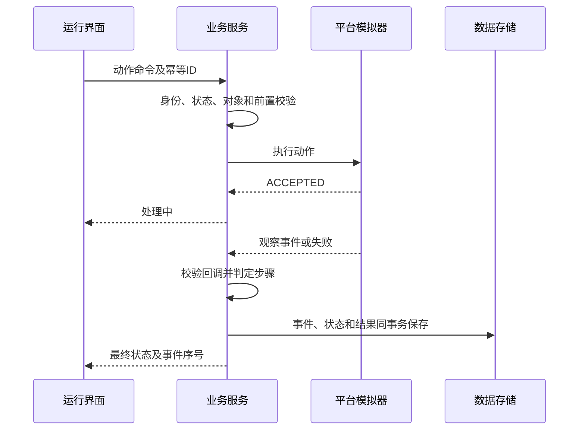

# 保障业务共性平台 Demo 数据与接口契约

版本：1.0　日期：2026-09-21

本文与[Demo建设实施方案.md](Demo建设实施方案.md)、[Demo演示脚本与验收用例.md](Demo演示脚本与验收用例.md)共同使用。文中数据、阈值、费用、设备及姓名均为合成演示配置。API和事件由本项目定义，不代表任何厂商现有接口。

## 1. 实现约定

### 1.1 统一字段

所有持久化业务对象包含`id、workspaceId、runEpoch、revision、createdAt、createdBy、updatedAt`。对象按工作区隔离，禁止客户端仅凭`workspaceId`访问任意数据。服务端身份、角色及当前工作区决定授权。

`revision`是草稿并发版本；发布对象使用不可变`versionId`。运行绑定显式版本，不允许以`latest`代替。`runEpoch`是重置代次，旧代次的HTTP命令、平台回调和推送均拒绝。

事件包含`eventId、eventType、schemaVersion、aggregateId、aggregateVersion、serverSequence、correlationId、causationId、actorId、sourceType、occurredAt、recordedAt、payload`。`sourceType`取`USER_INPUT、SIMULATED_PLATFORM、DEMO_SEED、SIMULATED_ACTUAL、DERIVED`；必要时保存来源记录ID。

### 1.2 时间、数值与空值

业务展示时区为Asia/Shanghai，数据库真实时间使用带时区时间戳。金标项目基准`2026-10-12 09:00:00+08:00`，所有排程用相对此时刻的整分钟。`simulationMinute`是业务时钟；页面播放速率只影响真实耗时，不改变计算结果。

工期和工时以分钟计，金额使用十进制定点数。费用为虚构的“示例费用单位”，不是报价。百分比内部使用0～1，展示乘100并保留两位小数；计算中不逐步四舍五入。空值为未知或未发生，0为有效零值，不能互相替代。

### 1.3 接口响应与错误

查询返回`data、traceId`，列表返回`items、nextCursor、total`。异步调用返回202和`jobId/statusUrl`，不能把受理当执行成功。关键命令携带`commandId、expectedRevision、runEpoch`；同一命令相同载荷重复调用返回原回执，载荷变化返回`IDEMPOTENCY_CONFLICT`。

| HTTP/错误码 | 语义与客户端动作 |
| --- | --- |
| 400 VALIDATION_FAILED | 字段或业务条件不合法，显示fieldErrors及可修复提示 |
| 403 ROLE_FORBIDDEN | 当前角色无权执行，保持原状态 |
| 404 OBJECT_NOT_FOUND | 对象不存在或当前范围不可见 |
| 409 REVISION_CONFLICT | 草稿已变化，获取最新版并比较；不静默覆盖 |
| 409 INVALID_TRANSITION | 状态不允许当前命令，返回当前状态和允许动作 |
| 409 STALE_EPOCH | 工作区已重置，丢弃旧操作并重新加载 |
| 422 RESOURCE_UNAVAILABLE | 资源/库存/技能不足，返回缺口和相关对象 |
| 422 DEPENDENCY_MISSING | 引用、前置步骤或必需材料缺失 |
| 422 DATA_INCOMPLETE | 评估数据不齐，返回缺失字段，禁止补零出分 |
| 503 PLATFORM_UNAVAILABLE | 模拟平台故障，可按策略重试并保留原任务 |

## 2. 数据模型

### 2.1 核心对象与字段

“必填”指对象进入提交/发布/运行状态前必须满足，草稿可逐步填写。

| 对象 | 必填业务字段 | 关系与保存规则 |
| --- | --- | --- |
| Project | code、name、scenarioType、baseTime、timezone | 一个项目可有多个独立工作区 |
| Workspace | projectId、seedVersion、runEpoch、checkpoint、status | 所有运行数据有此范围；reset递增epoch |
| UserSession | actorId、roles、workspaceId、expiresAt | 角色切换创建新会话审计，禁止前端仅改显示名称 |
| Equipment | code、type、configurationVersionId、state | 与AssetVersion、履历、任务分别关联 |
| Component | equipmentId、parentId、code、name | 结构树禁止环；业务部件ID稳定 |
| Asset/AssetVersion | category、name、sourceFormat、sourceRef、versionId、status | 原始与派生不覆盖，派生保存processor/profile/parentVersion |
| AssetProcessJob | sourceVersionId、operation、profile、status、resultVersionId | 每次失败/重试独立jobId；结果标记SIMULATED_PLATFORM |
| SceneVersion | entityList、assetVersionRefs、environment、lights、physics | entity含entityId、componentId、transform、material、constraint |
| BehaviorGraph | nodes、edges、variables、bindings、schemaVersion | 图校验后发布；节点执行与界面动画分离 |
| Topology | devices、ports、connections、mappingRules | 端口类型及方向一致，规则可测试 |
| CourseVersion | domain、sceneVersionId、steps、modeConfigs、scoreRuleVersionId、status | 领域OPERATION或MAINTENANCE；依赖不可变 |
| CourseStep | code、order、prerequisites、targetIds、action、conditions、score、help | 顺序号用于展示，前置关系决定可执行性 |
| Release | courseVersionId、targetProfile、dependencySnapshot、jobId、status | 成功才生成运行入口；清单不伪装可执行文件 |
| StationConfig | name、mockAddress、protocolProfile、pointMappings、status | 比例/偏移有类型；真实网络访问禁用 |
| TrainingAssignment | learnerIds、courseVersionId、mode、dueAt、sourcePlanVersionId、operationId | 来源预案可空；一人多次尝试不重复任务数 |
| TrainingSession | courseVersionId、members、interactionMode、assessmentScope、hostId、status | 评价范围INDIVIDUAL/TEAM/NONE，开始后固定；成员对应真实Demo身份 |
| TrainingAttempt | assignmentId、learnerId、mode、ruleVersionId、status、start/end | 已完成记录不可原位重置；补训新建attempt |
| TrainingEvent/Result | attemptId、stepId、action、judgement、actorType、eventSequence | 原始观察与业务判定分开，结果引用事件 |
| Questionnaire/Feedback | templateVersion、answers、courseVersionId、issueType、status | 主观评分与客观训练成绩独立 |
| SupportTask | equipmentId、purpose、scope、deadline、importance、wbs | 叶工序必须关联对象与目标 |
| Resource | type、ownerOrgId、capabilities、calendar、unit、capacity、location | 人员技能、工具归还、物料消耗分别建模 |
| ResourceRelation | fromOrgId、toOrgId、type、conditions | 类型RETURN_REPAIR/SUPPLY/TRANSPORT，不允许无效端点 |
| PlanVersion | taskId、operations、assignments、constraints、baselineSource、status | 保存初始输入、排程结果、校验及审批 |
| Operation | code、duration、predecessors、requiredRoles、resources、materialNeeds | 有向无环图，工期非负，消耗与占用分开 |
| PreparationItem | planVersionId、category、requirement、match、gap、owner、dueMinute、status | 六类：人员/物料/器材/设施/信息/计划 |
| Subplan | planVersionId、type、items、schedule、reviewStatus | 五类专项计划；下发后新修订不覆盖旧单据 |
| Transfer/PurchaseOrder | source/target、material、quantity、price、departure/eta、status | 演练与施工工作区分开，数量不超过可用量 |
| InventoryLedger | partition、warehouseId、materialId、documentId、eventType、quantity | 只追加，原单据+动作+行号唯一，不能任意改余额 |
| Exercise | planVersionId、inputSnapshotId、clock、status、parentExerciseId | 不同演练独立资源副本 |
| ExerciseEvent | exerciseId、dueMinute、priority、sequence、entityRevision、payload | 超期旧版本事件失效，已执行事件不可删除 |
| ExerciseSnapshot | exerciseId、simulationMinute、lastSequence、state、checksum | 复盘或分支使用，不覆盖原历史 |
| Evaluation | sourceRefs、metricVersion、binding、normalization、weights、algorithm、status | 输出raw/normalized/score/missing与来源 |
| Execution | approvedPlanVersionId、assigneeOrgId、signedAt、status、partition | 本Demo所有执行均SIMULATED_ACTUAL |
| WorkLog | executionId、operationId、start/endMinute、resourceSegments、quantity | 验证起止、角色、前置与资源重叠 |
| Inspection/Rectification | itemId、standardRef、result、evidence、round、parentInspectionId | 失败保留；整改与复查独立记录 |
| Comparison/Improvement | baselineRefs、actualRef、metrics、cause、owner、newVersionId | 原因人工确认，改善结论与预测分开 |
| Archive/Review | planVersionId、attachments、level、round、actor、decision、comment | 三级审核的每轮不可变，全部通过才能发布 |

### 2.2 关键唯一约束

- `workspaceId + runEpoch + commandId`：业务命令幂等。
- `workspaceId + eventId`：事件接收去重。
- `attemptId + producerId + producerSequence`：训练生产者序列，缺号可追踪。
- `attemptId + stepId + completionVersion`：同一步首次通过只授分一次。
- `partition + documentId + lineId + ledgerAction`：同一出入库动作只记一次。
- `exerciseId + serverSequence`：演练顺序唯一。
- `archiveId + reviewRound + level`：一次审核轮次中每级一个有效决定，纠正通过新轮次完成。

### 2.3 资源与库存分区

`MASTER_SEED`仅作初始化；`EXERCISE:<exerciseId>`保存演练占用；`EXECUTION:<executionId>`保存模拟施工库存。三者不相互扣减。计划中的需求不等于库存实际消耗，准备中的预留不等于领用。

物料账本动作：OPENING、RESERVE、UNRESERVE、DISPATCH、RECEIVE、ISSUE、RETURN。预留影响可用量，不改变在库量；发运减少源库在库、增加在途；收货减少在途、增加目标库在库；领用减少目标库在库、增加累计消耗。数量全部为正，动作定义方向。

主线在运行分区初始化时建立调拨单并预留远端2件；T02完成后发运，发运事务同时核销源库预留。在有效ETA时执行一次收货，本地增加2件；T05开始时一次领用2件。最终为远端2、本地0、在途0、累计领用2，合计仍为初始4。采购支线采用独立分区，外部模拟采购到货作为明确的新增来源入账，不能套用调拨的源库扣减。

## 3. 固定样例与可核算结果

### 3.1 主数据

| ID | 名称及属性 |
| --- | --- |
| PROJECT-DEMO-01 | 演示船A通用泵组维修保障与培训 |
| EQ-DEMO-01 | 演示装备，包含PUMP-01/VALVE-01/CTRL-01/SENSOR-01 |
| ORG-A / ORG-B | 本地维修单位/远端供应单位，之间存在供应与运输关系 |
| E1 | 电气技能人员，费率2/分钟，可用0～360分钟 |
| W1 | 仓储人员，费率1/分钟，可用0～360分钟 |
| M1 / M2 | 维修技能人员，各费率1.5/分钟，可用0～360分钟 |
| Q1 | 质量检查人员，费率2/分钟，可用0～360分钟 |
| L1 | 验收交接人员，费率2/分钟，可用0～360分钟 |
| TOOL-01 / TEST-01 | 通用示例工具/检测工位，各容量1 |
| MAT-SEAL-01 | 示例备件，计量单位件，需求2件，每件100示例费用单位 |
| WH-LOCAL / WH-REMOTE | 初始库存分别0件/4件，每个运行分区独立复制 |
| TRANS-01 | 调拨2件，T+30发运；常规到货T+90，费用60；加急到货T+135，费用100 |
| TASK-001 | 主维修任务，截止T+270分钟 |
| TASK-002 | 次要示例任务，仅用于排序/冲突支线，默认不占用主场景资源 |

加急T+135是相对延迟T+180的改善，仍晚于正常到货T+90。P0/P1/P2的运输参数及费用均明示，不把“加急”误写成早于正常运输。

身份样例将学员A关联人员M1、学员B关联M2；M1已有维修技能，但本次需要课程培训证据，M2预置已有本次适用证据。人员技能与培训证据分别保存。教员审核课程，项目审核员L1审核预案/专项计划；制作员/筹划员不能审批本人提交内容，施工员与验收员使用不同身份。归档再按L1/L2/L3完成独立三级流程。

### 3.2 P0八工序基线

| 工序 | 名称 | 前置 | 时长 | 人员及其他资源 | 基线区间 |
| --- | --- | --- | ---: | --- | --- |
| T01 | 任务检查 | 无 | 30 | E1 | 0～30 |
| T02 | 备件发运准备 | 无 | 30 | W1；完成后发运2件 | 0～30 |
| T03 | 模拟隔离确认 | T01 | 30 | E1 | 30～60 |
| T04 | 模拟拆解 | T03 | 60 | M1、M2、TOOL-01 | 60～120 |
| T05 | 更换示例部件 | T04，且2件已到库 | 30 | M1、M2、TOOL-01；开始时领用2件 | 120～150 |
| T06 | 模拟装配 | T05 | 45 | M1、M2、TOOL-01 | 150～195 |
| T07 | 检测确认 | T06 | 30 | E1、Q1、TEST-01 | 195～225 |
| T08 | 交接归档 | T07 | 15 | L1 | 225～240 |

总工期是并行排程的最大结束时间，不是把八工序时长相加。基线人员工时为E1=90、W1=30、M1=M2=135、Q1=30、L1=15，共435人分钟。人工费705，备件费200，运输费60，总费 **965**。

### 3.3 三次演练与P1

T04固定在120完成。从T05开始的剩余关键路径为120分钟。因此当前样例的完工时间为`max(120, materialArrivalMinute)+120`。这是该样例的校验公式，通用排程器仍按任务图和资源计算，不能只把这个公式写死到界面。

| 场景 | 到货 | 等待 | 工期 | 人工 | 备件 | 运输 | 总费 | 超过270分钟 |
| --- | ---: | ---: | ---: | ---: | ---: | ---: | ---: | ---: |
| E-BASE / P0 | 90 | 0 | 240 | 705 | 200 | 60 | 965 | 0 |
| E-DELAY | 180 | 60 | 300 | 705 | 200 | 60 | 965 | 30 |
| E-OPT / P1 | 135 | 15 | 255 | 705 | 200 | 100 | 1005 | 0 |

本样例等待不计付费工时，因为资源在等待阶段不被占用。若后续启用待工费用，必须作为新规则版本并同步修改金标结果。

延迟事件在T+60把`TRANS-01.eta`改为180；优化分支在同一仿真时间把ETA改为135。每次修改使运输实体revision增加。原90/180分钟到货事件携带旧revision，执行时应被标记STALE，不入库。最终只有一次有效收货。

### 3.4 EXEC-01模拟实绩

| 工序/子记录 | 实际区间 | 人员 | 费用 |
| --- | --- | --- | ---: |
| T01 | 0～30 | E1 | 60 |
| T02 | 0～30 | W1 | 30 |
| T03 | 30～65 | E1 | 70 |
| T04 | 65～130 | M1、M2 | 195 |
| 等待备件 | 130～135 | 无占用 | 0 |
| T05 | 135～170 | M1、M2 | 105 |
| T06 | 170～220 | M1、M2 | 150 |
| T07首次检查 | 220～240 | E1、Q1 | 80 |
| T07整改 | 240～250 | M1、M2 | 30 |
| T07复查 | 250～255 | E1、Q1 | 20 |
| T08 | 255～270 | L1 | 30 |

实际人工费 **770**，备件200，运输100，总费 **1070**。总工期270分钟，人工工时480人分钟。T07整体时段为220～255，其子记录不能再与父工序重复计人工费。

实绩导入提供FIRST_PASS、RECTIFICATION、HANDOVER三批样例：第一批到T07首次检查结束，第二批只含已创建整改单对应工时，第三批在复查通过后依次提交T07复查工时及T08。四个检查项及复查判定仍由验收员命令提交。不得一次批导将执行单改成ACCEPTED，未满足前置的行逐条拒绝并允许稍后重传。

相对P1：工期偏差`(270−255)/255=5.8823529%`，费用偏差`(1070−1005)/1005=6.4676617%`。相对P0：工期偏差12.5%，费用偏差约10.88%。页面默认P1，切换基线后重算并显示版本。

四个检查项CHK-01～04的首次结果为PASS/PASS/FAIL/PASS；CHK-03创建RECT-01后复查PASS。首次合格率3/4=75%，最终合格率4/4=100%，共五条检验结果记录但只有四个不同检查项。不能算成4/5或用最后一次记录覆盖首次失败。

### 3.5 P2改进版

复制P1生成P2，保持原八工序并增加`T04Q`：T04之后、T05之前，Q1执行10分钟的装配前检查。同时把备件准备到货目标改为120分钟，运输费用仍按示例100。

排程为T04在120结束、T04Q在120～130、T05在130～160、T06在160～205、T07在205～235、T08在235～250。人工费725、备件200、运输100，总费1025。预测工期250，比P1减少5分钟，但增加检查并不自动保证真实质量改善。

课程CV-MAINT-02修改R03检查说明与必填确认，十步骤及评分规则仍保持相同结构。历史尝试继续引用CV-MAINT-01，不能因说明更新改变88分记录。

### 3.6 训练金标事件

维修训练中先正确完成R01～R03；在R04发一次错误工具动作，再正确完成R04～R06；在R07先提交一次不满足条件的安装动作，再请求一次帮助，然后正确完成R07～R10。十个正确事件、两个错误事件、一个帮助事件，共十三个计分相关事件。

得分`max(0,10×10−2×5−1×2)=88`。正确率10/12=83.33%，错误率2/12=16.67%。帮助不进入操作正确率分母。事件重传、暂停/继续、视角调整和自动演示不增加正确或错误计数。演示模式返回`score=null、assessmentApplicable=false`。

系统一八步骤采用同一规则引擎但独立规则：每步12.5分、错误扣5分、帮助扣2分。无错误且无帮助时100分。模式和规则变更生成新尝试，不在运行中修改当前评分分母。

个人范围只用该学员的有效事件评价，其他成员和虚拟角色动作不计个人授分。TEAM范围以会话内规则规定的团队有效事件计算`teamResult`，另外记录成员动作数和错误数；个人结果标为不适用，不能用团队成绩确认个人培训证据。数字角色补位仅表示流程演示完成，不作为真人完成的评分证据；若团队必评步骤由虚拟角色代做，该评估标记不完整并列出缺项。

## 4. 计算和业务规则

### 4.1 排程与演练执行

Demo使用确定性的资源受限列表调度：校验DAG→计算前置最早时刻→按优先级/工序编号选择就绪工序→寻找满足资源日历和物料的最早可行区间→占用资源→登记完成/释放事件。不可满足时返回冲突，不伪造“最优解”。

工序开始要一次性校验并提交资源占用与物料领用。失败不部分扣库；完成释放工具/人员，消耗型备件不自动恢复。短缺工序进入WAITING，其原因关联具体资源。上游变更后重排未开始工序；已经完成的事实不能回写。

演练时间推进只由后端控制。事件比较键为`dueMinute、priority、sequence`，优先级依次为干预10、到货/释放20、完成30、启动40、指标50。在每个时间点处理至没有新的同刻事件，设置最大链式事件数防止循环。

同一演练只能有一个权威执行器，采用运行租约和版本校验。暂停不处理未来事件；“下一事件”推进到下一个不同时间点并处理该时点全部事件。手工停止生成ABORTED，保留已完成记录，不能与正常COMPLETED混同。

### 4.2 模板匹配、优先级与资源准备

模板先过滤`equipmentType、taskType、published=true`。Demo相似度采用`0.5×对象特征匹配+0.3×范围标签Jaccard+0.2×时长区间匹配`，分量为0～1；权重和阈值可配置。复用按钮永远创建新预案草稿，并重新绑定资源。该公式为Demo设计，不沿用R2示例权重作为真实标准。

任务排序使用`importanceScore`降序、`deadlineMinute`升序、`taskCode`升序，显示完整规则。不得隐含舰种价值、作战价值或其他未提供参数。

备件缺口=`max(0,需求量−可用量)`。采购建议量默认等于缺口，损耗/备用系数默认0；配置系数后显示推导。对已在途或已预留数量只能按明确规则计入一次。

**三类校验时点。** 预案提交检查引用、工序、资源配置及缺口解决计划；物料可以计划到货，出现等待/超期时形成提示，仍允许按该条件演练。执行单READY检查签收、技能、培训证据和开工必需资料；每道工序开始时检查该工序的人员、工具及实际可领用库存。T01～T04不消耗该备件，允许先执行；T05必须等收货后才开始。不能把“所有物料现货齐备”统一作为预案审批或项目第一工序开工前置，否则无法演示本场景。

计划状态APPROVED允许本项目演练和下发，PUBLISHED表示进一步开放到可复用预案库；两者均冻结内容。归档发布另检查完整成果包及三级意见，不以一次预案审批代替三级归档审批。

**寿期支线的固定规则。** Demo采用每月30天的示例历法，规划期24月共720天。周期为c月时，在c、2c等不超过24的月末安排一次2天窗口，区间为`[月序号×30−2, 月序号×30]`。周期6月合计停用8天、可用712天、可用占比98.89%；周期8月停用6天、可用714天、占比99.17%。这些是简化历法下的模型输出，不等同真实可用率。

使用强度取每月0～1值，样例阈值0.8；超过阈值的月份额外提出一个同样2天的月末窗口。用户确认后才纳入排程；重复/重叠窗口按区间并集计停用天数，拒绝建议须填原因。示例仅将第5月强度设0.9，在6月周期基础上增加第5月窗口，总停用10天。该规则与排序、资源约束各有独立版本。

### 4.3 指标口径

| 指标 | 算法 | 空值/特殊情况 |
| --- | --- | --- |
| 工期 | 最晚完成−项目起点 | 未结束显示当前经过时间，不能当最终结果 |
| 等待时长 | 任务就绪且因约束等待的区间并集 | 避免同时缺两资源时重复累加 |
| 完成进度 | 已完工叶工序数/总叶工序数 | 不以三维动画播放比例替代 |
| 工时利用率 | 某人员占用分钟/固定统计窗口 | 主场景窗口0～270；不同报告必须使用同一分母 |
| M1/M2利用率 | 基线/P1各135/270=50%；实绩各160/270≈59.26% | 人员总工时不能直接除以单人窗口 |
| 备件按需时点满足率 | 需求时刻已可领用数量/需求数量 | T05原需求时刻120，基线100%，延迟/优化均0%；另列最终满足率100% |
| 成本 | 资源分段分钟×费率+实际领用数量×单价+运输费用 | 预测与实绩来源分别保存，父子工作记录不重复 |
| 首次合格率 | 首轮通过的不同检查项/应检不同检查项 | 未检项单列，不当通过 |
| 最终合格率 | 截至报告时最终通过的不同检查项/应检项 | 整改未完成时保持未通过 |
| 整改闭环率 | 已关闭整改数/已创建整改数 | 无整改单时返回不适用 |
| 数据覆盖率 | 已匹配的必需字段/应匹配字段 | 缺失显示列表，禁止默认补零 |

### 4.4 评估算法的最小完整实现

**加权评价。** 正向指标`(x−min)/(max−min)`，负向指标`(max−x)/(max−min)`，限制在0～1并记录是否越界；min=max则拒绝配置。权重之和应在数值容差内为1。综合分为`100×Σ(归一值×权重)`。缺失必需指标时不出综合分，不擅自重新分配权重。

**AHP。** Demo提供3×3正互反矩阵，用户录入上三角，下三角取倒数，对角为1。以行几何平均法求权重，并计算`lambda≈mean((A×w)_i/w_i)`、`CI=(lambda−3)/2`、`CR=CI/RI`。RI示例配置0.58，允许阈值示例0.1；这些配置须在报告显示，生产方法由专家确定。

```json
{
  "caseId": "ALG-AHP-01",
  "matrix": [[1, 1.6666666666666667, 2.5], [0.6, 1, 1.5], [0.4, 0.6666666666666666, 1]],
  "expectedWeights": [0.5, 0.3, 0.2],
  "metricScores": [80, 90, 100],
  "expectedCompositeScore": 87,
  "expectedCR": 0
}
```

矩阵权重对应分数加权为`40+27+20=87`。数值容差采用1e-6；浮点导致的微小负CI归零。额外准备明显不一致的判断矩阵，计算超阈值时阻止发布权重。不得将几何平均近似描述为任意矩阵下的精确特征向量求解。

**模糊综合评价。** 用户配置三指标权重`[0.5,0.3,0.2]`和“优/良/待改进”隶属矩阵`[[0.8,0.2,0],[0.3,0.6,0.1],[0,0.5,0.5]]`。每行和为1，计算`B=w×R=[0.49,0.38,0.13]`；等级分`[100,80,60]`加权结果 **87.2**。显示矩阵与中间值，用户修改任一输入后重算。

**DEA。** 提供单投入、单产出、正值的CCR输入导向教学算例，限定范围明确展示。三个可比样例A=(投入10,产出5)、B=(8,5)、C=(10,4)。该一维情形效率`theta=(y/x)/max(y/x)`，结果 **0.8、1、0.64**。修改数据后重新计算，非正值或单位不一致时拒绝。不能把一维算例包装为完整多投入多产出DEA优化器。

以上算法样例使用独立评估数据集，不把87/87.2或DEA效率直接写成主维修项目的结论。主项目仍显示真实来源的工期、成本、质量和缺失项。

### 4.5 敏感性与多次推演

主敏感性输入到货分钟`[90,120,135,150,180]`，输出工期`[240,240,255,270,300]`；每一点创建独立演练快照和运行记录，不能只生成前端曲线。

人员数量支线在P1其他条件不变时选择1、2、3名相同技能维修人员：1名不满足T04/T05/T06的同时两人需求，返回不可行；2名和3名均255分钟，因为本算例工序时长没有人员数量缩短规则。

批量不确定性演示可预置上述五点为一组样本，统计按期完成4/5=80%、平均工期261分钟。称为“固定情景批次”，不把手工选取五点称为真实蒙特卡洛估计。若开发随机模式，则必须记录分布、种子及样本数，且不替代金标用例。

## 5. 业务API清单

统一前缀`/api/demo/v1`。所有接口自动带当前工作区，分页、角色、状态和幂等按第1章。普通草稿CRUD通过`GET/POST/PATCH`实现，关键状态只允许通过命令转换，禁止任意PATCH状态字段。

| 路径及方法 | 输入要点 | 输出/业务作用 |
| --- | --- | --- |
| POST `/workspaces` | projectId、seedVersion、checkpoint | workspaceId、runEpoch、初始对象清单 |
| POST `/workspaces/{id}/reset` | commandId、expectedEpoch | 新epoch与重置结果；旧请求失效 |
| POST `/demo-sessions` | 选择内置actorId | 服务端角色会话及审计 |
| GET `/workbench` | 项目、角色 | 待办、关联对象、统计及来源 |
| POST `/assets/imports` | 样例/上传引用、类别、格式 | 资产草稿、处理job |
| POST `/assets/{id}/process-jobs` | 源版本、operation、profile | jobId、处理记录 |
| GET/PATCH `/assets/{id}` | 元数据、权限、expectedRevision | 资产详情及新revision |
| POST `/assets/{id}/review` | decision、comment | 批准或退回记录 |
| GET/POST/PATCH `/authoring-projects`、`/{id}` | 工程、场景和绑定 | 保存结构、引用及修订 |
| POST `/authoring-projects/{id}/validate` | revision | 问题列表及validatedRevision |
| GET/POST/PATCH `/topologies`、`/{id}` | 设备、端口、规则 | 组网版本 |
| POST `/topologies/{id}/test` | signal、value | 规则执行过程与事件 |
| POST `/system-templates/{id}/instantiate` | 名称、参数覆盖 | 新独立工程及来源引用 |
| GET/POST/PATCH `/courses`、`/{id}` | domain、steps、UI、modes、scoreRule | 课程草稿 |
| POST `/courses/{id}/commands` | VALIDATE/SUBMIT/APPROVE/RETURN/PUBLISH | 状态、审核记录、发布版本 |
| POST `/releases` | courseVersionId、targetProfile | 发布jobId |
| POST `/jobs/{id}/retry` | 原任务、修正配置 | 新jobId，记录retryOf |
| GET/POST/PATCH `/stations`、`/{id}` | mock地址、点位映射 | 配置/连接状态 |
| POST `/stations/{id}/signals` | signalId、value、sessionId | 接受/拒绝及correlationId |
| POST `/training-assignments` | 人员、课程、模式、来源工序 | assignments与站内待办 |
| POST `/training-sessions` | courseVersionId、成员、权限模式 | 会话及平台session引用 |
| POST `/training-sessions/{id}/commands` | JOIN/START/PAUSE/RESUME/END/SET_MODE/TRANSFER_HOST | 合法转换及广播；SET_MODE仅协同权限 |
| POST `/training-attempts/{id}/actions` | actionId、stepId、targetId、commandId | 动作受理及最终判定关联ID |
| POST `/training-attempts/{id}/help` | stepId、commandId | 提示与帮助事件，仅首次该请求计数 |
| POST `/training-attempts/{id}/evaluate` | 已完成attempt | 评分结果及事件明细引用 |
| POST `/feedback` | 课程、问卷、意见 | 反馈/问题单 |
| POST `/support-tasks`、PATCH `/{id}` | 对象、WBS、约束 | 保障任务与校验问题 |
| POST `/integration-jobs` | 来源、映射、样例数据 | 导入批次及行级结果 |
| POST `/integration-jobs/{id}/commit` | 接受/修正/跳过行 | 导入对账和外部映射 |
| GET/POST/PATCH `/resources`、`/{id}` | 类型、能力、日历等 | 资源及关系 |
| POST `/lifecycle-plans/calculate` | 范围、周期、停用时间 | 窗口与冲突 |
| POST `/plan-matches` | taskId、匹配配置 | 候选、分量、拒绝原因 |
| POST `/plans`、PATCH `/{id}` | 任务、工序、资源 | 预案草稿 |
| POST `/plans/{id}/schedule` | revision、资源快照 | 可行排程或冲突说明 |
| POST `/plans/{id}/commands` | VALIDATE/SUBMIT/APPROVE/PUBLISH/CLONE | 状态或新版本 |
| POST `/preparations/{id}/match` | 六类需求 | 匹配、缺口及责任项 |
| POST `/preparations/{id}/demands` | 类型、缺口、目标 | 调拨/采购/培训需求草稿 |
| GET/POST/PATCH `/subplans`、`/{id}` | 五类计划schema | 草稿、核算及审核对象 |
| POST `/special-plans/{id}/compare` | 修复/更换/路径候选 | 筛选结果、平台回执和选择记录 |
| POST `/directives` | 预案、阶段、事件 | 导调配置版本 |
| POST `/exercises` | planVersion、inputSnapshot、directive | 新演练，clock=0 |
| POST `/exercises/{id}/commands` | START/PAUSE/RESUME/NEXT_EVENT/SET_SPEED/INJECT/STOP | 命令回执、序号、状态 |
| POST `/exercises/{id}/branches` | snapshotId、changeSet | 新exerciseId及父引用 |
| GET `/exercises/{id}/replay` | targetMinute | 快照与事件应用后的只读状态 |
| POST `/evaluations` | 数据、指标、绑定、算法 | 计算job及校验结果 |
| POST `/sensitivity-jobs` | 基线、变量、取值 | 子运行列表、结果汇总 |
| POST `/executions` | 已批准planVersion | ISSUED执行单 |
| POST `/executions/{id}/commands` | ACK/PREPARE/START/COMPLETE/ARCHIVE | 执行状态转换 |
| POST `/executions/{id}/work-logs` | 工序时间、人员分段 | 报工、资源占用、进度 |
| POST `/inventory-documents/{id}/commands` | APPROVE/DISPATCH/RECEIVE/ISSUE/RETURN | 单据及幂等账本 |
| POST `/inspections`、`/rectifications/{id}/commands` | 判定、证据、整改/复查动作 | 检查记录、整改单、闭环状态 |
| POST `/comparisons` | baselineRefs、executionId | 偏差与来源 |
| POST `/improvements/{id}/adopt` | 原因、修改项、责任人 | 新预案/课程草稿和改进关联 |
| POST `/archives`、`/archives/{id}/commands` | 资料、SUBMIT/REVIEW/RETURN/PUBLISH/REUSE | 审核轮次或复用的新草稿 |
| GET `/reports/{id}.md` | 已生成reportId | 真实Markdown报告，含来源、版本与计算口径 |

资源、模板、课程、预案的通用“删除”在有历史引用时转为停用；无引用草稿可以删除。批量动作逐条返回结果，部分失败不得全部显示成功。

## 6. 假设虚拟现实平台契约

### 6.1 能力边界

平台端口名为`VirtualPlatformPort`，Demo由`MockVirtualPlatformAdapter`实现。后续真实厂商适配器复用该接口，业务代码不能读取模拟器内部存储。

| 能力/方法 | 输入 | 输出与模拟要求 |
| --- | --- | --- |
| getCapabilities | 目标终端 | CAD/模型、关键帧、脚本、材质、物理、XR、环境、多人、发布能力表 |
| submitAssetJob | 源版本、格式、转换/LOD/纹理参数 | 异步job；支持失败/成功/取消，派生元数据固定可重现 |
| createScene/openScene | sceneVersion、实体和环境 | sessionRef；缺引用失败 |
| validateScene | 配置和目标能力 | 对象/约束/媒体/动作缺失问题 |
| previewTimeline | clip、目标时间、方向 | 对象状态快照；正倒跳播不触发训练业务完成 |
| applyEnvironment | weather、wind、wave、lightPreset | 参数回显和场景示意变化 |
| executeAction | commandId、entityId、action、parameters | ACCEPTED及后续OBSERVED/FAILED事件 |
| simulatePhysics | 物理类型、六轴约束、交互 | 抓取、旋转、碰撞观察事件；按配置拒绝锁定动作 |
| setCamera | 视角预设、实体 | 全局/设备/操作员示意视图切换 |
| connectStation | mock地址、协议/点位、profile | CONNECTED/FAILED；不连接真实硬件 |
| joinCollaboration | 会话、成员、权限模式 | 平台成员回执；关键权限和步骤以业务后端为准 |
| buildPackage | courseVersion、目标、依赖 | 模拟发布阶段与manifest，无真实exe/视频构建 |
| getSnapshot/applySnapshot | sessionRef、状态版本 | 可保存/恢复的示意场景状态 |
| closeSession | sessionRef | 释放临时资源，不删除业务记录 |

默认异步任务在约定短时内完成，例如2秒；这是Demo模拟器配置，不是实际产品性能。支持`SUCCESS、FAIL_ONCE、ALWAYS_FAIL、TIMEOUT、OUT_OF_ORDER、DUPLICATE_CALLBACK`故障profile，按`workspace+commandId`固定结果，不使用不可重现随机数。

### 6.2 动作处理顺序



平台事件不能自行授分或完结业务任务。即时前置条件拒绝可直接记录错误操作，不调用平台；平台失败属于技术故障，默认不扣学员分，并保留失败及重试记录。

```json
{
  "commandId": "CMD-MAINT-R05-001",
  "workspaceId": "WS-DEMO-01",
  "runEpoch": 1,
  "sessionId": "SESSION-MAINT-01",
  "attemptId": "ATTEMPT-A-01",
  "courseVersionId": "CV-MAINT-01",
  "stepId": "R05",
  "entityId": "ENTITY-PUMP-COVER",
  "action": "SIMULATE_REMOVE",
  "expectedEntityRevision": 3,
  "parameters": {},
  "simulationProfile": "SUCCESS"
}
```

平台回调示例：

```json
{
  "eventId": "VP-EVT-0005",
  "eventType": "platform.action.observed",
  "schemaVersion": "1.0",
  "workspaceId": "WS-DEMO-01",
  "runEpoch": 1,
  "commandId": "CMD-MAINT-R05-001",
  "sessionId": "SESSION-MAINT-01",
  "producerSequence": 5,
  "sourceType": "SIMULATED_PLATFORM",
  "payload": {"entityId": "ENTITY-PUMP-COVER", "state": "REMOVED", "entityRevision": 4}
}
```

模拟故障参数仅由演示管理员设置，普通运行请求不能任选SUCCESS来绕过校验。回调应通过内部受控接口，服务端核对command/session/epoch和允许的实体变更。

### 6.3 界面表示约定

对象状态至少使用颜色、图标和文字三者中的两种，避免只靠颜色。等待操作显示原因，错误显示恢复动作。假设平台状态在能力详情中明确；页面显示“模拟碰撞已触发”，不使用“真实物理验证通过”。

平台输出的文件格式、分辨率、面数等放在`declaredCapabilities`；平台能力对象中的`measuredMetrics`为空。前者不能自动填入后者。业务计算得到的工期、费用和成绩正常写入业务结果，它们与平台性能实测字段分开。

## 7. 事件与跨系统事务

### 7.1 关键业务事件

| 事件 | 生产者 | 消费者及效果 |
| --- | --- | --- |
| asset.approved | 资产服务 | 更新可选资产，不修改已发布课程 |
| course.published | 制作服务 | 课程库可选版本、训练待办 |
| training.step.evaluated | 训练服务 | 会话界面、统计；相同事件不重复计分 |
| training.attempt.completed | 训练服务 | 创建评价待办和报告任务 |
| training.evidence.confirmed | 教员命令 | 对应预案准备项更新，不改正式技能 |
| support.training.requested | 筹划服务 | 创建可接受/退回的培训需求 |
| plan.approved | 筹划服务 | 允许演练/下发，固定版本 |
| exercise.intervention.applied | 演练服务 | 资源变化与重排，写入原因为导调 |
| inventory.document.posted | 单据服务 | 更新对应分区余额/准备状态 |
| inspection.failed | 验收服务 | 创建整改待办，阻止执行验收结束 |
| comparison.improvement.adopted | 改进服务 | 创建新版预案或课程草稿 |
| archive.published | 归档服务 | 预案库开放复用，保留原历史 |

### 7.2 一致性

业务变更和outbox事件在同一数据库事务内写入。异步消费者记录eventId处理结果，实现至少一次投递下的幂等。不能宣称网络“只会收到一次”。

同一事件的多个消费失败分别重试，工作台显示待处理状态。计划已批准但培训需求创建失败时，保留审批事实，重试需求创建，不回滚全部历史或重复生成课程。

对象操作租约由服务端颁发并有到期时间。协同参与者掉线释放未完成操作的租约；已确认事件保持。主持人退出时暂停评审模式并由教员指定新主持人，不默认允许所有人写入。

### 7.3 重连、回看和重置

客户端断线保留最后确认序号，重连获取`stateSnapshot+lastSequence`再补拉事件。相同命令ID重试不产生新错误扣分。无法确定是否已执行时显示“结果确认中”，不直接再次发出新命令。

回看是只读计算，不再次发送库存、评分和工序完成事件。从回看位置继续试验必须创建新演练分支。快照含时钟、队列、资源占用、物料状态、任务状态、规则版本和最后序号，缺任一项不得作为完整恢复点。

重置只作用于选定Demo工作区，停止正在运行的执行器，递增epoch后恢复模板。旧平台回调被拒绝并记审计。已导出的Markdown报告标明旧工作区和runId，不被新报告覆盖。

## 8. 种子、检查点和报告

### 8.1 种子集合

`seedVersion=demo-1.0`包含装备及部件树、四设备组网样例、六类十五特效、200材质元数据、四类灯光、两种UI、协议/外设能力、六类资源、两个预案模板、十步维修模板、八步操作模板、五类专项计划模板、四项检查、评估算例和固定导入样例。

资源数量与参数允许修改。金标运行必须使用原始seedVersion并记录差异；用户修改后应按实际参数计算，不能继续展示金标数值。

### 8.2 检查点

| 检查点 | 已有前置资料 | 必须仍由现场操作产生 |
| --- | --- | --- |
| EMPTY | 账户、基础装备及资源模板 | 全部业务工程、课程、预案、训练、演练与报告 |
| OPERATION_START | 已批准资产和可引用动作模板 | 素材工程、组网、课程发布、训练与归档 |
| MAINTENANCE_START | 资产、来源培训需求或独立课程入口 | 维修课程发布、培训尝试、评分与证据 |
| PLANNING_START | 装备履历、资源实例、预案模板 | 任务、P0/P1、导调演练、施工与归档 |
| EVALUATION_START | 带来源标签的已完成样例运行及实绩 | 绑定、评估、比较、改进、P2验证和审核 |

EVALUATION_START用于独立讲解，必须显示“加载的样例运行”，不能冒充本场已经执行。所有检查点克隆到新工作区，禁止覆盖已有演示。

### 8.3 报告格式

报告首部包含报告类型、reportId、workspaceId、runEpoch、生成时间、数据性质、源课程/预案/运行/指标版本。正文包括范围、输入、事件/明细、结果、异常及缺失、人工意见、引用对象。导出Markdown表格与界面值一致，图表同时附原始数据表，确保离开网页仍可阅读。

支持训练报告、演练报告、指标评估、实绩对比和预案归档清单五类模板。任何报告重算都产生新版本，原报告保持可查看。

## 9. 代码实现顺序和契约测试

先实现工作区隔离、ID/版本、种子和错误模型，再实现纯函数规则，包括DAG校验、列表调度、费用、评分和指标。接着实现事务、业务命令与平台端口，最后连接33个页面和事件推送。

必要自动化测试包括：主场景排程及费用、步骤评分去重、库存守恒、旧到货事件失效、P2分支、审核退回/重提、epoch重置、权限拒绝、缺失数据、评估小样例。它们验证真实业务风险，不能只测试接口是否返回200。

主数据/页面契约、平台契约和验收数据共享同一schema及样例版本。前端开发不能自行修改枚举或金标数字；改动需同步三份文档、迁移脚本和测试。
