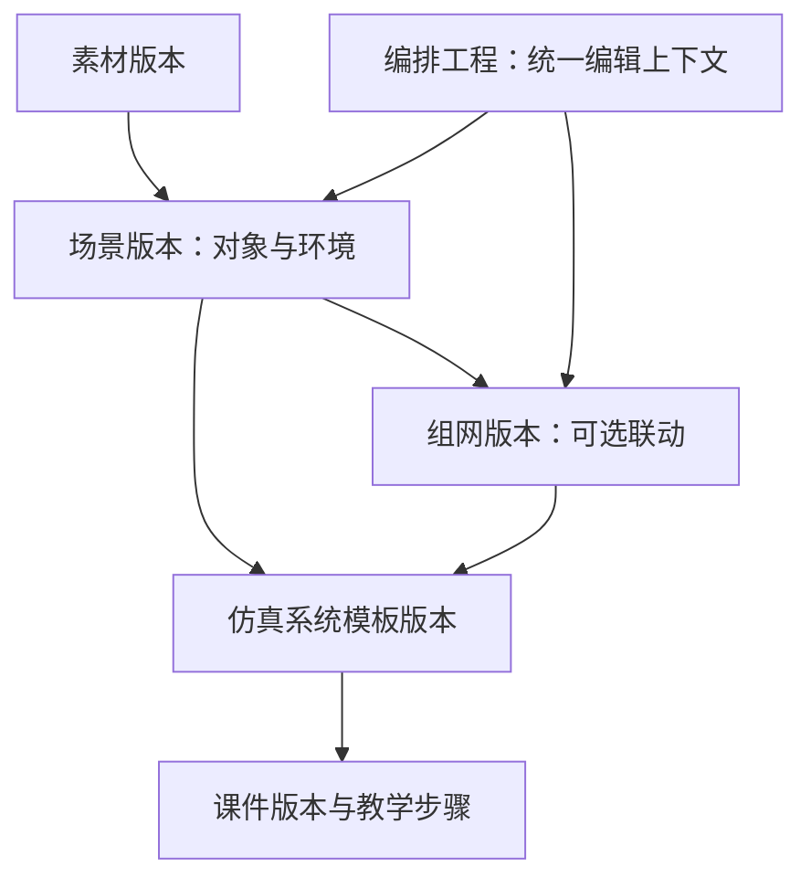

# P2—P7 后续重构：Codex 执行指导 V1.1

> 编制日期：2026-09-22。代码审阅基线：`0166b79914147ceb019af6e2131de5711880e75f`，提交说明 `09222`。
>
> 本文用于接续已实施的 P0、P1，指导后续代码修改。本次仅编制文档，没有修改项目代码，也没有重新运行仓库测试。文中新增能力、测试和页面均为待实施要求，不能直接写成“已完成”。

## 0. 使用方法与直接执行提示词

### 0.1 本文与上一版的关系

本文更新《三子系统业务重构_Codex代码修改执行指南_V1.0.md》中 P2—P7 的执行方式，重点纠正资源准备的菜单层级和用户操作路径。

- 保留已经完成的 P0/P1，不重建目录、不重做三系统导航、不重新引入旧菜单混用。
- 资源准备统一为“素材库—场景与设备编排—仿真系统模板库”。“设备关系与联动”进入编排工作区内部，按需使用。
- 采用当前仓库根 `source/` 路径，不再使用旧的 `peixun-demo-v1.0/source/`。
- P2 分为 A、B、C、D 四个可交付子阶段。每次执行一个子阶段，验证并展示成果后再推进。
- 与 V1.0 不一致的目录、资源菜单、编排工程组织、后续阶段细节以本文为准。历史保护、技术栈、UI风格和三系统完整闭环目标保持不变。

执行者须先读取当前代码、`AGENTS.md`（如有）和实施记录；若实际代码已超过本文基线，应识别已完成部分并继续，不覆盖后续用户修改。

### 0.2 最终目标

三个子系统都具备完整资源准备、课程/课件制作、发布、任务组织、训练、评价和归档能力：

| 领域 | 系统名称 |
| --- | --- |
| `OPERATION` | 装备使用及作战运用 |
| `MAINTENANCE` | 装备维修保障 |
| `SUPPORT` | 保障任务筹划及行为演练 |

底层服务与组件共用，业务数据及用户操作上下文独立。第三系统另外保留已有保障任务、预案、演练、模拟施工和成果归档业务链。

### 0.3 第一次执行：只完成 P2-A

将本文件交给 Codex，在已打开项目仓库的会话中发送：

```text
请完整阅读《P2-P7后续重构_Codex执行指导_V1.1.md》，基于当前仓库继续修改代码。

先核对当前分支、未提交变更、AGENTS.md、source/docs/业务重构实施进度.md，以及本文基线0166b79；保留所有已有用户修改。

本次只执行 P2-A。不要重做P0/P1，不要直接推进全部P2—P7，也不要只输出方案。

目标：三个子系统拥有一致的资源准备入口；实现真正独立的编排工程、场景对象编辑、领域资源选择、保存与刷新恢复。其余尚未实现的联动与模板能力如实标注，不做虚假按钮。

约束：保留当前UI配色和字体；保持Java/Vue/H2技术栈；保护历史数据；不得继续让新工程读写全局scene/topology；按本文建立新的增量迁移，不改写已实施的schemaVersion=2迁移含义。

完成本阶段实际代码、必要测试和可运行页面，更新source/docs/业务重构实施进度.md，报告修改文件、操作路径、测试结果和未完成项。阶段完成后停止，等待我验收。

未经我明确授权，不重置数据库、不覆盖运行中的用户数据、不强推、不自动推送或发布。
```

### 0.4 继续执行：按顺序一次一个阶段

推荐顺序：`P2-A → P2-B → P2-C → P2-D → P3 → P4 → P5 → P6 → P7`。

```text
继续按《P2-P7后续重构_Codex执行指导_V1.1.md》执行下一个未完成阶段。

先读取source/docs/业务重构实施进度.md，核验上一阶段代码和测试。已完成部分只回归，不重复建设。
本次只完成一个阶段：实现真实业务行为、相关测试及可运行交付，更新实施记录后停止。
不能为了通过测试删除关键断言、修改原业务金标、放宽权限或清空旧数据。
若上一阶段有阻断当前工作的缺陷，先修复并说明，不静默扩大本次范围。
```

如果用户明确要求一次完成完整 P2，可连续执行 P2-A—D，但每个子阶段仍必须有独立检查点、测试结果和可见页面成果。

## 1. 当前基线：哪些保留，哪些待改

### 1.1 已核对的 P0/P1 成果

| 现有成果 | 代码/位置 | 后续处理 |
| --- | --- | --- |
| 目录展平 | 仓库根 `source/`、`backend/`、`frontend/` | 保持结构，不迁回旧目录 |
| 三系统元数据 | `source/frontend/src/domain.ts`、`catalog.ts` | 扩展功能，保留显式领域上下文 |
| 域内任务与评价 | 操作、维修独立路由与返回路径 | 必须持续回归，不能退回维修统一入口 |
| 选择状态隔离 | `selectedCourseBySystem/selectedAttemptBySystem` | 扩展为编排工程选择，不重新使用单个全局选中对象 |
| 领域与身份投影 | `WorkspaceProjection.java` | 扩展新资源集合及第三系统教学，不推倒重写 |
| 领域命令约束 | `TrainingDomain.java` | 扩展对象类型，补明确授权和引用校验 |
| 迁移基础 | `WorkspaceMigration.java`，当前版本2 | 新增2→3及后续迁移步骤，禁止修改旧步骤后重跑 |
| 运行包同步/冷启动 | `sync-release-package.mjs`、`verify-release-package.mjs` | 继续使用，随路径/产物变化适配 |

仓库实施记录报告 P0/P1 已通过17项后端测试、41路由检查等。这是既有记录，执行后续修改时需重新验证受影响范围，不能直接复用“通过”结论。

### 1.2 仍存在的结构性问题

1. 操作系统仍显示“素材工程、设备组网、系统模板”，维修系统只显示“维修场景”。
2. `AuthoringView.vue` 的工程/场景分支仍编辑工作区单例 `scene`；组网也仍为单例 `topology`。
3. 设备对象和联动仍固定为泵、阀门、控制单元、传感器；连接规则不是可编辑的通用关系。
4. `template.save` 固定创建操作模板，`template.apply` 覆盖当前全局配置。
5. `course.save` 仍自动复制当前全局场景和组网；步骤编排和配置驱动运行未完成。
6. 第三系统课程制作仍显式关闭，`WorkspaceProjection` 在 SUPPORT 下清空课程、任务、尝试等集合；学员投影也清空保障业务对象。

第6项是 P1 的阶段限制，P5 必须同时调整制作开关、查询投影、命令权限和教学副本隔离，不能只把枚举开关改为 `true`。

## 2. 资源准备的新产品结构——本轮必须遵守

### 2.1 每个系统统一三个入口

| 入口 | 用户目标 | 主要内容 |
| --- | --- | --- |
| 素材库 | 找到可用于制作的材料 | 模型、动画、图像、音视频、文档、环境素材；分类、版本、审核、共享 |
| 场景与设备编排 | 把材料组成可交互训练环境 | 新建编排工程；对象与场景；设备关系与联动；调试预览 |
| 仿真系统模板库 | 复用已经配置好的训练环境 | 已发布模板、版本、对象和联动摘要、预览、复制编辑、供课件选择 |

公共资源中心可以保留为全部系统的资源汇总；不能要求用户必须离开本系统去公共中心才能完成资源准备。

不要继续把“素材工程、设备组网、系统模板”作为三种平级资源。工程是编辑工作区，联动是其中一种配置能力，模板是发布后可复用的成果。

### 2.2 编排工程内部采用三个工作区

| 页签 | 用户操作 | 应看见的结果 |
| --- | --- | --- |
| 对象与场景 | 添加素材实例、命名、配置位置/视角/环境/初始状态及单对象动作 | 本工程独立的对象列表、画面与属性 |
| 设备关系与联动 | 选择是否需要联动，配置设备端口、连接、前置条件及规则 | 哪个输入影响哪个输出、为何允许/拒绝动作 |
| 调试预览 | 注入模拟输入、执行动作、复位、观察状态 | 命中规则、前后状态、错误原因及调试事件 |

主操作按状态显示：“保存草稿”“检查配置”“开始调试”“发布为模板”“创建修订”。每项操作都有可见结果与下一步。

工程列表显示名称、所属系统、对象数、联动状态、版本状态、更新时间。模板列表显示适用范围、版本、设备组成、主要动作及使用说明，不只显示内部ID。

### 2.3 “设备关系与联动”的准确含义

它配置仿真设备之间的控制信号、状态反馈和触发条件，不是布置模型的位置，也不是培训步骤顺序，更不是只配置IP地址。

| 内容 | 所属能力 |
| --- | --- |
| 把泵放在工作台左侧 | 场景布局 |
| 点击泵显示结构说明 | 单对象交互 |
| 阀门就绪后控制器才能启动泵 | 设备关系与联动 |
| 传感器值低于阈值时产生告警 | 设备关系与联动 |
| 要求学员先检查阀门，再启动，错误扣分 | 课件教学规则 |
| 把这套环境保存供其他课件复用 | 仿真系统模板 |

维修系统同样需要联动能力，例如模拟检测和故障定位；单设备认知、拆装示意可以不使用联动。

第三系统的人员、库存、工期约束仍属于保障业务模型，不能为了菜单一致把这些全部伪装成设备端口连接。

### 2.4 联动是可选能力

每个工程显式选择：

- `NONE`：不需要设备间联动。允许单对象动作或静态教学场景，明确显示“本场景不使用设备联动”。
- `SIGNAL_GRAPH`：使用设备关系与联动。必须有合法对象、端口、连接和规则。

`NONE` 是正式配置，不是“功能未完成”；选择此模式后仍能发布模板、制作课件和完成培训。

可用模型、可用动作、联动规则由模拟平台能力描述提供；不能要求采购真实VR平台后才能完成本轮业务闭环。

### 2.5 推荐路由及旧入口兼容

三个前缀为 `/operation`、`/maintenance`、`/support`，共同功能如下：

| 路由后缀 | 页面 | feature建议值 |
| --- | --- | --- |
| `/assets` | 本系统素材库 | `assets` |
| `/simulation-projects` | 场景与设备编排列表 | `simulation-projects` |
| `/simulation-projects/:id` | 编排工作区 | `simulation-project-editor` |
| `/simulation-templates` | 仿真系统模板库 | `simulation-templates` |
| `/simulation-templates/:id` | 模板版本详情/预览 | `simulation-template-detail` |

`domain.ts` 为 SUPPORT 也增加“资源准备”分组。P2先开放三系统通用资源能力；SUPPORT的课程训练仍在P5完成前标明建设范围。

旧路由处理：

- `/operation/projects`、`/maintenance/scenes` 映射到各自工程列表；若只有旧单例配置，展示明确的旧配置卡片和复制入口。
- `/operation/topologies/:id` 只能定位所属工程的联动页签。旧 `TOPO-01` 映射到已迁移的旧操作配置工程；找不到时提示选择工程，不能拿最后一条替代。
- `/operation/templates` 映射到仿真系统模板库，保留能确认的旧模板映射。
- 第三系统 `/support/plans` 是保障预案库，保留不动，不能与仿真系统模板混用。
- 用 `pathForFeature` 统一跳转，更新演示指引中的旧页面ID映射；不要通过中文菜单名称判断领域。

## 3. 数据与版本设计——统一编辑入口，不丢失明确依赖

### 3.1 核心对象

本轮推荐以下结构。命名可合理调整，但业务关系与版本不变量不得省略。

| 集合 | 含义 | 关键关联 |
| --- | --- | --- |
| `assets` | 基础素材及组件能力 | 归属、共享、版本、可用动作和端口 |
| `simulationProjects` | 用户编辑的一套场景与联动配置 | `sceneRef`、`topologyRef`、`linkageMode`、状态与编辑版本 |
| `scenes` | 对象实例、布局、环境、视角和初始状态 | 每个实例引用具体素材版本 |
| `topologies` | 基于特定场景的连接与联动规则 | `sceneRef`、节点端口、连接、规则、参数 |
| `systemTemplates` | 已发布的可复用仿真配置版本 | 冻结场景/组网引用、来源工程、能力摘要 |
| `curricula`（P3） | 课程与课时 | 课件组织 |
| `courses`（保留） | 兼容现有课件版本集合 | 课程/课时、模板或环境依赖、步骤、评分和发布快照 |

`simulationProjects` 是此次统一工作区的业务对象。不要另外新建一套平行的“素材工程→场景工程→组网工程”增加重复层级；若当前分支已有等价对象，应复用并记录映射。

### 3.2 为什么保留场景和组网两个数据对象

用户在一个工作区编辑，但二者职责不同：场景描述对象与环境，组网描述设备间关系。保留明确引用，便于校验、版本冻结和未来平台适配；不要求用户分别跑三个页面才能保存。



### 3.3 字段与身份约定

- `domain/ownerSystem`：三个系统的归属；旧公共素材允许 `ownerSystem=SHARED`，但SHARED不是第四子系统。
- `id`：版本记录唯一ID。`familyId`：同一对象的版本族。`version`：内容版本。`editRevision`：当前草稿编辑版本。
- `workspace`：沿用工作区边界，跨系统共享仅限同一工作区。
- `visibility/sharedWith`：是否允许其他系统引用；可引用不等于可以修改源版本。
- `sourceRef`：复制、修订、模板实例化或迁移来源。
- `createdBy/updatedBy/publishedBy`：从服务端会话取得，不信任前端传入身份。
- 引用使用 `{id, version}` 并由服务端核对，不能只保存名称或依赖“当前最新”。

场景实例ID在同一个场景内唯一，例如 `PUMP-01`；完整定位依赖场景版本和实例ID。不同工程可以有同名实例，运行事件还必须带实例所属的预览/训练运行ID。

### 3.4 编排工程示例

```json
{
  "id": "PROJECT-MAINT-01-V1",
  "familyId": "PROJECT-MAINT-01",
  "version": 1,
  "editRevision": 1,
  "domain": "MAINTENANCE",
  "name": "泵组检测教学环境",
  "status": "DRAFT",
  "sceneRef": { "id": "SCENE-MAINT-01-V1", "version": 1 },
  "topologyRef": { "id": "TOPO-MAINT-01-V1", "version": 1 },
  "linkageMode": "SIGNAL_GRAPH",
  "description": "用于模拟检测与异常识别，不接真实设备",
  "sourceRef": null
}
```

`linkageMode=NONE` 时允许 `topologyRef=null`。发布校验按模式处理，不能再要求所有工程都有四台设备或三条连接。

### 3.5 对象和动作最低能力

场景至少支持：添加/移除对象、选择素材版本、编辑名称和示意位置、视角、初始状态。资源动作定义至少支持：

| 能力 | 示例 | 要求 |
| --- | --- | --- |
| 确认/识别 | 确认当前教学对象 | 保存实际对象与操作记录 |
| 参数设置 | 写入模拟状态值 | 数值/枚举类型及范围校验 |
| 状态动作 | 启动、停止、模拟开合 | 校验允许动作并改变实例状态 |
| 状态读取 | 获取当前模拟值 | 返回真实运行实例值，不能只显示固定文案 |
| 检查记录 | 保存模拟检查结论 | 结构化数据，支持教学完成条件引用 |

第五个及后续对象必须能通过数据加入页面，不能在 Vue 中继续枚举固定四设备。没有专用三维图形的对象可以用清晰的二维卡片/图标表示。

### 3.6 草稿、发布、修订和复制

推荐默认语义：

1. 新建工程创建独立场景草稿，按需创建独立组网草稿。
2. 工程保存以一个事务提交场景和组网修改，检查工程 `editRevision`，避免只保存一半。
3. 发布为模板时校验依赖、冻结所选场景与组网版本、创建模板版本，并将该工程版本置为只读。
4. 修改已发布工程通过“创建修订”生成同版本族的新ID、新场景/组网草稿；原版本保持不变。
5. “复制工程/从模板新建”创建独立版本族及新ID；场景内部对象ID可保留，但必须重新指向新场景/组网记录。
6. 资源素材的已批准版本可以继续引用；不要为每次复制重新复制上传文件。

可以采用独立发布副本而非锁定原草稿的实现，但必须达到同样的原子发布与历史不可变效果，并在实施记录说明。不能保存一个可变对象引用后声称它已冻结。

### 3.7 系统模板与课件环境

模板应保存：名称、归属、版本、说明、对象与动作摘要、联动模式、场景/组网引用、参数默认值、来源工程、发布人及依赖摘要。

模板不保存：学员成绩、培训任务、练习过程，也不直接等同于教学步骤模板。

P3中课件明确选择模板版本或已发布的场景/组网组合。普通“保存步骤”不能替换环境绑定。更换环境应列出受影响的步骤并重新校验，不自动把所有目标对象替换成泵组。

## 4. P2-A：统一资源入口与独立工程——第一批可见成果

### 4.1 必须完成的功能

1. 三系统都出现统一资源准备入口，共用相同组件但带各自领域。
2. 素材库显示本系统与获授权共享的素材，明确来源、状态和版本；导入时携带归属，不默认全局共享。
3. 工程列表支持新建、打开、复制、查看状态；新建时显式选择领域、名称、用途、是否需要联动。
4. 对象与场景页支持选择素材、添加/移除对象、重命名、示意布局、初始状态与视角。
5. 草稿可以保存、刷新恢复，至少在同一系统建立两套相互独立的工程。
6. 新工程不使用 `s.scene/s.topology`；旧配置继续有明确的兼容入口。
7. 服务器检查新资源对象归属、共享可见性、角色和编辑版本。
8. 发布、联动或模板在本子阶段未完成时，页面明确说明阶段范围；不得设置点击后无动作或虚假成功的按钮。

### 4.2 保存规则

- 草稿允许暂时不完整，返回可定位的待完善项；结构非法、重复ID、非法引用或编辑冲突应拒绝。
- 未保存内容切换工程/系统时，提供保存、放弃、取消；不直接丢弃。
- 显式ID不存在时显示错误页，不退回“最近一个工程”。
- 删除有联动/步骤引用的对象时显示依赖；用户明确选择处理后才提交，不能静默留下错误或自动清空步骤。

### 4.3 P2-A 验收

| 编号 | 操作 | 通过条件 |
| --- | --- | --- |
| P2-A01 | 分别进入三个系统资源准备 | 三个入口名称与层级一致，页面显示正确系统 |
| P2-A02 | 操作系统创建工程A/B，维修创建工程C | 三套数据独立，保存A不改变B/C |
| P2-A03 | 工程添加第五个对象并修改名称/位置 | 保存刷新后保持，非固定四对象列表 |
| P2-A04 | 使用其他系统未共享素材 | 后端拒绝；合法共享后可引用，不能修改源资源 |
| P2-A05 | 两个窗口修改同一工程 | 后保存者收到版本冲突，本地内容保留 |
| P2-A06 | 从旧场景入口进入 | 能找到旧兼容对象，不把旧配置写入所有新工程 |
| P2-A07 | 学员访问制作草稿或下载未授权素材 | 后端限制，不只隐藏导航 |
| P2-A08 | 切换系统后刷新工程详情 | 仍定位正确工程，任务/评价隔离不回退 |

交付时提供三个系统入口、工程A/B/C、第五对象截图及实际保存测试。只补菜单、不建立独立对象不算完成。

## 5. P2-B：设备关系与联动、真实调试

### 5.1 联动编辑最低能力

- 从本工程场景选择参与联动的对象，声明输入/输出端口及数据类型。
- 增删连接，修改规则和参数，配置动作前置条件与状态变化。
- 规则表单直接解释含义，例如“阀门未就绪时拒绝启动”，不能只显示 `CTRL.startRequest` 字符串。
- 单对象动作由对象能力处理；对象间影响由连接和规则处理；教学顺序与扣分留给P3/P4。
- 首版支持确定性的无环组合信号传播；有循环时给出明确校验错误。以后如需时序反馈，要单独引入时钟/延迟语义，不通过无限循环模拟。

### 5.2 联动数据示例

```json
{
  "sceneRef": { "id": "SCENE-OP-01-V1", "version": 1 },
  "connections": [
    {
      "id": "LINK-01",
      "source": { "objectId": "VALVE-01", "port": "ready" },
      "target": { "objectId": "PUMP-01", "port": "readyInput" },
      "valueType": "BOOLEAN"
    }
  ],
  "rules": [
    {
      "id": "RULE-START",
      "trigger": { "objectId": "PUMP-01", "actionId": "START" },
      "conditions": [
        { "field": "PUMP-01.readyInput", "operator": "EQ", "value": true }
      ],
      "effects": [
        { "objectId": "PUMP-01", "field": "status", "value": "RUNNING" }
      ],
      "rejectMessage": "阀门未就绪，当前不能启动"
    }
  ]
}
```

以上是推荐结构，不要求固定对象ID。完整校验还应验证每个动作、字段、端口和枚举确实由对象能力声明。缺失输入不能偷偷视为就绪；类型转换应显式定义或拒绝。

参数不能是可任意执行的脚本；不使用 `eval` 或让前端提交任意状态补丁。后端依据允许的规则生成状态变化。

### 5.3 调试实例

调试开始时根据工程草稿生成独立运行状态，不能直接修改场景的初始状态、其他调试实例或学员训练。

调试面板显示：输入/动作、命中规则、前后状态、拒绝原因、事件顺序。提供复位操作，复位当前调试实例，不清空工作区。

最小演示应实际表现：

1. 阀门未就绪，模拟启动被拒绝。
2. 设置阀门就绪，再启动，泵组状态变化。
3. 输入模拟值0.5，阈值0.4时无低值告警，阈值0.6时出现告警。
4. 停止/复位改变相应状态，调试记录能解释变化。
5. 另一工程或实例保持原状态。

这个规则执行能力应作为共享服务，P4直接复用；不先写一个前端演示版，再另外写一套不同的正式训练规则。

### 5.4 P2-B 验收

| 编号 | 操作 | 通过条件 |
| --- | --- | --- |
| P2-B01 | 增删连接和规则，刷新 | 配置真实持久化，依赖对象来自本工程 |
| P2-B02 | 输入端连接输入端、类型不匹配、对象不存在 | 明确拒绝并定位错误 |
| P2-B03 | 启动时前置条件未满足 | 失败原因来自状态检查，不记为成功 |
| P2-B04 | 修改阈值并用相同输入调试 | 状态结果随配置改变，非固定文案 |
| P2-B05 | 两个调试实例并行 | 不互相影响、不修改场景初始值 |
| P2-B06 | NONE模式工程调试单对象动作 | 不强制创建连接，也可正常预览 |
| P2-B07 | 构造循环或非法规则 | 被限定能力校验拒绝，不死循环、不执行脚本 |

## 6. P2-C：模板发布、版本复用与来源

### 6.1 发布前检查

发布前必须校验：素材版本可用、对象ID唯一、动作/端口有效、组网匹配场景、必需参数完整、规则合法、共享依赖闭包完整。

资源处于未审核或已停用状态时，阻止新的正式引用/发布；历史发布快照保留可读，不删除原证据。

发布操作以一个事务完成：冻结工程环境版本、创建模板版本、记录依赖及审计。相同命令或重复回调不能创建多个版本。模板不是保存时自动变为“已发布”。

### 6.2 模板详情及复用

用户能看到：模板用途、所属系统、版本、设备组成、联动模式、主要规则、依赖素材、发布信息、来源工程和使用说明。

支持两个明确动作：

- 查看/调试已发布版本：只读，不改变该模板。
- 从模板新建工程：创建目标领域的独立草稿及场景/组网ID，保留来源，可修改后另行发布。

P3才接入“用于课件”；P2不能把按钮跳到旧课件然后靠全局配置暗中传值。

跨领域复用应校验模板及其全部依赖的可用权限，不能模板共享但内部私有素材仍被绕过。需要脱离源配置修改时复制为目标系统自己的工程。

### 6.3 P2-C 验收

| 编号 | 操作 | 通过条件 |
| --- | --- | --- |
| P2-C01 | 含非法依赖的工程发布 | 被阻止，指出对象/素材/规则问题 |
| P2-C02 | 发布模板V1，查看详情 | 对象、联动、来源、依赖版本清楚可查 |
| P2-C03 | 复制模板并修改配置 | 原模板与其他引用者不变，新草稿有新ID |
| P2-C04 | 创建V2后再次打开V1 | V1内容与状态未改变 |
| P2-C05 | 跨系统引用模板 | 模板和依赖均通过共享校验才允许 |
| P2-C06 | NONE模式工程发布 | 合法发布，模板明确不使用联动 |
| P2-C07 | 访问保障预案库并复用原预案 | `templates.type=PLAN`原业务正常，不被场景模板迁移破坏 |

## 7. P2-D：资源准备闭环、兼容与阶段交付

### 7.1 本阶段完成什么

- 三系统分别从素材选择开始，建立工程、配置对象/可选联动、调试、发布模板、从模板新建工程。
- 清理新页面对全局 `scene/topology` 的引用；旧数据只走明确兼容分支。
- 迁移测试、旧路线兼容、角色/领域投影、中文显示、刷新恢复全部回归。
- 把P2入口和意义写入演示手册，用实际动作演示，避免继续让用户猜“组网为什么存在”。

### 7.2 P2完成的判据

| 编号 | 操作 | 通过条件 |
| --- | --- | --- |
| P2-D01 | 三系统各完成一遍资源准备 | 各自完整，不借另一个系统的菜单完成 |
| P2-D02 | 升级schemaVersion=2夹具并重复迁移 | 新对象数量稳定，原课件/训练/保障记录未改写 |
| P2-D03 | 运行旧操作/维修训练及原保障案例 | 原金标与既有领域隔离仍通过 |
| P2-D04 | 检查读接口、命令响应、幂等重放和下载 | 新资源范围一致，不因回执或直链越过范围 |
| P2-D05 | 同步并冷启动外层运行包 | 实际显示本次P2页面，静态资源完整，用户数据库未清空 |

P2全部完成仍不等于P3—P7完成。此时只应宣称资源与模板闭环完成；课件绑定和学员运行消费配置由后续阶段验收。

## 8. 接入现有代码的位置和方式

以下路径均相对当前仓库根目录。新增文件名为建议，不要求机械增加文件数量；可在清楚职责边界的前提下采用等价组织。

### 8.1 前端修改地图

| 文件 | P2重点 | 后续关联 |
| --- | --- | --- |
| `source/frontend/src/domain.ts` | 三系统统一资源准备分组，保留已有领域常量 | P5扩展第三系统教学分组 |
| `source/frontend/src/catalog.ts` | 新资源路由、页签上下文、旧入口兼容 | 保留课件/任务/评价域内路径 |
| `source/frontend/src/main.ts` | 安全的重定向、非法ID提示 | 深链接和刷新恢复 |
| `source/frontend/src/App.vue` | 识别新view及菜单分组，保留视觉样式 | 不扩散硬编码的页面ID判断 |
| `source/frontend/src/store.ts` | 工程选择按工作区/系统隔离，资源查询、编辑冲突处理 | P3环境绑定、P4运行实例 |
| `source/frontend/src/views/AssetsView.vue` | 本领域与共享素材，上传归属、审核与引用信息 | 课件依赖选择 |
| `source/frontend/src/views/AuthoringView.vue` | 新工程功能拆入明确组件，旧单例保留兼容边界 | P3不得再通过它暗中设全局环境 |
| 建议 `views/SimulationProjectsView.vue` | 工程列表、新建、复制、版本与来源 | 工程生命周期 |
| 建议 `components/SimulationProjectEditor.vue` | 对象/联动/预览三个工作区，统一保存和校验 | 模板发布入口 |
| 建议 `components/DeviceRelationsEditor.vue` | 端口、连接、规则、参数和语义提示 | 规则配置复用 |
| 建议 `views/SimulationTemplatesView.vue` | 模板列表、详情、预览、实例化 | P3供课件选择 |
| `source/frontend/src/components/SceneView.vue` | 数据驱动对象列表和状态；已有泵组图作为一种渲染方式 | P4动态训练场景 |
| `source/frontend/src/views/SystemOverviewView.vue` | 本系统资源准备进度及下一步 | 第三系统教学与业务指标分区 |
| `source/frontend/src/guide.ts`、`components/DemoGuide.vue` | 演示路线说明新资源关系和入口 | P7完整操作手册 |

`pathForFeature` 为建议保留的统一导航方法；对于列表与编辑页使用不同feature，避免同名feature查询取第一条而跳错页面。

### 8.2 后端修改地图

后端包目录为 `source/backend/src/main/java/cn/peixun/demo/`。

| 文件 | 修改要求 |
| --- | --- |
| `WorkspaceMigration.java` | 保留1→2迁移，新增2→3；后续有新持久化结构继续递增 |
| `Seed.java` | 新工作区初始化当前schema与新增集合；提供三系统资源示例，不固定所有场景为四设备 |
| `WorkspaceProjection.java` | 新集合领域/身份/共享过滤，返回必要依赖闭包，不把所有草稿暴露给学员 |
| `TrainingDomain.java` | 新对象范围校验；区分资源开放和SUPPORT课程阶段开关 |
| `DemoController.java` | 素材上传归属、资源下载范围、领域查询，保持API兼容 |
| `DemoService.java` | 新命令明确分发与权限，事务/幂等/CAS；回执投影一致性 |
| `TrainingModule.java` | 旧场景/组网/模板兼容；新命令委派独立服务，不继续堆单例逻辑 |
| 建议 `SimulationProjectService` | 工程增删改查、复制/修订、聚合保存和依赖校验 |
| 建议 `SimulationTemplateService` | 模板发布、不可变引用和实例化 |
| 建议 `SimulationRuleEngine` | 规则校验与确定性执行，供预览和P4训练共用 |
| `VirtualPlatformPort.java` | 扩展实例、动作、参数、状态结果等标准契约 |
| `MockVirtualPlatformAdapter.java` | 执行有限动作/信号模拟，返回状态变化、技术失败，不执行任意脚本 |

模板和工程必须使用实际对象ID查找，不能在新服务中继续读取 `s.get("scene")` 或 `s.get("topology")` 作为默认业务对象。

### 8.3 建议命令契约

继续沿用 `/api/demo/commands?workspace=...&domain=...`，保留 `action/commandId/runEpoch/expectedRevision/payload`。

| 命令 | 主要输入 | 核心校验与返回 |
| --- | --- | --- |
| `simulationProject.create` | domain、名称、联动模式 | 新工程及独立子对象ID |
| `simulationProject.save` | id、expectedEditRevision、场景/组网编辑内容 | 整体事务、类型和引用、草稿警告、更新版本 |
| `simulationProject.clone` | 来源ID、目标领域、名称 | 授权、新版本族与新ID、来源记录 |
| `simulationProject.revise` | 已发布工程ID | 原版本只读，新草稿及独立子对象 |
| `simulationProject.validate` | id | errors/warnings/依赖清单，指向具体对象/连接/字段 |
| `simulationPreview.start` | 工程或模板引用 | 独立预览实例，记录创建者和输入快照 |
| `simulationPreview.action/reset/close` | 预览ID、动作参数 | 实例权限、规则结果、前后状态，无正式成绩 |
| `systemTemplate.publish` | 工程ID、expectedEditRevision、说明 | 原子冻结和发布，返回模板版本 |
| `systemTemplate.instantiate` | 模板ID、目标领域、名称 | 校验依赖共享，创建独立草稿工程 |

`template.*` 老命令为兼容保留，新页面只调用新契约。`type=PLAN` 的保障预案逻辑保持不变，不被新命令接管。

新增命令要同时注册分发和权限。当前默认分支会进入筹划模块，不能只在前端发新命令而遗漏服务端接入。未知命令必须明确拒绝。

### 8.4 并发、投影与范围的具体要求

- 保留工作区全局版本控制，同时对工程草稿增加 `expectedEditRevision`。刷新全局版本后不能自动覆盖另一窗口的新编辑。
- 当前 `store.command` 自动刷新后重试；编辑命令必须在对象版本变化时返回明确冲突，保留本地草稿供用户处理。
- 网络晚到响应也要检查请求时的工作区、身份和领域；不能仅比较全局revision，把旧领域数据覆盖到新页面。
- 领域query是上下文，不是授权。新命令必须验证对象归属和角色，不能省略domain后就绕过检查。
- 查询投影、命令成功响应、幂等回执重放、资源下载、报告导出应用同一范围策略。当前回执保存了投影后的state；跨上下文重放时不能原样返回旧范围数据。
- 幂等业务结果不重复执行；可重投影旧回执或安全地重新获取当前可见state，但不能改变首次业务结果。
- 后端校验依赖使用真实工作区状态，不能把“未包含在前端投影里”误判为资源不存在，也不能据此绕过共享权限。
- 权限依据账号角色和对象权限，不能只允许ID恰好为 `INSTRUCTOR` 的账号；独立审核教员仍需可用。

## 9. 迁移与兼容：P2开始前必须落实

### 9.1 从当前schemaVersion=2继续

不要改写现有1→2迁移，再把所有工作区当旧版执行。新增迁移步骤，例如2→3创建新资源集合与旧配置映射；之后的模型升级使用独立新版本。

对于未经过P1的旧夹具，要能按顺序完成1→2→3。新创建/克隆/重置的测试工作区也应生成或迁移至正确版本。

### 9.2 旧数据处理规则

| 旧对象 | 转换/兼容方式 | 不能做的事 |
| --- | --- | --- |
| 工作区单例scene/topology | 保留原值；新建带旧来源标识的兼容工程，操作与维修编辑副本独立 | 把它作为所有新工程共享引用 |
| 旧course自带环境快照 | 保留课件自己的原快照，必要时按领域+内容摘要生成只读引用 | 用最新全局场景替换历史课件环境 |
| 旧操作template | 创建对应仿真模板/工程来源映射，保留原ID关系 | 丢失来源或与保障预案模板混合 |
| `templates.type=PLAN` | 继续由原保障预案业务使用 | 批量迁入场景模板库 |
| 旧素材 | 保留原ID、审核状态、文件引用及已有SHARED映射 | 每次读数据重复复制，或无故把旧依赖变成未审核 |
| 旧训练、反馈、证据 | 只补兼容元数据，不改步骤、事件、评分和确认关系 | 按新规则重算历史分数 |
| 旧保障任务/预案/演练/归档 | 保留既有数据和版本 | 为新教学案例改动正式业务历史 |

兼容工程ID及来源映射要确定且幂等；重复迁移不增加同名副本。无法确定的引用标为待处理，不用“最近一个资源”填补。

### 9.3 避免旧保存逻辑污染新环境

P2新页面不再写全局scene/topology。旧课件运行可继续读取其旧快照；对于旧课件编辑，应保持原环境，或提供显式的“复制旧编辑配置”兼容动作，不能暗中把P2新工程写回全局供它消费。

P3新课件必须有明确环境引用；兼容分支以真实持久化的旧契约标记区分，不能由客户端随意传 `legacy=true` 绕过新校验。

### 9.4 数据保护和测试

迁移先在构造的旧快照和独立测试数据库验证；保留只读预检、迁移版本、对象数量及警告记录。失败事务回滚，成功后才递增schema版本。

当前 `DemoService.load` 在读取时调用迁移，迁移结果不一定立即落库。新增迁移必须明确持久化时机：通过受控迁移事务或成功的工作区写事务保存完整结果，兼容既有revision校验；不能每次读数据重新生成随机ID。应验证保存后重启仍保持同一对象和引用。

现有用户数据库位于仓库根 `backend/.data/`。需要实际迁移时，停止旧程序并做一致备份；不要删除数据库来“解决兼容问题”。没有实际迁移用户数据就如实说明。

回滚使用对应旧程序及迁移前备份；不能假设旧JAR自动兼容新结构。保持工作区轮次、命令回执和审计的既有约束。

## 10. P3：课程/课件、明确环境绑定与自由步骤编排

### 10.1 接续范围

本阶段将P2发布的环境交给教员制作课件。首先完成操作、维修系统，公共组件保留SUPPORT扩展点；第三系统的完整业务教学在P5开放。

课程是教学组织，课件是可运行内容版本。建议新增 `curricula` 保存课程目标、受众和课时；保留现有 `courses` 作为课件版本集合，补 `curriculumId/unitId`，避免一次改名破坏旧任务。

### 10.2 教员的实际操作路径

1. 建立课程及课时，填写学员应掌握的能力。
2. 为课时新建课件，选择已发布的仿真模板版本。
3. 页面自动展示模板对应的场景、设备、联动摘要及版本；不让教员重复填写同一套配置。
4. 高级场景可显式选择匹配的已发布场景/组网，但必须校验组合关系，不能借用当前全局配置。
5. 选择空白或预置步骤模板，编辑步骤、动作、参数、条件、提示和评分。
6. 预览学员视角，检查状态和结果；保存、提交审核、由其他教员审核、生成发布版本。
7. P4运行能力完成后，分配该版本给学员。阶段间用能力检查阻止新契约课件落入旧运行器，旧课件继续正常使用。

### 10.3 步骤编辑最低要求

| 能力 | 具体要求 |
| --- | --- |
| 新增/复制/删除 | 稳定ID，复制生成新ID，删除说明依赖影响 |
| 调整顺序 | 上移/下移及拖动排序；“上一步/下一步浏览”不能冒充排序 |
| 对象选择 | 从绑定场景动态获取，不固定四个设备 |
| 动作选择 | 从目标对象能力获取动作编码，按钮文案可自定义 |
| 参数 | 按类型显示数值/枚举/对象/资源/检查结果输入 |
| 条件 | 前置状态、完成判断、失败说明，使用类型化规则 |
| 分值 | 每步权重/分值、错误和帮助扣分，合计校验 |
| 模式 | 引导/自由/演示，说明提示和计分差异 |
| 草稿 | 允许半成品保存；预览/提交/发布采用更严格校验 |

新课件可以是5步、6步或其他合法数量，8/10步仅为可选示例。第一版采用线性流程，失败留在本步；不在此阶段引入复杂分支、并行或循环教学图。

`expectedResult` 用来解释结果，不能作为成功条件。用户修改“动作按钮文字”不能创建未定义的实际设备行为。

### 10.4 发布和版本绑定

建议新契约使用 `interactionSchemaVersion=3`，区别于旧 `interactionVersion=2`，并有明确转换和兼容判断。工作区schema版本与交互契约版本是两种独立版本。

```json
{
  "id": "COURSEWARE-OP-01-V1",
  "domain": "OPERATION",
  "curriculumId": "CURRICULUM-OP-01",
  "unitId": "UNIT-01",
  "version": 1,
  "editRevision": 4,
  "status": "DRAFT",
  "interactionSchemaVersion": 3,
  "environment": {
    "templateRef": { "id": "TEMPLATE-OP-01-V1", "version": 1 },
    "sceneRef": { "id": "SCENE-OP-01-V1", "version": 1 },
    "topologyRef": { "id": "TOPO-OP-01-V1", "version": 1 }
  },
  "steps": [],
  "scoreRule": { "total": 100, "errorPenalty": 5, "helpPenalty": 2 },
  "publishedSnapshot": null
}
```

上例仅示意结构，空步骤不能审核或发布。

- `course.save` 只保存明确字段，不读全局场景/组网；环境改绑应为显式操作。
- 选择模板时，由服务端解析对应场景/组网及依赖版本；前端同时提交的引用必须一致，不能用模板V1名称搭配另一份可变场景。
- 更换模板/场景后，列出目标对象、动作或规则不再有效的步骤，要求处理后发布。
- 发布快照冻结教学步骤、环境、动作能力、评分和平台契约。运行不读取最新制作草稿。
- 审核期间内容及依赖不可偷偷变化，制作者不能审核自己制作的课件。
- 修订新版本不修改旧版本；旧任务固定原课件，新任务才选择新版本。

### 10.5 修改位置与验收

重点修改 `CourseBuilder.vue`、`lesson.ts`、`TrainingModule.java`，新增课程管理视图、步骤编辑器和发布校验服务。环境选择优先复用P2模板查询，不另造一份模板数据。

| 编号 | 验收操作 | 通过条件 |
| --- | --- | --- |
| P3-01 | 新建课程/课时及空白5步课件 | 课程和课件关系清楚，步骤可增删复制排序 |
| P3-02 | 从模板库选择V1作为环境 | 页面显示真实场景、组网和素材版本 |
| P3-03 | 仅改说明或评分后保存 | 环境引用完全不变 |
| P3-04 | 改绑缺少原步骤对象的模板 | 定位问题并阻止发布，不默认替换对象 |
| P3-05 | 半成品保存、预览、提交 | 草稿可保存，未满足对应校验时不能继续 |
| P3-06 | 预览动作与设备规则 | 调用P2同一规则服务，无正式任务和成绩 |
| P3-07 | 审核、发布、修订 | 自审被阻止；V2不改变V1 |
| P3-08 | 新旧交互契约并存 | 旧课可继续；运行未就绪的新契约不进入旧运行器 |

## 11. P4：配置驱动学员运行、台位与评价

### 11.1 运行模型

培训任务引用准确的课件版本，训练尝试创建独立运行实例。其状态来自冻结发布快照，不从工作区编辑对象读取。

同一任务存在运行/暂停尝试时提供续训入口；完成后补训创建新尝试。两个学员、两个课件和制作预览互不影响。

运行事件至少包含：`eventId/commandId/attemptId/stepId/actorId/objectId/actionId/parameters/beforeState/afterState/result/reason/scoreDelta/sequence/at`。

平台模拟负责状态变化与执行结果；教学引擎依据当前步骤的条件判断是否通过及得分。调试、课件预览、正式训练复用核心规则，正式训练额外应用任务权限、计分和证据记录。

### 11.2 学员界面

保留已有清晰风格与“读完结果后继续”的体验。持续展示：

- 当前课程目标、任务要求、版本及进度。
- 本步任务、对象、动作、参数与必要前置条件。
- 操作后实际输入、设备变化、成功/失败原因、计分变化和保存状态。
- 下一动作：重试、帮助、继续、暂停/恢复、提交或查看评价。

数据驱动 `LessonStep.vue`、`SceneView.vue`，移除新课件对固定 `trainingObjects` 的依赖；旧四对象逻辑只用于旧契约兼容。

后台区分动作已通过与用户继续阅读确认，重复点击继续不能重复计分。暂停/刷新后恢复同一尝试的状态及必要反馈。

### 11.3 评分和故障口径

- 首版新课件总分固定100，每步分值合计等于100；后台按通过分值合计减错误/帮助扣分计算，限制到0—100。
- 每步只得一次通过分，同一命令重放不重复扣分；帮助和技术故障不是同一事件类型。
- 操作错误按冻结规则处理；平台超时、失败、迟到/重复回调不算学员操作错误。
- 正确率默认沿用已通过步骤数除以已通过步骤数加业务错误次数，帮助与技术故障不计入；分母为0显示无结果。
- 演示模式不计分；团队成绩和个人成绩分开，团队操作校验成员与控制权，不凭 `scope=TEAM` 放开所有学员。
- 旧课程和旧完成记录保持原评分算法，不重新计算历史结果。

### 11.4 台位与外设

三个系统均可配置台位能力和模拟外设映射，但课件可声明“不需要外设”。真实硬件通信仍模拟。

信号必须指向明确的预览或训练实例及有效动作，不能再调用全局 `topology.signal` 改变其他对象。断开、未映射、目标实例无权限或已结束时，返回明确原因。

### 11.5 培训任务、评价和归档

任务支持指定人员、模式、完成期限及必要台位；Demo可用批次创建多条单人任务，不强制建设复杂班级组织。

完成结果显示成绩构成、过程详情、课程反馈和教员确认状态；归档引用课件、任务、尝试、评分规则、事件及评价。教员确认证据应指向准确尝试，不因曾确认旧补训就自动确认新尝试。

重点修改 `TrainingAssignments.vue`、`TrainingPlayer.vue`、`TrainingView.vue`、`VirtualPlatformPort/MockVirtualPlatformAdapter`、训练命令与运行服务；发布快照和P2规则服务直接复用。

| 编号 | 验收操作 | 通过条件 |
| --- | --- | --- |
| P4-01 | 分配P3新课件并训练 | 运行确实使用所选模板、对象与规则 |
| P4-02 | 同输入在阈值0.4/0.6版本运行 | 告警结果不同，旧任务保持原版本 |
| P4-03 | 错对象、错参数、未满足前置条件 | 当前步骤不通过，原因及扣分可核对 |
| P4-04 | 正确操作 | 状态变化、事件、反馈和分数一致，主动继续 |
| P4-05 | 暂停、刷新、续训、补训 | 状态恢复、在途不重复启动、旧尝试不被覆盖 |
| P4-06 | 技术故障和重复/迟到命令 | 不扣业务错误分，不重复推进或回退状态 |
| P4-07 | 两个学员和一个预览同时操作 | 运行状态及权限隔离 |
| P4-08 | 模拟台位指向实例、断开或未映射 | 合法信号影响正确实例，错误信号不改全局状态 |
| P4-09 | 查看评价、确认证据、导出归档 | 记录与真实事件一致，跨学员直链不可越权 |

## 12. P5：第三系统的真实教学闭环

### 12.1 保留原保障业务，增加教学练习

原主线继续可用：保障任务 → 预案/资源准备 → 导调演练 → 评估 → 模拟施工 → 对比改进 → 三级归档。

教学主线新增：课程/课件 → 仿真环境与保障教学案例 → 教学步骤和评分点 → 发布分配 → 学员编制方案、计算、处理事件 → 复盘评价归档。

不能直接为SUPPORT复制泵组8步或维修10步，也不能仅展示预生成的排程结果。

### 12.2 必须同步修改的基线限制

- `TrainingDomain.SUPPORT` 的课程制作开关，在本阶段具备真实功能后开放。
- `WorkspaceProjection.applyDomain` 不再对SUPPORT清空全部课程/任务/尝试等集合，应按领域筛选。
- `applyLearner` 允许读取本人尝试的教学任务/方案/演练副本，同时继续隐藏正式业务和他人副本。
- 第三系统补齐课程、课件、培训任务、评价、归档路由；已有方案指标 `/support/evaluations/:id` 保留，教学评价使用不同路径。
- `SystemOverviewView` 分开显示保障业务进度和教学培训进度，不能用“演练完成次数”冒充“学员培训完成数”。

### 12.3 教学案例与评分示例

课件：“泵组保障方案编制与延迟事件处置”。以下为合成数据和模拟业务：

| 阶段 | 学员实际操作 | 自动检查依据 | 示例分值 |
| --- | --- | --- | ---: |
| 理解任务 | 阅读对象、范围、时限并确认 | 任务确认事件 | 10 |
| 配置资源 | 选择人员、物料及设施 | 能力、数量及可用性约束 | 20 |
| 编制方案 | 编辑工序、依赖及资源引用 | 必需内容、无环、资源合法 | 20 |
| 计算验证 | 运行排程和费用计算 | 后端结果及约束核对 | 20 |
| 事件处置 | 接受模拟到货延迟，选择处置并推进演练 | 处置前后方案/演练记录 | 20 |
| 提交复盘 | 完成演练并提交结论 | 结果、依据和说明完整 | 10 |

例如可使用现有金标案例：正常工期240、延迟到货后300、加急到货后255；数字来自既有算法输入，不在页面上写死。若学员输入不同，应显示真实计算值并按课件条件评价。

### 12.4 教学副本与权限

- 课件固定引用教学案例/预案版本，开始尝试时创建独立副本。
- 可以复用现有 `tasks/plans/runs`，但增加 `purpose=BUSINESS/TRAINING`、`attemptId`、`ownerLearnerId`，在读写、统计、导出中统一隔离。
- 学员通过 `training.support.*` 等受控命令编辑自己的练习副本，不能临时切换为筹划员/导调员，也不能放宽正式 `plan.*`、`run.*` 权限。
- 可抽取纯校验/计算服务复用 `ScheduleEngine`，不要让教学接口无约束调用正式命令入口。
- 保留案例原始版本、其他学员副本和正式业务不变。
- 方案工期/费用/资源指标与学习成绩分开保存；两者可以关联，不直接以费用低就自动给学员满分。

| 编号 | 验收操作 | 通过条件 |
| --- | --- | --- |
| P5-01 | SUPPORT新建课件、发布、分配 | 整条教学入口在本系统内 |
| P5-02 | 学员实际改资源和工序并计算 | 结果来自后台，能体现不同输入 |
| P5-03 | 注入延迟并进行处置 | 前后结果与事件保留，可复盘 |
| P5-04 | 两学员执行同一案例 | 副本独立，原案例及正式预案未改变 |
| P5-05 | 学员直接调用正式业务命令 | 被拒绝，不能靠省略purpose或domain绕过 |
| P5-06 | 查看方案评价及学习成绩 | 含义、数据、展示和归档明确区分 |
| P5-07 | 回归原保障任务至三级归档 | 原算法、状态和金标保持 |

## 13. P6：训练问题分流与可选跨系统协作

### 13.1 归档与问题处理分开

正常训练无问题也能完成评价归档。记录问题是可选动作，不要求每次训练生成保障任务。

| 类型 | 处理方向 | 必须保留的结果 |
| --- | --- | --- |
| CONTENT：教学内容问题 | 建议修订，创建课件新草稿 | 问题与新课件版本关联 |
| LEARNING：掌握不足 | 补训/复训 | 原成绩和新任务/尝试关联 |
| PLATFORM：平台异常 | 技术问题登记与处理跟踪 | 故障记录、处理意见和状态，不扣学习分 |
| EQUIPMENT_SUPPORT：疑似保障问题 | 核实后关联/创建保障任务 | 核实人、意见、对象、范围与任务来源 |

问题状态至少覆盖待分流、处理中、已解决/关闭，并能追踪处理依据。

### 13.2 转保障任务规则

只允许经过核实的保障类问题转换。显示确认表单填写对象、任务范围、类型、时间和约束；不能继续使用固定泵组、维修类型、270时限和示例工序套用所有问题。

后端校验来源尝试存在且符合状态、用户权限、问题分类及核实状态；转换与关联事务完成。同一个问题重复转换不创建第二个任务，即使commandId不同也需要业务防重。

保留 `保障任务 → 问题 → 来源尝试 → 课件版本` 的可追溯关系，不把仿真异常直接当作真实装备故障。

现有“保障准备提出培训需求—维修培训证据回传”可继续作为受控协作，不能成为三个系统独立完成训练的前提。培训完成证据也不等于正式岗位资质认证。

| 编号 | 验收操作 | 通过条件 |
| --- | --- | --- |
| P6-01 | 内容问题分流 | 创建修订关联，不生成保障任务 |
| P6-02 | 学习问题分流 | 新建补训，原成绩不修改 |
| P6-03 | 技术问题登记和处理 | 有结果跟踪，训练不因此被扣分 |
| P6-04 | 未核实/无权的保障问题转任务 | 服务端拒绝；合法确认后才能生成 |
| P6-05 | 重复转换问题 | 只有一个关联任务，来源链可查 |
| P6-06 | 不创建问题而完成正常训练 | 评价与归档仍完整可用 |

## 14. P7：全链路回归与可运行交付

### 14.1 三条最终人工演示路线

| 系统 | 必须能够现场完成的流程 |
| --- | --- |
| 装备使用及作战运用 | 选素材 → 建独立工程 → 配联动并调试 → 发布模板 → 建5步课件 → 审核发布 → 分配 → 学员操作与状态反馈 → 评价归档 |
| 装备维修保障 | 选素材并添加工具/检测对象 → 建维修工程，可选择无联动 → 发布模板 → 建6步维修课件 → 审核分配 → 模拟检查/操作 → 评价归档与修订/补训 |
| 保障任务筹划及行为演练 | 准备仿真资源和保障教学案例 → 配课件约束及评分 → 发布分配 → 学员编制方案与事件处置 → 分别查看方案指标和学习分数 → 复盘归档 |

每条路线从本系统入口开始，正常主线不借其他系统菜单补齐。跨系统共享素材以来源标签表达，不把用户带入其他系统的编辑草稿。

### 14.2 保留的原金标

| 原案例 | 应保持的结果 |
| --- | --- |
| 操作8步全正确 | 100分；技术故障不增加业务错误 |
| 维修10正确、2错误、1帮助 | 88分；正确率83.33% |
| 维修10正确、1错误、1帮助 | 93分 |
| 正常保障演练 | 工期240，总费用965 |
| 延迟到货180 | 工期300，总费用965 |
| 加急到货135 | 工期255，总费用1005，原延迟分支仍为300 |
| P2改进预案增加10分钟检查、到货120 | 工期250，总费用1025 |
| 模拟施工与检查返工 | 工期270，总费用1070 |
| 三级归档 | 禁止跳级，保留退回和重新审核历史 |

此表“P2改进预案”是旧保障案例名称，与本文P2开发阶段不同。新课件可以有不同评分规则，但不能改旧例预期来掩盖回归失败。

### 14.3 最终验收

| 编号 | 检查 | 通过条件 |
| --- | --- | --- |
| P7-01 | 三条路线从空测试工作区执行 | 真实表单、命令、事件和结果闭环，不能只展示已完成夹具 |
| P7-02 | 原业务金标和P0/P1回归 | 隔离、深链接、旧课程、保障算法正常 |
| P7-03 | 迁移、历史报告、版本追溯 | 幂等、可恢复，旧记录不被重算或改写 |
| P7-04 | 1440px、常用笔记本宽度和390px | 主操作、任务说明、反馈清晰，关键操作不被遮挡 |
| P7-05 | 同步后从根目录运行包冷启动 | 前后端同次构建，JS/CSS/字体可加载，无需开发服务器 |
| P7-06 | 对照阶段清单及报告 | 每项都有代码/测试/操作证据，未验证项如实列明 |

### 14.4 不扩大到真实VR建设

无需实现真实三维渲染、物理引擎、头显SDK、外设驱动或真实装备控制。模拟表现必须依赖正确配置并形成可核对的业务结果，不能只修改文案。

示例继续使用合成设备、模拟参数和教学操作，不引入真实敏感装备数据或实际作战/维修规程。

## 15. 实施验证与运行包交付

### 15.1 先确认运行位置

以下命令以仓库根目录为起点，适用于当前已核对的目录结构。Windows下按环境使用 `npm.cmd`、`mvn.cmd`；不要为执行命令把源码迁回旧目录。

```bash
cd source
npm --prefix frontend ci
npm --prefix frontend run build
mvn -B -ntp -f backend/pom.xml verify
```

前端构建包含TypeScript检查；Maven验证须实际生成可运行JAR。任一步失败，先处理失败原因，不能用旧产物继续声称当前代码可运行。

首次准备浏览器环境时，在 `source/frontend/` 运行：

```bash
npx playwright install chromium
```

Linux CI需要系统依赖时沿用现有 `--with-deps` 配置。不要因本机无法安装浏览器而把相关检查标为通过；记录阻塞条件及已经完成的其他验证。

### 15.2 按阶段增加有效测试

| 阶段 | 最小新增验证重点 | 测试应抓住的实际错误 |
| --- | --- | --- |
| P2-A | 多工程持久化、2→3幂等迁移、资源归属和编辑冲突 | 保存A污染B；省略domain越权；刷新丢失第五对象 |
| P2-B | 规则类型、端口方向、条件拒绝、阈值变化、实例隔离 | 界面改了规则但后端仍执行固定四设备逻辑 |
| P2-C | 发布原子性、不可变版本、实例化及共享依赖 | 改草稿导致旧模板改变；共享模板泄露未授权依赖 |
| P2-D | 三系统资源准备浏览器流程及旧流程回归 | 新菜单正常但某系统无法保存/发布，或旧数据被污染 |
| P3 | 非固定步数、顺序调整、换环境依赖检查、发布快照 | 保存时暗中替换环境；步骤只能改文字不能改行为 |
| P4 | 运行实际消费配置、重复事件、技术失败、评分与回放 | 仅按stepId成功；重复点击重复计分；历史被重算 |
| P5 | 两学员教学副本、后台计算、正式业务隔离 | 修改教学预案影响正式业务；SUPPORT查询仍清空教学数据 |
| P6 | 分类分流、核实与权限、转换业务防重 | 普通内容问题生成保障任务；重复生成任务 |
| P7 | 三条人工演示、旧金标、迁移与根目录冷启动 | 源码已改但交付包仍旧；报告与真实运行结果不一致 |

规则服务使用可复现的输入/输出断言，浏览器验证用户能够完成任务。不要为每个文案写镜像测试，也不要只断言HTTP 200或按钮存在。

### 15.3 既有回归脚本

在 `source/` 执行；脚本使用独立测试工作区/内存数据库，不能指向用户演示库：

```bash
node scripts/verify-browser.mjs
node scripts/verify-training-workflow.mjs
node scripts/verify-three-systems.mjs
```

注意：当前 `verify-three-systems.mjs` 主要验证三领域/身份的数据投影，不等于已经覆盖三条完整教学流程。P2增加资源准备浏览器用例，P4/P5增加相应教学链用例；可以扩展现有脚本，也可以新增职责明确的脚本并接入CI。

新增脚本需自行启动、等待就绪、关闭其测试服务，避免与8081、8082、8083等既有测试端口冲突；端口占用应报错，不能误连正在运行的用户实例。

测试范围按实际变更选择。在P2-D、P7及准备交付运行包时完成约定的综合回归；中间阶段无需反复运行与改动无关的所有检查，但不得省略受影响的迁移、权限或金标测试。

### 15.4 源码与外层运行包必须一致

源码构建和相关回归通过后，在 `source/` 执行：

```bash
node scripts/sync-release-package.mjs
node scripts/verify-release-package.mjs
```

沿用现有同步脚本，将同次构建的 `source/backend/target/peixun-demo-1.0.0.jar` 和 `source/frontend/dist/` 同步至根目录 `backend/peixun-demo.jar`、`frontend/dist/`。保留 `start.bat/start.sh` 的运行关系，不手动覆盖用户数据库。

当前冷启动脚本使用8083及独立H2内存库，校验JAR、页面和JS/CSS/字体资源；它不能替代业务流程验收或实际用户数据迁移验证。

根 `.github/workflows/ci.yml` 及 `repository-config/ci.yml` 继续以 `source/` 为构建工作目录；新增验证脚本应同步接入适用的CI配置。同步运行包属于本地交付准备，提交、推送、正式部署仍按用户本次授权执行。

## 16. 每阶段必须给用户看到的成果

### 16.1 阶段交付清单

每个阶段结束时交付：

1. 实际修改的代码与必要验证，页面可从明确入口打开。
2. 一条用户可照着走的操作路线，包括角色、菜单、示例对象和预期结果。
3. 本阶段验收编号的通过/失败/未验证状态及证据位置。
4. 修改文件摘要、测试命令及实际结果、运行包同步状态。
5. 本阶段遗留问题和下阶段接续点，明确区分缺陷与尚未到阶段的功能。

不要长时间只做分析而没有可运行增量。开始时说明本次阶段和将出现的页面；工作中简短报告已经完成的行为及下一项核验；遇到阻塞时保留已完成的代码并说明原因，不用“全部重构中”掩盖当前状态。

截图可辅助说明界面，但不能代替保存、刷新、执行、计分和隔离的验证。

### 16.2 更新的Markdown文档

| 文档 | 维护内容 |
| --- | --- |
| `source/docs/业务重构实施进度.md` | 保留P0/P1记录，新增P2-A—D及后续阶段实际状态 |
| `source/docs/数据迁移与兼容说明.md` | 新版本迁移、旧字段保留、备份恢复和未验证事项 |
| `source/docs/三系统演示操作手册.md` | 按角色给出菜单、输入、操作结果和下一步 |
| 建议新增 `source/docs/资源准备与模板使用说明.md` | 用具体例子解释素材、编排、联动、模板和课件关系 |
| `source/docs/本轮验收记录.md` | 本轮范围、命令、结果、验收编号及证据；保留历史记录 |

资源说明至少解释一次：从素材库选择阀门和泵 → 在工程中放置和命名 → 按需要配置“阀门就绪才可启动泵” → 调试 → 发布模板 → P3选择模板制作教学步骤。另给一个“无设备联动的部件识别/检查课件”例子，说明无需为了发布强行画连接线。

### 16.3 实施进度记录模板

```markdown
## 本轮：P2-A / 实际日期

- 起始提交：填写实际SHA
- 本轮目标：填写已约定范围
- 实际结果：已完成 / 部分完成 / 阻塞
- 修改文件：路径及作用
- 可复现入口：角色、路由、示例名称
- 操作步骤与结果：填写真实执行结果
- 验收编号：逐项通过 / 失败 / 未验证，并给证据
- 测试命令与结果：含失败或环境限制
- 数据库与迁移：测试库类型、版本、是否触及实际用户库
- 运行包：已同步并冷启动 / 未同步及原因
- 未完成项：问题、影响、后续处理阶段
- 下一阶段：P2-B；前置条件是否满足
```

不能把“已设计接口”“页面显示成功”“已有旧截图”记录为相应业务功能完成。若已经实际进入更后阶段，应按代码和证据更新记录，避免后续Codex重复实施。

## 17. 防止再次偏离目标的实施约束

| 易出现的偏差 | 本文要求的处理 |
| --- | --- |
| 三个系统复制菜单，底下仍用同一个scene/topology | 独立持久化对象；领域、ID、版本和实例共同定位 |
| 组网、工程、模板各做一套互不相关编辑器 | 统一编排工程；联动为内部可选配置；模板为发布成果 |
| 设备连接可编辑，但启动结果仍写死在泵组if分支 | 共享规则服务实际读取保存的连接、参数和条件 |
| 新增第五对象后只能展示，课件和运行器无法操作 | P3动作来源和P4执行状态都从对象能力读取 |
| 步骤从8改5，但仍必须按固定8个action完成 | 运行消费发布课件的步骤与条件，旧契约明确兼容 |
| 第三系统沿用泵组8步课件假装完成筹划教学 | 学员实际编制方案、计算、处置事件并提交教学成果 |
| 所有训练问题一律生成维修/保障任务 | 按内容、掌握、平台、保障四类分流，保障类先核实 |
| 为通过测试覆盖历史成绩、清库、删除断言 | 修复实现；保护原证据；明确新旧契约边界 |
| 完成源码即交付，用户启动后仍看到旧页面 | 同次构建、同步根运行包、冷启动验证并报告 |

总体判断标准：用户能够知道“我现在制作/执行的是什么、使用哪份资源、下一步做什么、动作为什么成功或失败、结果存在哪里”。这些答案应由页面和真实状态给出，不依赖演示者额外口头解释。

## 18. 审阅依据与使用边界

本指南基于以下固定提交文件及相关调用链编制；后续执行以用户仓库当前代码为准，对新增用户修改做增量接续。

- [P0/P1实施进度](https://github.com/lizhao013216-prog/peixun/blob/0166b79914147ceb019af6e2131de5711880e75f/source/docs/业务重构实施进度.md)
- [三领域及导航分组](https://github.com/lizhao013216-prog/peixun/blob/0166b79914147ceb019af6e2131de5711880e75f/source/frontend/src/domain.ts)
- [页面目录与路由元数据](https://github.com/lizhao013216-prog/peixun/blob/0166b79914147ceb019af6e2131de5711880e75f/source/frontend/src/catalog.ts)
- [现有课件与场景编辑](https://github.com/lizhao013216-prog/peixun/blob/0166b79914147ceb019af6e2131de5711880e75f/source/frontend/src/views/AuthoringView.vue)
- [工作区迁移](https://github.com/lizhao013216-prog/peixun/blob/0166b79914147ceb019af6e2131de5711880e75f/source/backend/src/main/java/cn/peixun/demo/WorkspaceMigration.java)
- [领域与身份投影](https://github.com/lizhao013216-prog/peixun/blob/0166b79914147ceb019af6e2131de5711880e75f/source/backend/src/main/java/cn/peixun/demo/WorkspaceProjection.java)
- [现有训练业务实现](https://github.com/lizhao013216-prog/peixun/blob/0166b79914147ceb019af6e2131de5711880e75f/source/backend/src/main/java/cn/peixun/demo/TrainingModule.java)

本文是后续实施要求，不是代码完成报告。交付文档时未修改仓库代码、未重新执行项目构建/测试；实际完成度以每轮实施后的代码、运行结果和验收记录为准。
