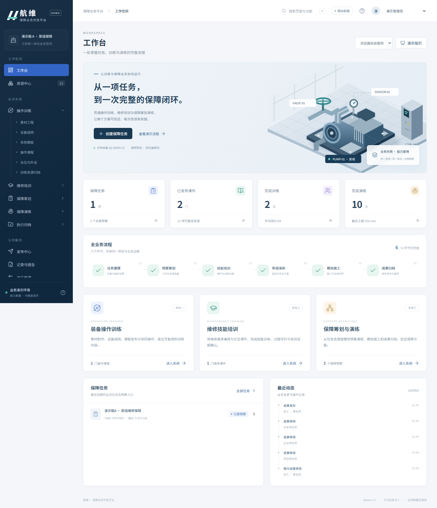
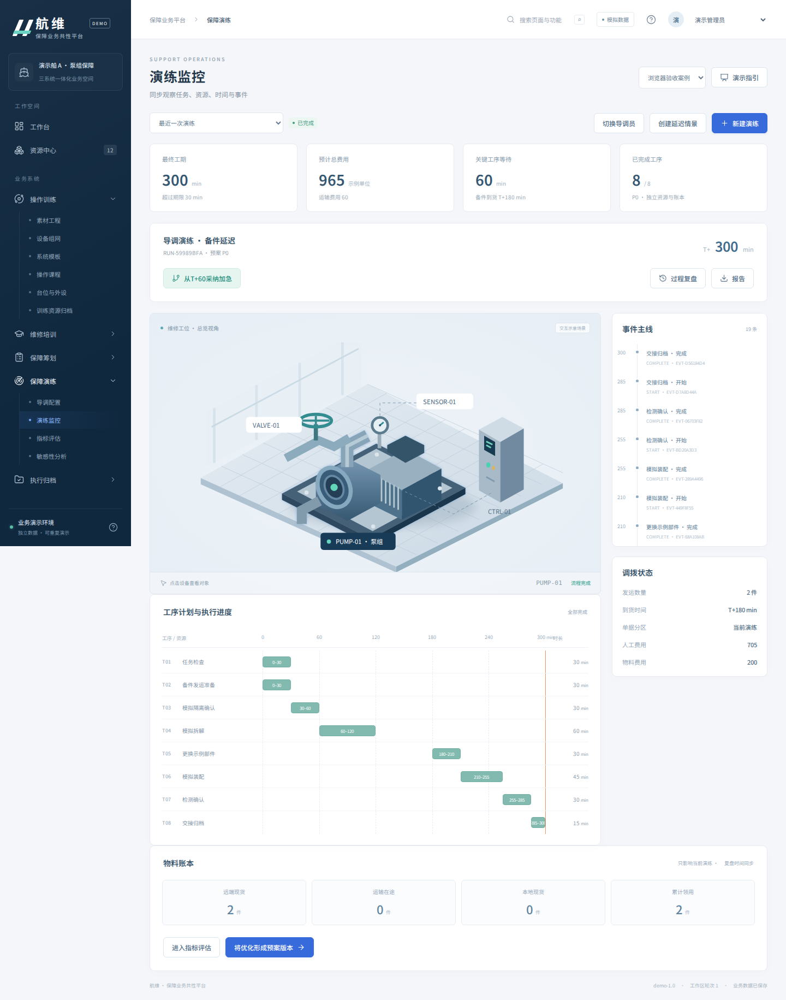

# UI设计说明

## 1. 视觉方向

以专业业务工作台为基准：深蓝导航提供稳定的结构，浅灰背景和白色内容面板承载业务信息，蓝色突出主要操作，青绿表示通过或完成，橙色表示等待与提醒，红色表示失败。避免大面积霓虹光效和装饰性大屏。

“航维”为本Demo展示名称。工作区固定展示演示对象、版本和身份，避免用户在跨系统跳转后失去上下文。

| 元素 | 规范 |
| --- | --- |
| 主导航 | 240px，公共空间与业务分组分层，当前页面保持明显高亮 |
| 页面标题 | 英文小型分区标签、中文主标题、一行任务说明 |
| 顶部操作 | 搜索、演示身份、工作区、演示指引 |
| 内容组织 | 指标 → 主业务对象 → 过程与记录，重点操作靠近对象 |
| 卡片 | 细边框、10～14px圆角、轻阴影，避免多层阴影堆叠 |
| 状态 | 颜色与中文文案同时表达，不仅依靠颜色 |
| 字体 | 随项目提供Noto Sans SC界面字符子集，系统中文字体作为回退 |
| 图标 | Lucide统一线性图标，按需引入 |
| 场景 | 代码绘制的泵组工位示意图，点击选择对象，状态与业务同步 |
| 数据图 | 甘特图、维修窗口、敏感性折线、费用对比，围绕具体业务问题 |

## 2. 页面类型

- **工作台**：业务入口、四项真实计数、六段流程、三系统入口、最近任务与事件。
- **资源和列表**：搜索、分类、资源卡片/表格、版本和审核状态；空状态提供下一步入口。
- **编辑器**：左侧对象树、中间场景与时间轴、右侧属性，场景配置与课程编排入口分明。
- **训练运行**：步骤列表、场景、当前操作和反馈、个人或团队评价范围；成绩完成后展示记录入口。
- **筹划演练**：关键指标、时间控制、场景和甘特图、右侧事件、下方物料账本。
- **施工归档**：阶段进度、职责动作、质量检查、整改记录与审批意见，历史记录保留。

## 3. 交互约定

业务动作先由后端验证，成功后更新快照并显示反馈。耗时发布有独立状态；错误信息使用可理解的业务说明。参数无效或缺少前置条件时保留当前业务记录。

模型转换、原生包发布、物理仿真在界面明确标为模拟能力；不把静态场景示意图称为真实VR渲染。实现细节集中在演示管理与开发文档，主要业务页面使用业务词语。

危险的“重置当前工作区”需要输入工作区名称。正常业务操作按流程直接进行。模态框支持Escape关闭，控件提供焦点样式和可访问名称。桌面使用多栏，窄屏转单栏并折叠导航；数据表和甘特图在各自容器内横向滚动。

## 4. 维护方式

所有颜色、间距、状态和响应式规则集中于`frontend/src/style.css`，页面优先复用现有类。共享组件在`frontend/src/components`。新增路由应登记`catalog.ts`，确保搜索与导航同时覆盖。

场景SVG与关键帧为可维护的前端代码资源；后续真实引擎接入时，用相同的对象选择和状态事件替换场景宿主。图标登记在`Icon.vue`，新增图标需明确导入，避免打包整个图标库。

字体来源为Google Fonts的Noto Sans SC项目，许可见`frontend/public/fonts/OFL.md`。当前子集覆盖代码中的界面文案，补充大量新文案时应重新生成子集或采用项目指定的完整字体方案。

## 5. 浏览器实测界面

以下为实际运行截图，业务指标来自完整案例命令执行结果。

