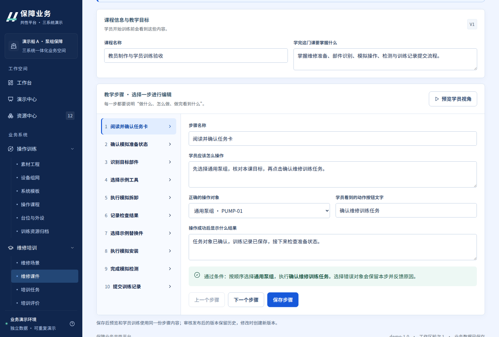
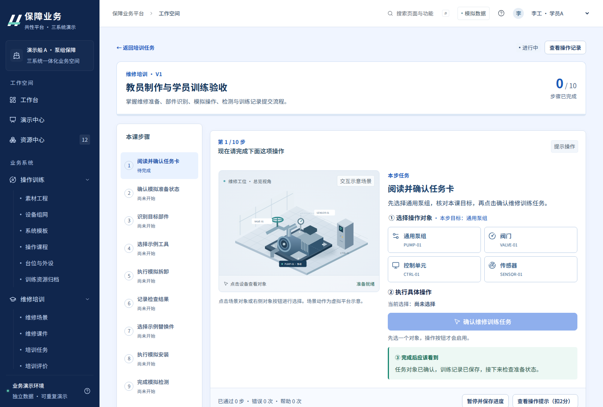
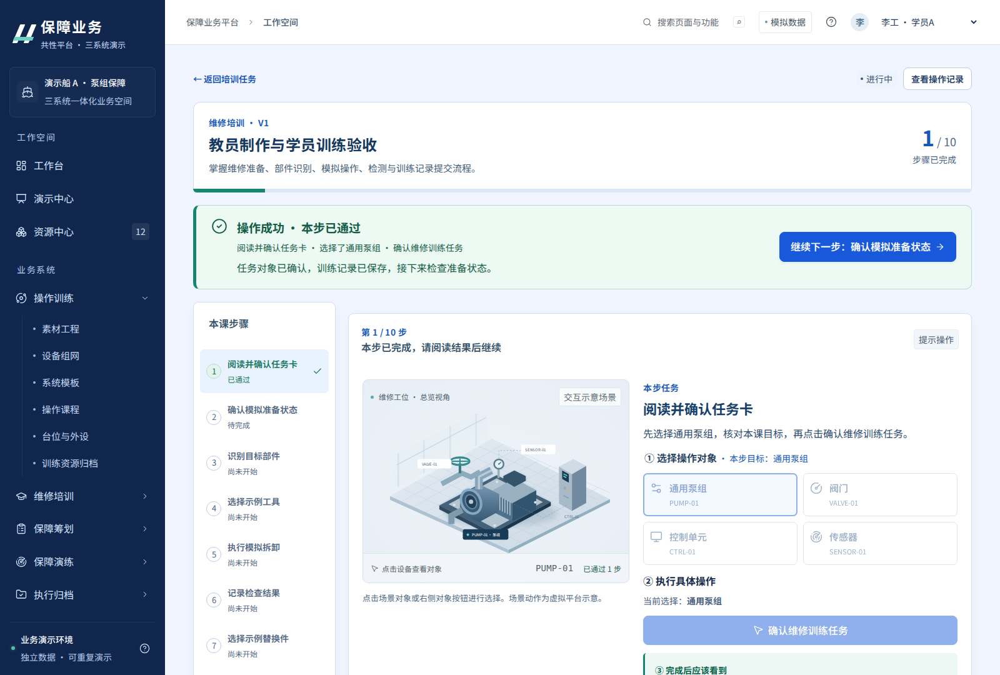
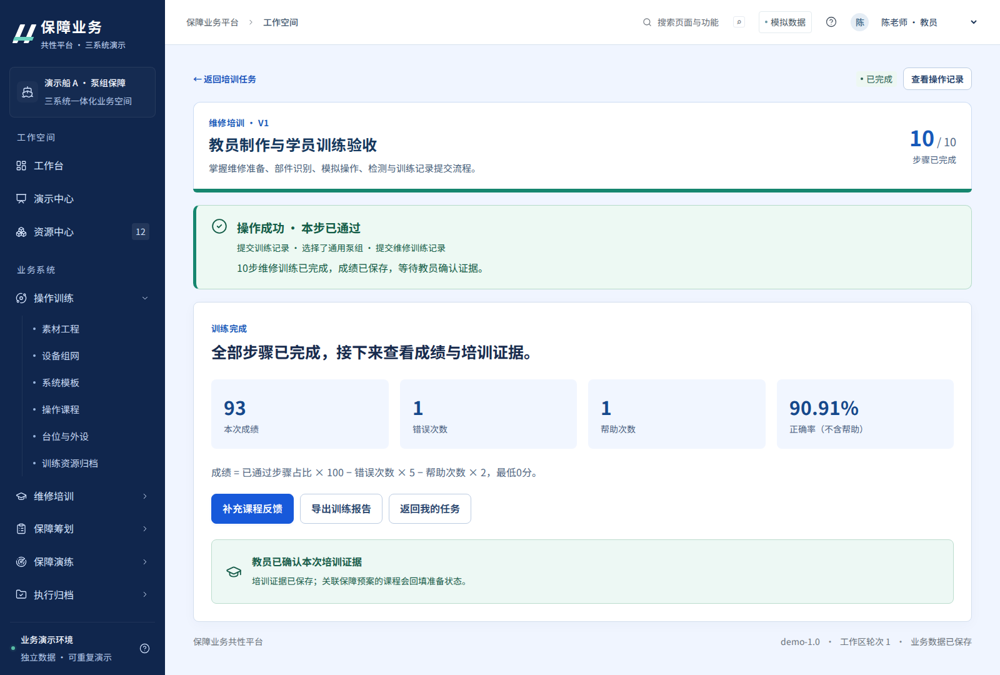

# Demo 1.2 业务流程优化说明

## 1. 本轮定位

保留1.1配色和字体，以教员课件制作及学员训练为重点，将业务指引直接融入使用页面。原有演示中心仍用于汇报讲解，不再承担实际业务页面的全部操作说明。

## 2. 教员如何制作课程

1. 从首页点击“教员：制作与发布课件”，明确进入制作身份。
2. 新建课程，填写课程名称、教学目标；维修课程可关联保障培训需求。
3. 在步骤列表选择一步，配置名称、学员操作说明、正确对象、动作按钮文字、成功后结果。数据不完整时阻止保存/提交。
4. 保存后点击“预览学员视角”，尝试选择错误和正确对象。预览不生成训练成绩或证据。
5. 提交审核；由另一位教员审核，可填写意见退回。制作者不能审核自己的课件；增加独立审核教员账号承接同一教员参与制作的情况。
6. 审核通过后直接发布。显示构建中、失败原因与重试入口，成功后提供任务分配。
7. 选择学员A/B分配，页面立即提示去学员任务或查看培训结果。已发布版本的修改通过修订草稿完成。

## 3. 学员如何训练

- 只显示当前学员被分配的任务，卡片说明目标、版本、步骤数、进度和下一动作。管理身份可查看全部任务。
- 开始前说明训练方式、计分规则和身份；默认提示操作、个人训练。
- 训练页面显示当前课程、当前步骤、进度；先选择对象，再点击具有业务含义的动作按钮。未选对象不能提交。
- 正确对象不再全部固定为泵组：新版操作课程涉及泵组、阀门、控制单元、传感器；维修课程依据步骤使用泵组、阀门、传感器。
- 操作成功后显示刚才的动作、结果及下一步骤，用户读完反馈后主动点击继续；不会让页面静默跳到另一项任务。
- 选择错误对象或提交错误动作时保留本步，明确说明错误原因和扣分；帮助说明扣分；技术故障不扣分。
- 暂停/刷新保留进度；同一任务存在运行/暂停中的尝试时，服务端拒绝再次创建，前端提供继续入口。
- 完成后显示成绩构成、错误/帮助次数、报告和反馈入口，明确区分“学员已完成”与“教员已确认证据”。

## 4. 数据和接口变化

新版课程增加 `interactionVersion=2`。每步保留原有字段，并增加 `actionId`、`actionLabel`、`expectedResult`。操作对象使用步骤自己的 `target`。

`training.action` 的PASS请求携带 `stepId`、`target`、`actionId`；后端校验目标对象和动作，事件保存实际对象、动作、结果说明与扣分。前端预览和正式训练复用同一个操作组件，正式成绩仍由服务端计算。

已有已发布课程不批量改写。旧课程未设置interactionVersion时，保留不要求actionId的兼容入口，前端补充必要的操作提示。完整演示案例生成器已使用新版步骤契约，原88分维修样例及保障工期/费用口径保留。

场景中的“步骤已通过”与设备“运行中”分开显示，避免确认任务后误以为设备已启动。VR渲染、物理效果仍使用假设平台能力。

## 5. 验证与限制

- 后端13项测试通过：原业务闭环10项，以及步骤对象/动作及反馈、重复训练保护、教学字段完整性与旧课程兼容3项。
- 页面端从空工作区走通制作、修改、预览、独立审核、发布、分配、训练、反馈和证据确认。
- 确认教员修改的说明和结果在学员端一致展示；错误对象保留当前步骤；完成10步、1次错误、1次帮助得到93分。
- 覆盖刷新、暂停/继续及390px训练页面无整体横向溢出。原34路由及演示中心回归继续保留。
- 本轮重点完成教员与学员链条；保障筹划/施工业务能力的既有缺口仍以原验证记录为准，不宣布全部AC验收完成。

## 6. 仓库目录与交付

实际源码位于仓库根目录的 `source/`。根GitHub Actions工作目录和缓存路径已调整到这一位置，并加入完整培训业务浏览器测试。

运行新版时使用本轮包中的JAR和静态文件，或进入source重新构建。原数据库可以继续使用；需要查看新版课程的具体动作模板时，从演示中心准备新案例或新建课程。

## 7. 实际运行页面

以下截图来自自动化操作的实际页面。

### 教员配置步骤

### 学员当前任务

### 操作结果与下一步

### 训练完成

