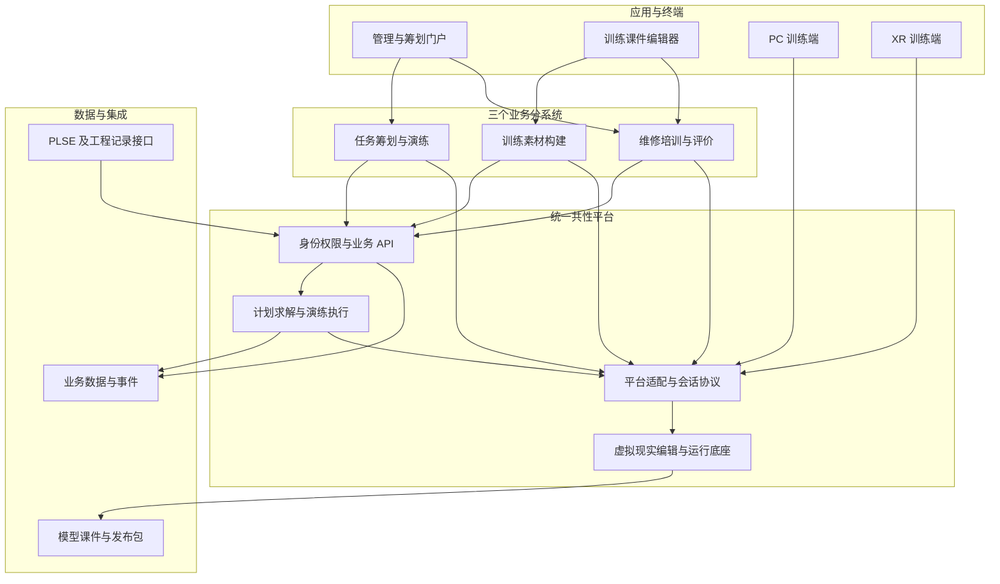
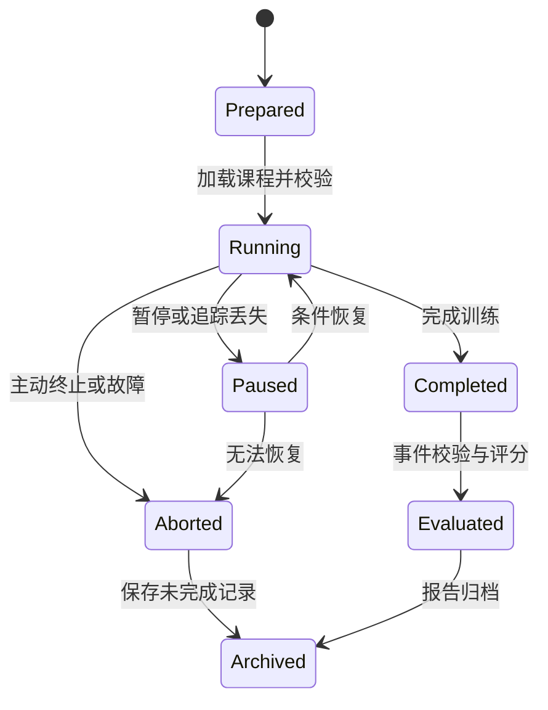
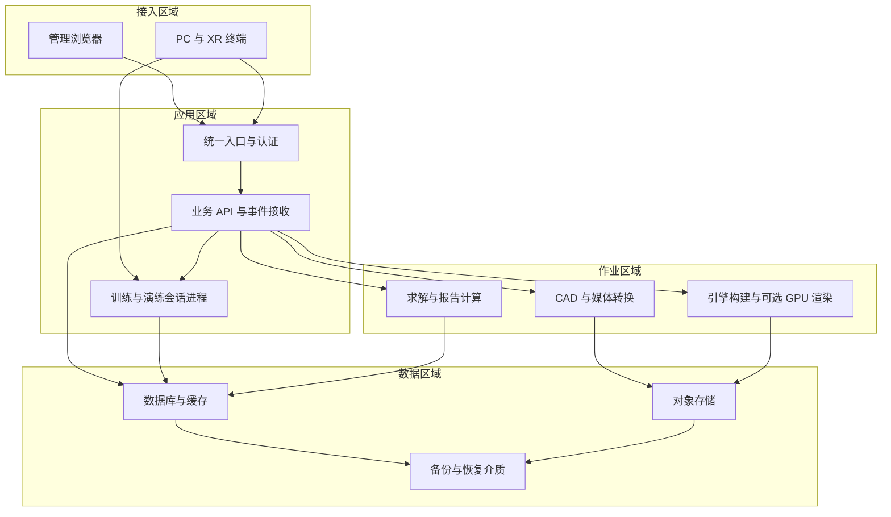

# 保障业务共性平台详细建设技术方案

**版本：V1.0｜日期：2026-09-21｜状态：技术设计评审稿**  
**适用阶段：平台选型验证、Demo 建设、正式系统设计与开发、集成验收**

> 本方案以《三系统功能列表.xlsx》为需求基线，以《保障业务共性平台建设方案汇报.pptx》为建设思路参考。采用“一个统一虚拟现实平台软件底座、三个业务分系统、一套共性数据与集成服务”的总体结构。虚拟现实平台可采购，也可基于成熟引擎自建；业务模型、数据标准、业务规则及对外接口由项目统一掌握。
>
> 文中标为“原始要求”的内容来自功能清单；“建议”表示本方案提出的设计或工程目标；“待确认”表示附件尚未明确。建议指标、估算周期、设备配置和 Demo 样本规模均不代表已确认的合同承诺。本次交付为设计文档，尚未完成软件实现或性能实测。

## 目录

1. [建设定位与范围](#1-建设定位与范围)
2. [需求基线与关键指标](#2-需求基线与关键指标)
3. [虚拟现实平台采购与自建路线](#3-虚拟现实平台采购与自建路线)
4. [总体架构与技术选型](#4-总体架构与技术选型)
5. [虚拟现实共性平台详细设计](#5-虚拟现实共性平台详细设计)
6. [系统一：装备使用及作战运用模拟训练构建](#6-系统一装备使用及作战运用模拟训练构建)
7. [系统二：装备维修保障技能虚实培训构建](#7-系统二装备维修保障技能虚实培训构建)
8. [系统三：保障任务筹划及行为演练](#8-系统三保障任务筹划及行为演练)
9. [统一数据模型与资产标准](#9-统一数据模型与资产标准)
10. [接口、事件与外部系统集成](#10-接口事件与外部系统集成)
11. [核心算法与评估口径](#11-核心算法与评估口径)
12. [Demo 建设范围与演示脚本](#12-demo-建设范围与演示脚本)
13. [正式系统部署与容量设计](#13-正式系统部署与容量设计)
14. [权限、安全与运行维护](#14-权限安全与运行维护)
15. [测试与验收方案](#15-测试与验收方案)
16. [实施计划、团队与交付物](#16-实施计划团队与交付物)
17. [成本构成、风险与待确认事项](#17-成本构成风险与待确认事项)
18. [58 个子模块需求追踪矩阵](#18-58-个子模块需求追踪矩阵)
19. [技术参考资料](#19-技术参考资料)

## 1. 建设定位与范围

### 1.1 建设目标

建设面向装备训练、维修培训和保障任务筹划演练的共性平台，使模型、场景、脚本、课件、资源、预案与过程数据能够按版本复用。平台同时提供面向业务人员的管理门户、面向内容制作人员的可视化编辑器、面向受训人员的 PC/XR 运行端，以及面向筹划人员和导调人员的计划与演练工作台。

正式系统需要完成以下业务闭环：

1. 模型及多媒体导入、校验、轻量化、审核入库，形成可复用资产。
2. 通过场景编辑、关键帧、可视化脚本与交互配置制作训练素材和培训课件。
3. 发布到 PC 与指定 XR 设备，组织训练，记录步骤级操作并生成评价结果。
4. 基于装备履历、任务和资源编制保障预案，开展资源受限的行为演练。
5. 将演练结果与实际工程记录按相同口径对比，形成经审核的新预案版本。

### 1.2 三个分系统的边界

| 分系统 | 原始清单范围 | 主要交付 | 依赖虚拟现实平台的方式 |
| --- | --- | --- | --- |
| 系统一：装备使用及作战运用模拟训练构建分系统 | 1 个模块、7 个子模块，重点为训练素材快速制作 | 动画、脚本、数字角色、特效、自然环境与光照制作能力及样例素材 | 使用统一编辑器与运行时，生成可复用素材包 |
| 系统二：装备维修保障技能虚实培训构建分系统 | 4 个模块、31 个子模块 | 资产管理、高保真场景、课件开发、多端培训及评价 | 使用同一资产库、场景编辑器、物理交互、XR 适配和发布服务 |
| 系统三：保障任务筹划及行为演练分系统 | 5 个模块、20 个子模块 | 任务与资源建模、筹划、导调、推演、对比评估和归档 | 将任务与资源绑定到三维实体，使用底座进行态势展示、行为呈现和复盘 |

系统一的名称涉及作战运用，但当前清单仅明确训练素材制作能力。完整战术规则、对抗裁决、毁伤模型、武器效能模型等不在本次已明确范围内，不能仅凭分系统名称推定需要建设。新增场景应通过需求变更单明确。

系统二提供培训级拆装和交互仿真。高精度结构强度、流体、热力学或工艺认证计算不由通用刚体仿真自动覆盖。系统三的调拨和施工进度首先属于模拟状态；实际业务写回必须另行明确接口权限和审批流程。

### 1.3 对初步 PPT 的继承与调整

| PPT 内容及位置 | 本方案处理 |
| --- | --- |
| 第 2～3 页：三系统、10 模块、58 子模块 | 保留，已按 Excel 逐项核对 |
| 第 2、4～7 页：TMAX3D、MakeReal3D、VMPro 分工 | 保留为候选采购线索，未验证其具体版本能力、接口、授权或报价 |
| 第 2、6 页：双平台集成 | 调整为一个统一逻辑底座，优先采用单一主运行时；只有专项能力缺口经过验证后才引入第二套工具 |
| 第 8～9 页：系统三自主开发 | 保留业务自主开发，同时明确其三维展示与复盘必须接入统一底座 |
| 第 10～11 页：数据贯通 | 转为可实现的资产引用、版本绑定、事件回流和审核机制；不是所有信息都能直接自动转换 |
| 第 12 页：采购后集成实施 | 增加需求冻结和 PoC 技术验证门槛，并增加自建平台路线 |

PPT 中“亿级三角面”“直接读设计院图纸”“全终端可用”等描述不作为已核实技术事实，也不替代 Excel 的验收指标。产品介绍、厂商演示和实际交付能力分别留证。

### 1.4 角色与主要工作台

| 角色 | 工作台与权限 |
| --- | --- |
| 平台管理员 | 用户组织映射、字典、终端登记、参数、运行监控 |
| 资产管理员 | 模型导入、转换任务、版本、质量审核、授权 |
| 内容制作人员 | 场景、动画、脚本、界面、数字角色、课件编排 |
| 教员 | 课程组织、训练房间、提示与纠错、训练记录、评价 |
| 学员 | 授权课程、PC/XR 交互、个人报告与问卷 |
| 筹划人员 | 任务剖面、资源匹配、预案、时间计划及方案比较 |
| 导调人员 | 演练启停、倍速、事件注入、异常处置、监控 |
| 评估与审核人员 | 指标体系、对比分析、预案审核、归档发布 |

## 2. 需求基线与关键指标

### 2.1 来源与编号规则

《三系统功能列表.xlsx》的有效内容位于 **Sheet1 第 1～71 行**；Sheet2、Sheet3 为空。第 1、10、46 行分别是三个分系统标题。58 个子模块为本方案的最小追踪单元，沿用原编号，例如 `2.2.11`。父模块中的整体要求同样纳入验收，不能只验收子模块名称。

采用以下编号：`REQ-原编号` 为需求，`AC-原编号` 为验收用例组，`Q01～Q21` 为关键指标，`D01～D10` 为 Demo 场景，`POC01～POC10` 为底座选型验证项。一个子模块可能需要多个实际测试用例。

### 2.2 原始量化要求及测试口径

下表完整保留父模块中的关键数量和时延门槛。原文存在“例子特效”“15中”等文字错误，按“粒子特效”“15 种”理解，最终由需求评审确认。

| 编号 | 原始要求 | 来源 | 建议验收口径及待明确点 |
| --- | --- | --- | --- |
| Q01 | 特效类型不少于 6 类，特效数据不少于 15 种 | B2 | 独立类型目录及 15 个可加载预设，逐一运行；同一效果改名不重复计数 |
| Q02 | 灯光类型不少于 4 类 | B2 | 建议方向光、点光、聚光、矩形/面光四类；分别调整颜色、强度及适用的范围/衰减参数 |
| Q03 | 支持 GB 级模型资源存储与管理 | B11 | 暂用至少 1 GB 单资产原文件验证分片、校验、恢复与版本管理；正式锁定最大文件及总库规模 |
| Q04 | 导入包括 FBX、OBJ、STEP 等不少于 3 种格式 | B11 | 三种均使用真实样本导入，不能仅以支持任意三种格式替代指定格式 |
| Q05 | 支持不少于 3 个级别的模型细分 | B11 | 暂按三级可管理细分解释，建议同时提供装配层级与三级 LOD 样例；“细分”究竟指层级、细分曲面或精度档位须确认 |
| Q06 | 资源检索响应不超过 3 秒 | B11 | 计时覆盖带权限过滤的查询到首屏结果，不含模型全量下载；数据量、并发量、冷/热缓存共同签字冻结 |
| Q07 | 模型精度满足设备及拆装维护，关键零部件支持精细模型 | B18 | 冻结关键件清单、拆装约束和允许误差；外观审查与可操作性共同验收 |
| Q08 | 模型纹理分辨率不低于 2048×2048 | B18 | 对约定需贴图的模型逐项检查，压缩前源纹理与正式运行档位分别登记；例外与降级须获确认 |
| Q09 | 同屏多边形面数不低于 1000 万三角面 | B18 | 用约定场景、固定视点和引擎统计验证，区别库内总面数、加载面数与实际渲染面数；不能以不可见模型凑数 |
| Q10 | VR 端合并分辨率不低于 4K | B18 | 冻结头显、单眼面板像素、合并定义及实际渲染分辨率，不能用桌面镜像窗口分辨率替代 |
| Q11 | 平均帧率不低于 30 fps | B18 | 原始下限保留；记录原生应用帧率及重投影情况，不用插帧冒充；持续 XR 训练另设更高的设备适配目标 |
| Q12 | 用户操作到场景响应延迟不超过 100 ms | B18 | 端到端输入至可见反馈实测，覆盖设备、运行时与必要网络环节，不能只测接口耗时 |
| Q13 | 材质球不少于 200 种 | B18 | 可加载、有分类和使用授权，覆盖金属、建筑、织物、自然等；不能仅列出名称 |
| Q14 | 支持一键发布 | B24 | 从审核通过的场景/课件发起后台构建，生成有版本及日志的可运行包；失败可定位 |
| Q15 | 可直接发布 MP4 格式影片 | B26 | 指定镜头与时段录制，验证音画、封装、分辨率、时长及播放兼容性；MP4 不承担交互课件功能 |
| Q16 | 不少于 2 种预设课件 UI 模板 | B33 | 至少引导训练、考核训练两种，均可配置并分别运行验证 |
| Q17 | 课件交互响应不超过 500 ms | B33 | 点击课件控件到反馈实测；涉及三维操作时同时满足更严格的 Q12 |
| Q18 | 支持文件、图像、三维动画、视频、音频等不少于 5 种媒体格式 | B33 | 按五种媒体类别各选至少一种格式验收，建议 PDF、PNG/JPEG、动画资产、MP4、WAV/MP3 |
| Q19 | 培训数据细到单次操作步骤 | B42 | 能定位学员、会话、课件版本、步骤、对象、动作、结果和时间，并追溯评分依据 |
| Q20 | 评估分析报告生成不超过 30 秒 | B42 | 从有效报告请求被受理到报告可下载，包含排队、计算、渲染；冻结报告模板与数据规模 |
| Q21 | 评估结果支持 Excel 等多维度导出 | B42 | 按课程、人员、时间等维度筛选，导出值与页面、明细一致；受数据权限控制 |

Q09～Q12 原则上应在同一约定硬件、终端模式及场景负载下联测。若客户将它们分配到不同终端或不同负载档位，应在签署的验收矩阵中明确，不能自行拆开以降低标准。建议同时保留平均值、P95/P99、最大值和违规次数；“不超过”指标不擅自改成只有 P95 合格即可。

### 2.3 非量化需求完整性

海洋风速、风向和波浪参数位于 B2 的父模块要求中，不能因 `1.1.6` 子模块未再次列出而遗漏。B19 明确 STL、单独贴图导入及模型材质、贴图、动画导入；B27/B38 明确键盘、方向盘和手柄；B28 明确多人互动、多种交流方式及行走、飞行、摄像机动画；B29 明确 MR、数据手套、头盔显示器与动态抓握；B31 明确六自由度通用约束。上述内容均纳入第 18 章矩阵及专项测试。

## 3. 虚拟现实平台采购与自建路线

### 3.1 “一个平台软件底座”的具体含义

平台底座至少包含：资产处理、场景编辑、关键帧、可视化脚本、材质与环境、物理交互、数字角色、多人协同、PC/XR 输入适配、发布构建、运行时 SDK 和过程事件采集。

统一底座并不要求所有模块处于同一个进程。CAD 转换器、GIS、物理引擎、打包服务可以作为组件接入，但应满足同一资产标识、场景版本、权限机制、运行会话和业务事件协议。三个分系统不能分别维护互不兼容的模型库和运行数据。

建议优先形成 **一个主编辑环境、一个主三维运行时、一个平台适配层**。Web 门户和 GIS 视图是底座的接入端；只有 Web 表单和统计大屏不足以满足本项目的虚拟现实平台要求。

### 3.2 两条路线的实现与责任

| 维度 | 路线 A：采购成熟平台并集成 | 路线 B：基于成熟引擎自建平台软件 |
| --- | --- | --- |
| 基础能力来源 | 厂商编辑器、运行时、转换及发布组件 | 选定一个成熟三维引擎，组合 CAD、XR、GIS 和媒体组件 |
| 我方开发重点 | 业务插件、适配层、统一管理服务、课程/训练规则、系统三、集成与验收 | 除路线 A 的业务内容外，自建可视化编排、资产流水线、编辑器扩展、发布中心和运行 SDK |
| 代码与数据控制 | 明确厂商代码边界，掌握我方业务源码、中立数据和项目工程 | 掌握平台业务源码与工程，但引擎及第三方组件仍受相应许可约束 |
| 主要风险 | 黑盒接口、额外模块授权、离线限制、资产迁出损失 | 图形/XR 人才要求高，编辑器产品化、转换兼容与性能调优工作量大 |
| 优先适用条件 | 样本 PoC 达标，SDK 完整，授权与交付边界可接受 | 成熟平台关键项不达标，或长期复用及自主扩展价值能覆盖投入 |
| 决策材料 | 厂商实测记录、接口样例、许可清单、缺口及整改承诺 | 自建 PoC、可用组件清单、差距工作量、团队和阶段预算 |

**本方案建议：先按统一能力清单做限期 PoC，再确定主路线。** 采购应采购可扩展的编辑与运行能力；自建应基于成熟引擎建设平台软件。自行从零开发渲染引擎、CAD 几何内核和 XR 驱动不作为默认项目范围。

### 3.3 采购路线的准入条件

以下条件为建议的采购技术门槛，需要在采购文件和合同中落实：

1. 支持约定网络环境中的安装、激活、开发、构建和运行，说明离线授权期限、硬件更换和服务中断处理。
2. 提供 SDK/API、事件回调、错误码、样例工程、开发文档和可用的调试方式。至少能访问稳定模型 ID、交互状态、步骤事件及发布结果。
3. 明确开发席位、编辑席位、运行端、并发房间、XR 终端、渲染节点、CAD 转换器、插件与升级维护的授权范围。
4. 能导出项目工程、资产元数据、模型层级和业务数据；明确材质、脚本、物理约束等迁出时不能保留的部分。
5. 使用客户样本完成 Q03～Q12 及目标设备验证，不能只提供预录视频。
6. 说明版本升级兼容策略、漏洞修复与故障响应，明确供应商退出时的持续运行方案及可取得的工程材料。
7. 全部厂商专有接口进入适配器，业务服务和预案数据不得直接依赖不可导出的私有场景字段。

PPT 提及的 TMAX3D、MakeReal3D、VMPro 可以进入候选清单；其能力、授权和联合部署可行性目前均标记为“待 PoC”。不预设必须购买两个平台，也不在缺少实测时给出厂商评分。

### 3.4 自建路线的组件与工作包

| 工作包 | 建设内容 | 达到可用平台的必要结果 |
| --- | --- | --- |
| 主运行时 | 评估 Unreal Engine、Unity 或满足环境要求的其他引擎，最终选择一个 | 可打开代表场景，PC 和指定 XR 设备可运行；版本冻结 |
| 编辑器产品化 | 层级、属性、资源拖拽、关键帧、UI、脚本图、预览、撤销重做 | 教员可按模板完成课程制作，不要求逐次修改源码 |
| 资产处理 | CAD 转换、装配结构保留、网格修复、LOD、纹理处理、缩略图 | 原文件可追溯，转换日志完整，关键件可交互 |
| 业务图执行器 | 定义节点、类型、端口、执行条件和运行事件 | 同一业务流程可在编辑预览和正式运行中一致执行 |
| XR 与外设 | OpenXR 接入、设备扩展、手势/手套标定及输入动作映射 | 指定设备上的抓取、释放、旋转、热点交互和误差记录 |
| 多人会话 | 房间、对象控制权、状态同步、语音/文字、重连 | 多人不会同时覆盖同一关键对象的状态 |
| 构建与发布 | 依赖锁定、目标平台构建、包校验、安装升级和回滚 | 在干净终端完成部署，重现已发布内容 |

采用 OpenXR 可以减少设备接口差异，但具体手部追踪、空间锚点、透视显示、数据手套仍需核验运行时与扩展能力，不能承诺所有头显无适配通用。[OpenXR 官方说明](https://www.khronos.org/openxr/)

### 3.5 同样本 PoC 与决策评分

| 编号 | 验证项 | 通过证据 |
| --- | --- | --- |
| POC01 | FBX、OBJ、STEP/STP、STL 及独立贴图导入 | 原文件、转换报告、层级/单位/材质前后对比 |
| POC02 | GB 级装配模型及关键件细节 | 完整传输记录、峰值内存、可选中零部件及资产检索时间 |
| POC03 | 1000 万三角面、4K、帧率、交互延迟联合验证 | 同配置性能日志、采样方法、设备记录与视频 |
| POC04 | 关键帧正播、倒播、跳播及脚本组合 | 状态快照和运行事件，不出现重复步骤或重复计分 |
| POC05 | 拖拽编排、六自由度约束和碰撞提示 | 现场编辑后运行，约束与反馈按配置生效 |
| POC06 | PC、指定 MR 头显及数据手套 | 实机执行抓取/释放/旋转，设备能力与故障降级表 |
| POC07 | 两人协同、控制权冲突与断线重连 | 房间记录、对象权属日志、最终状态一致 |
| POC08 | exe/目录包、目标 XR 包、MP4、断网运行 | 干净终端安装、运行与授权检查记录 |
| POC09 | API、步骤事件、单点登录和跨系统引用 | 可执行样例代码、接口日志、关联 ID |
| POC10 | 工程及数据导出、更换适配器样例 | 资产和元数据能重新入库；行为及材质损失清单明确 |

建议硬门槛包括部署授权、必需接口、约定设备、数据导出和关键性能。硬门槛全部通过后按功能覆盖 25%、性能 20%、开放与迁移 20%、开发效率 15%、五年总成本 10%、交付维护 10% 评分。每项按 0～5 分打分，总分为 `Σ(单项分/5×权重)`。供应商承诺尚未实测的项目不能按“已通过”计分。

若单平台存在缺口，优先补充 CAD 转换、媒体或硬件适配组件。必须双平台时，一个平台负责主要制作与运行，另一平台负责限定的离线处理或特定终端；同步交付资产转换、稳定 ID 映射、脚本重建及版本兼容测试，单独核算重复开发成本。

## 4. 总体架构与技术选型

### 4.1 逻辑架构



业务 API 管理已提交的事实、权限与版本；三维运行时负责渲染、输入和物理表现；训练判定服务管理步骤与得分；演练服务管理任务、资源和仿真时钟。渲染帧率不决定施工时长，客户端动画结束也不能自动代表实际任务完工。

### 4.2 建议技术组合

| 层次 | 建议方案 | 选择理由与边界 |
| --- | --- | --- |
| 管理门户 | Vue 3、TypeScript，表格/甘特/图表按需要选组件 | 适合资产、课程、计划和评价管理；不承担高保真 XR 渲染 |
| 业务服务 | Java 21 与经兼容验证的 Spring Boot 稳定受支持版本 | 便于统一实现事务、权限、集成和后台作业；立项时冻结准确版本 |
| 初期服务组织 | 模块化单体 API，加转换、求解、构建、会话等独立工作进程 | 控制早期部署复杂度，并隔离耗时、GPU、原生库和许可依赖 |
| 业务数据库 | PostgreSQL；有空间查询需求时增加 PostGIS | 统一关系数据、版本引用、空间要素和事务 |
| 文件与大对象 | 经授权和部署验证的 S3 兼容对象存储 | 管理原模型、媒体、课件包、快照和报告；产品在采购阶段确定 |
| 缓存与临时状态 | 可选 Redis，限制内存及键生命周期 | 存放令牌缓存、短期房间状态与进度；不作为唯一业务记录 |
| 可靠异步 | Demo 采用数据库任务表与 outbox；正式按吞吐引入消息队列 | 同库提交任务与事件，再异步投递；明确至少一次投递与幂等 |
| VR 平台 | 路线 A 的采购软件，或路线 B 的单一主引擎平台 | 对外实现同一项目协议；商业/开源许可单独审核 |
| CAD 转换 | 厂商转换器或 Open CASCADE 类组件，专有格式按需购买 SDK | 几何处理与业务 API 隔离；导入质量取决于文件与转换链 |
| GIS | 私有化二维/三维 GIS 组件和离线地图服务 | 地理与场景坐标分离；按实际数据及地图授权选择产品 |
| 求解与评估 | 独立算法工作进程，候选 OR-Tools；统计计算可用 Python | 固定输入、版本、随机种子与输出；不阻塞 Web 请求 |
| 可观测性 | 结构化日志、指标、链路追踪及业务审计 | 同时监控服务器、构建任务和客户端帧率/显存 |

产品与版本表需在 G1 技术选型评审后冻结，包括操作系统、引擎、插件、GPU 驱动、XR 运行时、CAD 转换器、编译器和数据库版本。此表不是承诺最新版本组合可直接兼容。

### 4.3 服务与数据所有权

| 逻辑模块 | 拥有的数据 | 提供的能力 |
| --- | --- | --- |
| identity | 本地角色、项目授权、外部身份映射 | 登录集成、数据权限、审计主体 |
| asset | 原文件、资产元数据、转换版本、部件映射 | 导入、预览、检索、授权、归档 |
| authoring | 场景、动画、行为图、UI 与课程草稿 | 编排、校验、版本发布申请 |
| training | 课程版本、培训会话、步骤结果、问卷 | 培训组织、评分、使用分析 |
| planning | 任务、资源快照、预案、审批和时间计划 | 筹划、匹配、求解、归档 |
| exercise | 演练实例、仿真时钟、导调命令、事件与快照 | 运行、监控、暂停、分支与复盘 |
| evaluation | 指标定义、算法版本、计算任务和报告 | 统计、敏感性、计划与实际对比 |
| integration | 外部映射、同步游标、质量问题与任务 | PLSE/工程系统接入、重试与对账 |

初期可共用一个数据库实例，但按模块分表或 schema，并通过应用接口完成跨模块修改。工作进程不得直接写其他模块业务表。业务拆分成微服务应由负载、独立发布和团队边界驱动。

### 4.4 必须落实的架构决策

| 决策 | 实施要求 |
| --- | --- |
| 业务自主 | 预案、资源、评分、流程版本存入项目数据库及中立文件，避免仅保存在引擎蓝图中 |
| 平台隔离 | 业务调用统一适配接口；对厂商接口、对象句柄、坐标转换进行封装 |
| 固定运行输入 | 训练与演练绑定资产、场景、规则、课程、预案和算法版本，运行期间不随编辑草稿漂移 |
| 两类时钟 | 保留真实时间与仿真时间；倍速演练不能改变真实用户响应统计 |
| 数据来源可见 | 模拟、人工录入、外部实绩、计算结果均带来源标记 |
| 内容也是交付 | 模型、贴图、动画、课程和验证样本与软件一同排期、审核、移交 |

## 5. 虚拟现实共性平台详细设计

### 5.1 资产导入和处理流水线

流程为：分片上传与哈希校验 → 文件与授权校验 → 格式解析 → 单位/轴向标准化 → 装配树提取 → 网格处理 → LOD/纹理派生 → 碰撞体生成 → 预览与质量检测 → 人工审核 → 发布可用版本。

原文件必须保留。派生文件记录 `sourceAssetVersion`、转换器版本、参数、耗时、三角面数、纹理大小和错误。转换任务采用 `QUEUED / RUNNING / SUCCEEDED / FAILED / CANCELLED` 状态；失败保留原因，重试生成新任务，不覆盖已有可用资产。大文件采用分片、断点续传、配额和超时管理，解压防路径穿越及异常膨胀。

| 输入类别 | 原始要求与处理方式 | 质量关注点 |
| --- | --- | --- |
| STEP/STP | 解析几何及可获得的装配、颜色、名称，三角化后进入运行资产 | 单位、装配实例、曲面误差、零件编号和关键件缺失 |
| STL | 读取三角网格并补充业务元数据 | 格式自身信息有限，不假定具有装配树、材质或动画 |
| FBX | 导入几何、层级及文件中存在的材质、贴图和动画 | 坐标、骨骼、动画、外部贴图路径和转换 SDK 许可 |
| OBJ | 导入网格、分组和关联材质/贴图 | 外部 MTL/纹理缺失、法线和单位 |
| 多媒体 | 图像、音频、视频、文档生成预览与缩略图 | 编码兼容、清晰度、大小、版权、字体与外链 |

Open CASCADE 的 XDE 提供装配及扩展属性交换能力，可作为自建 CAD 流水线的候选组件；是否满足具体 CAD 导出文件必须用样本验证。[XDE 官方文档](https://occt3d.com/dev/doc/overview/html/occt_user_guides__xde.html)

**对 B19 的处理：**“同时导入材质、贴图和动画”按源文件具备相应数据、格式及转换器能承载时实现；STEP/STL 等通用几何文件不能统一保证带有完整动画。建立格式能力矩阵，对动画采用 FBX/动画伴随包、对材质采用独立材质映射补充。替代导入路径须经客户确认，不能静默丢失或自行删减此要求。

### 5.2 模型层级、轻量化与稳定标识

资产至少支持“装备—系统—部件—零件”的业务层级，以及独立的场景实例树。一个零件可以在多个场景实例中出现。`componentId` 对应业务部件，`sceneEntityId` 对应场景实例，`engineObjectId` 是运行时临时句柄，三者不能混用。

轻量化按整体、部件和关键操作区分别设置策略。建议生成高、中、低三个 LOD 档，记录简化比、包围盒差异、关键孔位/连接面误差和材质保留情况。关键连接件可锁定不简化，远景结构允许更大简化。没有签署几何误差标准前，不给出“保留精度”的统一百分比承诺。

贴图处理包括尺寸校验、压缩、图集、重复去除、mipmap 和材质合并，但需保留 Q08 的约定纹理档位。不同 XR 设备的降级档单独发布。原始精细模型与轻量模型都能追溯同一部件；不因重新导入而造成脚本绑定失效。

### 5.3 场景和二维界面编辑器

编辑器提供场景树、视口、资源面板、属性面板、时间轴、脚本图、UI 画布、问题列表和预览功能。支持层级拖拽、变换、批量编辑、分组、撤销重做、自动保存、版本比较和发布前检查。

场景对象可配置：位置/旋转/缩放、部件绑定、材质、碰撞、物理质量、约束、交互热点、动作映射和可见性。UI 可配置面板、按钮、图片、透明度、文本、热点、动作与渲染视口区域。PC UI 采用鼠标/键盘布局；XR 使用空间面板、射线或近场交互，并单独设置尺寸、距离和遮挡规则。

场景编辑采用草稿锁或明确的协作冲突机制。多人训练与多人同时编辑是两项不同能力；清单要求的“多人在线互动”不自动包含完整协同编辑器。

### 5.4 关键帧与可视化行为脚本

动画数据包含对象、轨道、关键帧时间、插值、事件标记和起止状态。逻辑编排包含事件、条件、动作、分支、并行、等待、变量和终止节点；每个节点有类型化输入输出、错误策略与版本。

建议首批内置节点：点击/抓取/按键、设置变量、条件判断、播放动画、跳转时间、设置对象状态、触发特效、显示提示、语音讲解、等待确认、完成步骤、发送过程事件。脚本库按版本复用，升级前显示被引用课程清单。

动画倒播仅改变可视状态；训练业务回退由步骤状态机独立控制。跳播到目标时刻时先恢复对应状态快照，再计算必要的视觉状态。得分、操作完成、资源扣减等有副作用事件不随时间轴重复执行，采用事件幂等和明确的“训练重置”命令处理。

行为图发布前检查循环上限、未绑定对象、缺失变量、端口类型和不可到达节点。自定义脚本采用受限 API、运行时预算与白名单，禁止从课件任意执行操作系统命令、访问文件或外网。

### 5.5 特效、自然环境与光照

构建特效目录、参数模板和预览场景，交付不少于 6 类/15 种可运行效果。效果绑定触发条件、位置、持续时间、强度和恢复动作。示例可覆盖烟、火、射流、尾焰、粒子散布、破裂/破碎等，最终分类由评审确认。

自然环境支持导入地形与场景资源，组合桥梁、植被、船坞、码头、车间、船舱。海洋参数包含风速、风向、波浪大小；天气包含阴、晴、雨、雪、雾、霾、冰雹。建立参数合法范围、单位、预设、切换过渡和重置功能。

环境视觉效果与业务影响规则分别配置。画面出现大浪或降雨并不自行改变任务工期；需要影响演练时，导调规则明确哪些作业暂停、持续多久及恢复条件，并记录事件。

光照支持昼夜时段、大气参数和至少四类灯光。提供舱内、码头、车间等预设；光照烘焙、实时阴影和高成本效果分档，保持验收场景的可重复性。

### 5.6 刚体、约束、碰撞与拆装

对象具有静态/动态/运动学状态、碰撞体、质量和惯量等属性。六自由度约束按三个平移轴、三个旋转轴分别设置锁定、自由或限位，并配置阻尼、驱动和约束对象。

拆装交互采用“粗碰撞检测 + 精确装配位姿/步骤判定”：允许抓取不等于满足拆卸条件，模型靠近装配位不等于安装完成。业务规则检查前置步骤、目标部件、工具类型及姿态容差，完成后再提交步骤事件。碰撞支持颜色、声音等提示，防止连续接触导致重复播报。

复杂高面数可视模型使用单独简化碰撞体，关键区域保留更细碰撞代理。首次验证关注穿透、约束抖动、重物交互、抓握丢失和不同帧率下的一致性。物理效果用于培训表现时，工程结论由审核过的业务规则和专业模型提供。

### 5.7 数字舰员和虚拟教官

数字舰员采用角色、岗位、动作库和行为状态机，支持按预设脚本执行补位动作。虚拟教官根据已批准的课程步骤、错误码和帮助策略进行讲解、演示、引导与纠错。二者共享角色资源，但权限、行为与评价影响独立。

第一阶段采用确定性规则、预录音频/本地语音合成与动作模板。大模型问答可作为后续可选能力，必须绑定审核知识及出处，其回答不直接控制评分、判定资格或修改预案。用户清单未要求大模型，不将其作为 Demo 的前置依赖。

### 5.8 多人协同与外设适配

输入适配器将鼠标、键盘、方向盘、手柄、头显和手套映射为 `Select / Grab / Release / Rotate / Confirm / Cancel` 等业务动作。设备能力表记录支持的手势、追踪精度、固件、标定方式和扩展接口。

多人会话由权威服务维护成员、角色、课程版本、对象控制权与关键步骤。关键对象使用租约控制权或排他操作令牌，离线/超时自动释放并发出提示。姿态采用高频增量同步及插值；步骤、评分、任务状态走可靠事件。建议 PoC 姿态发送频率从 10～20 Hz 起测，根据带宽与视觉效果调整，渲染仍使用终端本地帧循环。

支持文字和语音两类交流，语音在约定网络内运行并单独控制录制授权。浏览模式包括行走、飞行及摄像机动画；VR 默认提供舒适的移动方式，强制镜头动画等模式由教员按终端能力启用。

### 5.9 多端构建与发布

发布状态为：`DRAFT → VALIDATING → BUILDING → TESTING → APPROVED → RELEASED`，失败进入 `FAILED` 并可从新构建任务重试。发布包包含资源清单、依赖版本、校验值、平台配置、运行权限和升级说明。

| 目标 | 交付方式 | 主要限制 |
| --- | --- | --- |
| Windows PC | exe 加资源目录或安装包 | 引擎运行库、驱动、授权和文件路径需在干净终端验证 |
| 指定 PCVR 头显 | PC 原生运行包加 XR 运行时 | 头显/显卡/驱动/接口组合共同验收 |
| 指定独立式 MR/XR 设备 | 对应操作系统及设备支持的应用包 | 单独裁剪资源、适配输入和性能，不能假定 Windows 包直接运行 |
| 浏览器门户 | Web 管理、模型轻预览、GIS | 不以轻预览替代原生高保真训练验收 |
| 浏览器高保真展示 | 可选内网视频流式渲染 | 增加 GPU、编码与网络延迟，需要单独核算 |
| 视频 | MP4 | 用于展示/教学记录，丢失交互和可编辑性 |

成熟引擎的发布通常需要针对目标平台编译、处理资源并打包，部分平台还依赖专用 SDK。因此“一键发布”应封装完整构建过程，并非同一个可执行文件在所有设备上通用。[Unreal Engine 打包文档](https://dev.epicgames.com/documentation/en-us/unreal-engine/packaging-your-project)

可选视频流式渲染由服务器运行三维应用，终端接收画面并上传输入，需单独配置串流基础设施。[Pixel Streaming 官方说明](https://dev.epicgames.com/documentation/en-us/unreal-engine/overview-of-pixel-streaming-in-unreal-engine)

### 5.10 过程记录与复盘公共能力

同时保存步骤事件、关键状态快照和必要的姿态轨迹。复盘通过最近快照加后续事件恢复业务状态，通过已记录变换重现关键物体位置；不依赖不同硬件重新计算刚体物理来获得完全一致的历史画面。

复盘界面包含真实/仿真时间轴、关键事件、视角、资源状态和指标。回看操作不产生新的培训完成事件。基于历史创建新演练时生成新实例和父实例关系，原始记录保持不变。

## 6. 系统一：装备使用及作战运用模拟训练构建

### 6.1 功能组织

系统一以“训练素材工程”为主对象，组合设备模型、动画、控制逻辑、脚本模板、数字角色、环境、特效和灯光。素材工程提供模板创建、编辑、预览、审核、发布和引用查询。

页面包括素材工程列表、关键帧编辑、可视化脚本、脚本库、数字角色配置、特效库、环境配置和发布记录。关键帧、脚本等实际编辑界面可以由采购软件提供，但门户应能定位其工程版本、权限及发布结果。

### 6.2 典型制作流程

1. 制作人员选择已审核装备模型，创建素材工程并固定资产版本。
2. 通过关键帧制作开关、旋转、移动等动作，定义标准开始和结束状态。
3. 从脚本库拖入事件、条件、动画和反馈节点，绑定模型对象与变量。
4. 配置数字角色、场景环境及光照，选取特效预设并设置触发条件。
5. 分别测试正播、倒播、跳播、重复触发和复位，检查对象及事件状态。
6. 审核后发布素材包，系统二以引用方式用于课件，系统三用于任务演练的表现层。

### 6.3 运行数据与交付边界

素材包包括 `assetRefs`、`animationClips`、`behaviorGraph`、`characterBindings`、`environmentPreset` 和 `effectBindings`，保存依赖版本及适用终端。素材包可以独立预览，但完整课程的学员、训练任务和评分由系统二管理。

默认交付通用装备操作素材及约定的样例工程。具体型号数量、每种装备动画数、角色动作数量、场景面积和完整课程数量，需要形成独立内容清单；58 个软件子模块不等同于无限量内容生产。

## 7. 系统二：装备维修保障技能虚实培训构建

### 7.1 培训模型资产管理

资产登记包括名称、类型、装备/部件编号、所有人、组织、标签、密级或数据等级、来源、许可、文件大小及版本。检索支持名称、编号、类型、标签与层级，并先进行权限过滤。

模型预览提供旋转、缩放、部件选中、隐藏/隔离和层级定位。文档、视频和音频使用隔离的预览组件。删除已被发布课程引用的资产时，应提示依赖并仅做停用或新版本替换；需要物理删除时按归档与保留策略执行。

### 7.2 高保真培训场景构建

采用第 5 章统一的模型、材质、场景、PBR、光照、界面、脚本、多人、XR 和物理能力。业务侧增加“维修对象—工具—工位—步骤”绑定、热点、拆装约束、碰撞提示和过程判定。

场景工程与资产库的编辑边界明确：修改位置或材质覆盖只影响场景实例；修改原模型几何生成资产新版本。关键零件修改后执行引用分析，列出受影响课程，不能后台替换所有在训课件。

### 7.3 多模态课件模型

课件包含：课程信息、章节、场景、步骤、媒体、交互规则、教学模式、评价规则和发布目标。每一步至少配置以下字段：

| 字段 | 作用 |
| --- | --- |
| stepId、name | 稳定步骤标识及名称 |
| prerequisites | 前置步骤、状态及允许分支 |
| targetComponentIds | 操作对象，绑定部件及场景实体 |
| allowedActions | 允许的设备动作与输入映射 |
| requiredTools | 工具类型及替代规则 |
| successConditions | 状态、顺序、位置/姿态容差或人工确认 |
| errorRules | 错对象、错顺序、超时等错误分类 |
| teachingContent | 文字、图片、文件、音频、视频和动画引用 |
| scoringRuleVersion | 步骤权重、扣分、重试及必过条件 |
| eventPolicy | 哪些动作记录，哪些只作为连续姿态采样 |

至少提供两种 UI 模板：引导训练模板显示当前步骤、帮助和纠错；考核训练模板按规则控制帮助，并在结束后展示评价。模板不改变课程事实与操作事件结构。

### 7.4 培训运行状态机



步骤使用 `LOCKED / READY / ACTIVE / PASSED / FAILED / SKIPPED` 状态。跳步是否允许、跳步如何扣分由课程规则确定；教员强制跳步单独记录。每次重新开始生成新尝试号，保留上一轮记录。

### 7.5 效果评价与反馈

训练记录同时保存原始事件与计算结果。建议基础指标为步骤正确率、关键错误数、完成时长、重试次数、帮助次数、课程完成率；主观问卷评价与客观操作评价分别展示。

可配置的示例评分为：`score = max(0, Σ步骤得分 − Σ规则扣分)`。各步骤满分之和、重复扣分策略及关键步骤失败时的结果由课程负责人批准。评分可重算，但必须记录新旧规则版本并保留原结果。

报告包括课程与资产版本、参与人、训练模式、操作时间轴、错误分布、评分依据及建议。支持 Excel 导出，并对同一筛选条件进行明细和汇总对账。离线训练未完整同步时显示“数据未齐”，不能生成看似完整的正式报告。

### 7.6 与其他系统的业务关系

| 数据关系 | 处理方式 |
| --- | --- |
| 系统一素材进入课程 | 引用已发布素材版本，制作人员补充步骤及评价规则 |
| 系统三预案形成培训需求 | 用工序、对象和技能要求生成课程配置草稿，教员审核后发布 |
| 培训记录反馈筹划 | 提供汇总表现、技能相关证据和建议，不直接覆盖正式人员资质 |
| 培训中发现模型/流程问题 | 建立反馈任务，修改后生成新资产、课程或预案版本 |

## 8. 系统三：保障任务筹划及行为演练

### 8.1 任务剖面、履历与信息资源

任务剖面以多级 WBS 树表达，节点配置目标、装备对象、故障/技术状态、维修范围、时间窗、验收要求与依赖关系。任务树可从模板创建，叶子节点应能够对应工序、资源需求和演练事件。

履历数据区分装备静态基础信息、动态使用数据、技术状态更改、维修记录、加改装记录及人工输入损伤。每条数据保留来源、业务发生时间、同步时间、外部编号和质量状态，人工更正不覆盖外部原记录。

信息资源管理涵盖 PLSE 构型、BOM、历史维修和故障数据，以及维修手册、标准和图纸。文档按型号、系统、维修场景和版本分类；手册内容解析、预览和检索可使用文本提取，但审核有效版本由业务人员确定。

### 8.2 保障系统及资源建模

| 资源类型 | 关键属性 | 动态状态及约束 |
| --- | --- | --- |
| 施工单位 | 名称、地址、联系方式、起重/施工设备、团队技能和修理能力 | 可承接范围、工作日历、在执行任务、有效期 |
| 人力 | 岗位、技能工种、等级、所属单位、资质 | 班次、占用、缺勤、可用时间、技能组合 |
| 工具与工装 | 型号、适用工序、位置、数量、校验有效期 | 在用、可调拨、维护中、运输时间 |
| 备品备件 | 物料编号、适配关系、批次、数量、库存地点 | 在库、预留、在途、消耗、补给到达时间 |
| 维修场地与仓储 | 类型、容量、空间位置和限制 | 预约、占用、禁用时间窗 |
| 码头、泊位与船坞 | 可容载条件、潮汐、吊装、供电供气和坞期 | 适配约束、时间窗、并发容量、维护状态 |

建立组织之间的送修、供应和运输关系，以带方向的关系表示发出单位、接收单位、业务类型及可用条件。资源可视化必须能够追溯数据来源和更新时间。

资源数量拆分为实际账面、计划预留、演练占用三套逻辑口径。演练初始化复制经确认的资源快照，后续注入短缺只改变当前演练实例。

### 8.3 单船全寿期修理结构筹划

以装备构型为分解依据，向下形成设备维修需求，再按停航窗口、资源能力和工程范围向上合并。设计五项能力：

1. **使用强度预测：**支持历史使用量、计划使用量、人工场景值，输出带单位与来源的强度曲线；无历史数据时采用显式场景假设。
2. **初始时间轴：**依据专业人员提供的维修周期、使用量阈值和可用窗口生成候选维修节点，支持手工调整。
3. **时机与范围统筹：**检查构型间依赖，将可合并的维修任务组合到候选窗口，显示合并理由及未满足条件。
4. **全寿期周期测算：**在给定规划起止期内生成各次维修窗口、工程范围、资源需求与版本对比。
5. **部署能力仿真优化：**保留原清单名称，暂按客户给定能力需求下的装备可用性与维修窗口统筹设计。依据“可用/维修/等待”等状态计算时间占比与能力满足情况，对候选修理方案比较和优化；具体能力定义、需求曲线与允许调整范围由客户确认。

生命周期、可靠性参数和修理规范必须由客户或专业单位提供，系统不凭模型外观推算故障率。Demo 采用明确标注的示例周期；正式系统支持替换参数、回溯来源和对比不同假设。

### 8.4 多任务与预案生成

多任务排序综合任务重要度、截止期、资源可行性与已有承诺。权重和规则可配置，但资源容量、技能、坞期及前后置关系作为硬约束独立处理，不能用高优先级抵消。

进坞替代方案包含候选设施、可用时间窗、适配检查、冲突及延迟差异；只有满足专业约束的候选项才能进入比较。系统输出原因与可行性，不将“得分最高”直接当成可执行结论。

预案检索先按型号/构型兼容、任务类别和有效状态过滤，再对相似特征排序，显示命中条件和差异。复用会创建新草稿，重新绑定当前装备、资源、日历和文档版本。无合适预案时按标准模板生成草稿；“智能生成”首先采用检索、规则和约束求解即可实现，不依赖大模型。

### 8.5 生产前准备与施工筹划

准备检查包括人员、物料、器材、设施、信息和计划六类。每项显示需求、可用量、匹配依据、缺口、到位时间、责任人及替代方案。缺少强制条件时不得发布为“可执行”。

施工总计划包含组织指挥关系、任务包、工序依赖、时间计划、资源分配和里程碑。三维保障要素绑定场景对象，GIS 要素绑定地理位置；双向点击能定位同一业务对象。支持基线与修订版比较，并冻结已下发执行或已用于演练的版本。

### 8.6 行为推演与虚拟调度

演练使用离散事件执行机制：任务就绪、资源申请、资源等待、作业开始、作业完成、调拨出发/到达、资源释放和导调注入构成事件。任务持续时间来自预案或有来源的分布参数，三维动作由事件驱动。

实例状态为 `CREATED → READY → RUNNING ↔ PAUSED → COMPLETED`，异常可进入 `FAILED` 或 `ABORTED`。支持初始化、开始、暂停、继续、倍速和结束。历史回退通过复盘或从快照创建分支实现，不逆向修改已有执行记录。

导调注入包含目标、仿真发生时间、影响持续期、参数、原因和操作者。可模拟资源不可用、交付延迟、额外维修任务等。系统重新检查计划可行性，生成调度建议；是否采用由导调人员确认并记录。

“就近调拨”先筛选规格、数量、授权、运输能力和到达期限，再按可行路径与到达时间排序，不能仅使用直线距离。Demo 可使用预设运输时长和路线，页面明确其来源；正式接入实际路网或经批准的运输模型。

过程监控同时展示三维场景、GIS、任务甘特、资源列表与异常列表。界面分别显示计划、演练和实绩，时间轴明确使用仿真时间还是实际时间。

### 8.7 实际工程对比与预案归档

演练数据与实绩通过项目、装备、任务、工序、资源和时间口径映射。原计划基线、演练预测、实际完成、修订计划分列保存，禁止用最终修订计划覆盖原基线后再计算偏差。

对比结果包含：工期与开始/结束偏差、资源消耗、备件满足、质量达标、成本预算和安全管控记录。没有实绩的指标标记为缺失，不填零、不生成“已验证有效”的结论。

预案归档状态为 `DRAFT → SUBMITTED → REVIEWED → APPROVED → PUBLISHED → ARCHIVED`，退回生成审核意见。归档包包含原始和优化预案、演练配置、运行事件、施工记录、评审报告、偏差、优化轨迹和验证结果。多级审核的级数、角色、回避规则及签名方式由客户确认。

发布新的预案版本后，旧版本可检索但不再作为默认新任务模板；已运行任务仍引用原版本。指标变化先形成优化建议，经审核后才能成为正式预案。

## 9. 统一数据模型与资产标准

### 9.1 核心实体及关联

| 领域 | 建议实体/表 | 核心关系与字段 |
| --- | --- | --- |
| 身份权限 | user_mapping、org、role、project_member、resource_acl | 外部身份到本地主体映射，角色与项目/资源范围 |
| 装备构型 | equipment、configuration_version、component、bom_relation | 装备拥有多个构型版本，部件与 BOM 关系按版本生效 |
| 资产 | asset、asset_version、asset_derivative、asset_component_map | 一个资产多个版本，一个版本多个目标平台派生文件 |
| 场景 | scene、scene_version、scene_entity、scene_binding | 场景版本包含实体，实体关联资产版本及业务对象 |
| 制作 | animation_version、behavior_graph_version、ui_template_version | 引用节点、变量、轨道、运行协议版本 |
| 课程 | course、course_version、course_step、course_dependency | 课程版本绑定场景、步骤、规则及素材版本 |
| 训练 | training_session、training_attempt、step_event、step_result | 会话与尝试下记录步骤事实，结果引用原始事件 |
| 问卷 | questionnaire_version、feedback、feedback_answer | 问卷版本固定，统计与客观成绩分开 |
| 任务 | support_task、task_node、task_dependency | 任务树及无环的工序依赖图，关联装备对象 |
| 资源 | resource、resource_capability、resource_calendar、resource_relation | 人员、器材、设施及供应运输关系 |
| 库存与占用 | stock_snapshot、resource_reservation、simulation_allocation | 实际来源快照、计划预留和演练占用分开 |
| 预案 | plan、plan_version、plan_operation、plan_assignment、approval_record | 版本包含工序、资源、时间计划、组织关系和审核 |
| 演练 | exercise、exercise_input_snapshot、exercise_event、exercise_snapshot | 实例绑定完整输入，事件顺序和状态快照可追溯 |
| 评价 | metric_definition_version、evaluation_run、metric_value、report | 保存算法、权重、输入范围、结果与缺失说明 |
| 实绩 | actual_record、external_mapping、comparison_baseline | 外部项目/工序映射到本地对象与固定对比基线 |
| 集成及作业 | integration_job、sync_cursor、data_quality_issue、outbox_event、consumer_receipt | 数据同步、错误隔离、幂等与事件投递 |
| 发布审计 | build_job、release_package、terminal_installation、audit_log | 包校验、终端版本、发布操作及审计 |

主键使用项目统一生成的 UUID 或等效全局标识。业务编号与外部编号独立保存，避免以后因客户编号规则调整而破坏引用。业务行至少包含项目范围、版本、创建/修改者、时间和有效状态；资产等对象增加数据等级与来源。

### 9.2 几何、地理和时间规范

建议中立三维数据采用米制、右手坐标、Y 轴向上；各引擎在适配器中做轴向、长度和旋转变换，禁止在业务代码散布转换常量。模型保留原单位与源坐标元数据，并配置已知尺寸样件测试，避免毫米当米。

GIS 数据保存原始坐标参考系及转换记录；场景以局部原点和本地坐标表达，通过固定变换与地理位置关联。需要测量或路线距离时采用适合区域的投影或测地算法，不能把经纬度差直接视为米。大场景按分块与局部坐标控制精度。

数据库业务时间建议存 UTC，界面按项目时区显示，默认项目时区待确认。另存 `simulationTimeMs`、`clientMonotonicMs` 和服务端接收时间，分别用于推演、端侧耗时和数据到达分析。跨机延迟测量先校时，最终端到端验证优先采用同一测量时基。

### 9.3 中立资产与场景包

建议归档包包含：`manifest.json`、原文件引用、预览模型、部件映射、业务场景 JSON、行为图 JSON、课程规则、材质映射、碰撞/约束参数和权限元数据。发布端另生成引擎原生包。

glTF/GLB 可用作网格、材质和部分动画的交换载体。glTF 核心规格不定义动画播放顺序等运行行为，因此业务状态、逻辑脚本和物理约束必须另行保存与适配，不能承诺一次导出即可完全迁移平台。[glTF 2.0 规范](https://registry.khronos.org/glTF/specs/2.0/glTF-2.0.html)

地理大场景需要流式组织时，可评估 3D Tiles；它解决空间三维数据组织与传输问题，不承担维修业务流程定义。[OGC 3D Tiles 标准](https://www.ogc.org/standards/3dtiles/)

示例清单如下，字段是本项目拟定义的协议：

```json
{
  "schemaVersion": "1.0",
  "packageId": "course-demo-pump-001",
  "packageVersion": "1.0.0",
  "sourceType": "DEMO",
  "courseVersionId": "cv-demo-001",
  "sceneVersionId": "sv-demo-001",
  "assetVersions": ["av-demo-001"],
  "behaviorVersionId": "bv-demo-001",
  "scoringRuleVersionId": "rv-demo-001",
  "coordinateSystem": {"unit": "m", "handedness": "right", "upAxis": "Y"},
  "requiredCapabilities": ["rigidBody", "constraint6Dof", "stepEvents"],
  "targetProfiles": ["PC", "PCVR"],
  "files": [{"path": "scene/scene.json", "sha256": "<构建时计算>"}]
}
```

能力清单采用必需/可选标记，运行端缺少必需能力时拒绝启动并指出原因。清单采用摘要和签名校验，不能把可修改的 JSON 当作授权依据。

### 9.4 版本、并发与保存

草稿采用乐观锁 `revision`；保存时提交 `expectedRevision`，冲突返回当前版本并引导比较。已发布资产、课程、预案和指标版本不可原位覆盖。停用版本可阻止新会话使用，但历史记录仍需可读。

发布或运行前生成依赖锁定清单。对象存储路径使用稳定标识和版本，原文件名只作为显示名称。数据库与文件写入采用暂存、校验、确认、清理的状态流程；避免数据库已发布而文件尚未成功上传。

事件按会话/演练及时间分区，建立 `(sessionId, producerId, sequence)`、`(exerciseId, serverSequence)` 等索引。原始姿态数据可分段压缩存入对象存储，数据库保存索引；是否保存全量手部轨迹、音视频及保留时长需确认。

## 10. 接口、事件与外部系统集成

### 10.1 业务 API 基本约定

采用 HTTPS 与版本化路径 `/api/v1`，结构化数据使用 JSON，大文件独立上传。每次调用携带认证信息、关联请求 ID 和项目范围；项目权限由服务端根据主体校验，不信任客户端传入的角色。

| 接口建议 | 输入/输出要点 | 一致性及失败处理 |
| --- | --- | --- |
| `POST /assets/uploads` | 文件元数据、大小、摘要 → 分片上传凭据 | 按资源范围授权，上传会话到期可恢复或重建 |
| `POST /assets/{id}/conversions` | 源版本、处理配置 → jobId | 幂等键，相同请求不重复转换 |
| `GET /assets` | 条件、游标、排序 → 授权结果 | 分页、稳定排序、过滤后计数 |
| `POST /scene-versions/{id}/builds` | 目标终端与构建配置 → jobId | 返回 202，异步状态、错误日志与取消 |
| `POST /training-sessions` | 课程版本、模式、参与人 → sessionId | 固定依赖和规则，校验用户及终端权限 |
| `POST /runtime-tickets` | 会话、终端 → 短期一次性启动票据 | 消费后失效，不在启动链接放长期令牌 |
| `POST /training-sessions/{id}/events:batch` | 事件批次 → 接收/重复/拒绝/缺序结果 | 按事件 ID 和生产者序列去重，不用客户端时钟做唯一键 |
| `POST /plans/{id}/solve-jobs` | 版本、资源快照、目标与限制 → jobId | 可取消，输出可行性、目标值、耗时及求解状态 |
| `POST /exercises` | 预案版本、资源快照、规则/种子 → exerciseId | 初始化校验全部输入，不接受浮动“最新版本” |
| `POST /exercises/{id}/commands` | 命令 ID、期望序号、动作及参数 | 命令权限、幂等、过期拒绝和执行回执 |
| `GET /exercises/{id}/snapshots` | 目标仿真时间 → 快照与事件范围 | 支持复盘与重连，限制可见字段 |
| `POST /evaluation-jobs` | 数据范围、指标/模板版本 → jobId | 区分培训报告和批量敏感性作业 |
| `POST /integration/import-jobs` | 来源、数据集、映射版本 → jobId | 校验、隔离错误行、对账、可审计重试 |

统一错误包含 `code`、`message`、`traceId` 和可处理的字段详情。常见错误区分未授权、版本冲突、依赖缺失、能力不支持、任务超时、数据不全。外部展示不泄漏服务器路径和内部堆栈。

### 10.2 平台适配接口

接口由项目定义，采购与自建运行时分别实现，不能只对厂商文档中的方法改名。

| 能力 | 适配命令/事件 | 必要规则 |
| --- | --- | --- |
| 能力发现 | `getCapabilities()` | 返回版本、终端、物理/XR/媒体能力及限制 |
| 内容加载 | `loadPackage(packageId, version)` | 校验权限、签名、依赖和资源摘要，异步报告进度 |
| 实体绑定 | `resolveEntity(sceneEntityId)` | 保持业务 ID 稳定，避免把引擎临时句柄暴露给业务服务 |
| 视觉控制 | `setEntityState`、`playClip`、`setEnvironment` | 携带命令 ID，支持确定的完成/失败回执 |
| 交互绑定 | `bindAction(actionId, inputProfile)` | PC 与 XR 映射到相同业务动作 |
| 运行事件 | `interactionPerformed`、`stateChanged`、`runtimeError` | 附带会话、版本、对象、动作与来源 |
| 状态恢复 | `applySnapshot(snapshotVersion)` | 校验会话和序号，恢复时不再次触发业务完成事件 |
| 生命周期 | `start`、`pause`、`resume`、`stop` | 状态合法性验证，终端关闭仍保存已确认记录 |

本机嵌入可以使用受控 IPC，浏览器嵌入使用明确来源校验的消息桥，跨机使用加密网络协议。具体承载方式由底座 SDK 能力决定；无论哪种方式都使用一致的数据结构和契约测试。

### 10.3 事件规范与可靠处理

以下为步骤操作事件示例，ID 为示例值：

```json
{
  "eventId": "evt-demo-00042",
  "eventType": "training.step.performed",
  "schemaVersion": "1.0",
  "projectId": "project-demo",
  "sessionId": "session-demo-01",
  "attemptId": "attempt-01",
  "producerId": "terminal-01",
  "producerSequence": 42,
  "actorId": "trainee-demo",
  "courseVersionId": "cv-demo-001",
  "stepId": "step-05",
  "componentId": "component-demo-01",
  "sceneEntityId": "entity-demo-008",
  "action": "CONFIRM",
  "occurredAt": "2026-09-21T02:00:00Z",
  "clientMonotonicMs": 125430,
  "simulationTimeMs": 30000,
  "sourceType": "DEMO",
  "payload": {"observedState": "ASSEMBLED"}
}
```

客户端提交“观察到的动作”，权威判定端根据固定规则生成 `training.step.evaluated`。在线模式采用服务端或可信会话进程判定；离线模式由签名发布的规则包本地计算，回传后复核并标记来源。客户端上传的分数不直接成为权威结果。

业务事务与 outbox 同库提交，投递失败重试；消费者用 eventId 或自然幂等键记录处理结果。消息按至少一次投递设计，禁止宣传网络端到端天然“恰好一次”。同一演练的命令由权威进程串行确定顺序，不要求所有系统事件全局排序。

重复事件返回已有回执；乱序事件暂存并请求缺失序号；发现缺口无法恢复时标记会话不完整。断线重连先取得快照与最后确认游标，再补传事件。离线状态不合并到仍由其他人运行的协同房间，而是形成独立会话或显式恢复流程。

### 10.4 PLSE 与实际工程系统接入

PLSE 的真实接口文档尚未提供。“标准化 API”在本方案中指项目定义统一适配契约，不代表对方已具备相同 REST 路径。

| 数据集 | 建议同步内容 | 主数据原则 |
| --- | --- | --- |
| 装备与构型 | 型号、装备、构型版本、系统与部件层级 | 外部系统为来源，本地保留编号映射及变更历史 |
| BOM | 零件、数量、上下级关系、生效时间 | 使用构型版本和单位进行校验 |
| 履历与故障 | 使用量、状态变更、维修/改装、故障记录 | 区分发生时间、修订时间与同步时间 |
| 技术资料 | 手册、标准、图纸及版本 | 授权获取，文件与元数据同时追溯 |
| 资源及库存 | 人员能力、物料、设施、时间窗 | 筹划使用有时间戳的快照，模拟不覆盖实账 |
| 实际工程记录 | 工序、计划/实际起止、消耗、质量和成本 | 保留外部原记录，统一工序与计量口径后比较 |

优先使用 API 增量同步；无可靠增量机制时采用受控全量差异比较。每批记录同步游标、数量、成功/失败、摘要及对账结果。晚到或更正数据触发受影响报告的“待重算”标记，不静默改写已发布报告。

Demo 提供可替换的模拟适配器和模板文件导入。正式对接需完成认证、字段字典、分页、时间、限流、错误码、网络策略和联调样本确认；不能把模拟接口的通过视为 PLSE 联调完成。

## 11. 核心算法与评估口径

### 11.1 资源受限计划

用工序开始时间 `s_i`、持续时间 `d_i`、结束时间 `e_i=s_i+d_i` 和资源分配变量表达计划。至少实现：前后置约束、人员技能与班次、互斥设备/工位、累计资源容量、物料可用时间、设施适配与时间窗。

依赖工序满足 `s_j ≥ e_i`；同一互斥资源上的工序不能重叠；累计资源任一时刻使用量不超过可用容量。物料为消耗型，工具/工位为可复用占用型，不能用相同的资源释放逻辑处理。

优先输出可行计划，再优化逾期、总工期、成本和负载均衡。各指标先约定单位和归一化尺度，再设置权重。结果返回 `OPTIMAL / FEASIBLE / INFEASIBLE / UNKNOWN / CANCELLED` 等明确状态。超时找到可行解时注明尚未证明最优；无解时输出经过检查的冲突说明，不编造具体冲突证据。

OR-Tools 的官方作业车间示例展示了工序前置和设备互斥约束，可作为实现参考；本项目的技能、物料、时间窗和替代设施需要额外建模与验证。[OR-Tools 调度示例](https://developers.google.com/optimization/scheduling/job_shop)

Demo 先采用规则排序与可行性检查，保留求解接口；正式阶段引入约束求解，并使用已知可行/无解样例交叉验证。不能把排序列表直接称为完整优化计划。

### 11.2 预案相似检索

将硬性兼容条件作为过滤器，将任务类别、对象、维修范围、资源结构和工期区间作为可解释相似特征。示例 `similarity=Σ(w_k×featureScore_k)`，权重和特征版本固定。结果显示差异项，复制预案后强制重新校验当前资源及构型。

语义向量检索可用于文档辅助检索，但不替代结构化兼容性校验。缺少已审核预案时返回无合适模板，并进入新建流程。

### 11.3 基础指标字典

以下为建议口径，需业务评审确认。每个指标都保存时间范围、单位、分子分母、缺失处理与版本。

| 指标 | 建议计算 | 边界处理 |
| --- | --- | --- |
| 工期偏差率 | `(实际或演练工期−基线工期)/基线工期` | 基线为零则不可计算；演练与实绩分列 |
| 备件满足率 | 按需求时点可满足数量/该时点需求数量 | 按物料单位分组；不能直接累加不同比例和单位 |
| 人员工时利用率 | 分配作业工时/同期间可用工时 | 明确是否计入培训、等待和加班 |
| 设施利用率 | 占用时长/可用时长 | 排除停用时间并说明并发容量口径 |
| 任务按期完成率 | 按期完成任务数/纳入考核且到期任务数 | 未到期和取消任务按规则剔除 |
| 质量达标率 | 通过检验数量/已检验数量 | 无检验记录不能视为全部达标 |
| 成本偏差率 | `(实际成本−预算成本)/预算成本` | 成本分类与含税口径一致，预算为零不可计算 |
| 出库效率 | 经确认的出库完成数量/有效处理时长 | 计量单位和作业种类分组统计 |
| 保障检测率 | 已完成规定检测项/应检测项 | 适用项由任务与标准版本确定 |

安全管控按批准的检查项、违规事件、整改闭环及红线规则单独展示；不能用综合高分抵消明确的未通过项。

### 11.4 层次分析、模糊评价和 DEA

功能清单 B68 提及三类专业算法，正式版本应提供相应的计算配置、输入校验、过程和结果说明，而非只放算法名称。

| 算法 | 输入与计算设计 | 使用条件与验收 |
| --- | --- | --- |
| 层次分析法 AHP | 指标层级、判断矩阵，求取权重并计算一致性诊断 | 展示矩阵与权重；一致性阈值由评估专家确认，不通过时阻止发布权重 |
| 模糊综合评价 | 等级集、隶属函数/规则、指标权重、合成算子 | 显示标准化值、隶属矩阵和合成结果，以手工可复核的小样例验算 |
| 数据包络分析 DEA | 一组可比较的决策单元、投入/产出指标、方向及规模报酬假设 | 配置 CCR/BCC 等选定模型，说明相对效率及参照集合；样本可比性与数量由专家确认 |

零值、负值、缺失和量纲处理写入指标版本，不做未披露的数据变换。缺少可比样本时 DEA 结果显示“不具备计算条件”，但算法功能仍需使用专用测试集完成正式验收。Demo 的单个演练不作为 DEA 有效性证据。

综合评价使用基础事实加专业方法形成结果，系统不能保证采用某种算法后即可消除主观性。权重、参数和样本选择都必须可解释、可复算。

### 11.5 敏感性分析与对比

敏感性分析改变资源数量、工时、到货时间等可控输入，重新求解或推演，观察工期、缺口及综合评价变化；不直接修改最终分数制造趋势。

Demo 选择备件到达时间和人员数量两项，设定基线与上下扰动，生成结果表和变化曲线。正式支持单因素、组合情景及有依据的随机试验。每次记录输入差异、种子、算法版本与运行状态。

可使用有限差分近似 `S=(Δ输出/基线输出)/(Δ输入/基线输入)`；分母为零时改为绝对差值并标注。阈值或排序改变时展示对应可行性变化，不能只给一条平滑曲线。

实际工程对比必须选择相同对象、工序范围、计量单位和基线版本。数据映射覆盖率和缺失率随报告一起显示，偏差原因支持人工审核补充，不把相关性直接认定为因果关系。

## 12. Demo 建设范围与演示脚本

### 12.1 Demo 目标与样本

Demo 的目标是证明虚拟现实底座可用、关键交互真实、三系统数据可关联，以及正式系统具备可延伸的实现路径。Demo 不等于 58 个子模块全部交付，也不代表通过正式性能和外部集成验收。

建议使用“码头/车间内通用泵组检查与维修培训”作为贯穿场景，所有型号、参数、人员和履历均为示例或经授权样本。该场景只验证通用操作、培训和维修流程，不引入额外作战效能建模。

| 样本 | 建议 Demo 配置 |
| --- | --- |
| 三维场景 | 1 个简化码头/车间场景，1 套可拆装设备，约 20～50 个可识别部件，其中至少 5 个可交互 |
| 模型与媒体 | FBX、OBJ、STEP/STP、STL 各有样本；图片、文件、音频、视频、三维动画各有样本 |
| 训练内容 | 1 个素材工程、1 门课程、8～12 个步骤、引导与考核两种 UI 模板 |
| 数字角色 | 1 个补位角色、1 个规则驱动教官角色 |
| 任务与资源 | 1 个任务剖面，约 10～20 个工序；2 个施工单位、约 10 个人员样本、若干工具/备件和 2 个设施候选 |
| 预案与演练 | 基线预案、资源短缺方案各 1 个；至少 1 次导调注入及重新筹划 |
| 终端 | 2 台 PC；至少 1 套指定 VR/MR 头显。数据手套可在专项 PoC 验证，未完成前标记为未验证 |
| 对比数据 | 1 份标记为示例的工程实绩文件，用于验证导入、映射和偏差计算 |

关键性能另备 GB 级模型和千万三角面测试场景，不使用小型演示场景证明高负载指标。素材样本与压力样本的用途在交付清单中分开。

### 12.2 分层实现状态

- **D：Demo 核心实现。** 在限定样本上通过真实接口、计算、保存和运行完成，正式版本仍需扩展范围与性能。
- **V：Demo/选型专项验证。** 用独立样例验证底座能力，未必进入主演示流程，不能视为正式全量交付。
- **F：正式阶段完整建设。** Demo 只明确入口、数据结构或设计，不以静态页面冒充实现。

第 18 章对 58 个子模块逐一标注 D/V/F。所有 F 项仍属于正式建设范围；D/V 标签不降低客户原始要求。

### 12.3 十个可重复演示场景

| 场景 | 操作与链路 | 可见结果与验收证据 |
| --- | --- | --- |
| D01 资产入库 | 上传真实模型，完成转换、结构树、预览和版本保存 | 重新登录可查到资产；部件编号、摘要和转换日志存在 |
| D02 素材制作 | 新建关键帧，拖入条件与动画节点，配置环境/光照 | 现场修改参数后预览生效；正播、倒播、跳播不重复发业务事件 |
| D03 课程制作 | 引用 D02 素材，配置 8～12 步、媒体、热点与两类 UI | 课程规则可保存、校验并生成 PC 发布包 |
| D04 PC 培训 | 按步骤操作，故意触发错顺序/错对象，再完成操作 | 记录错误、教官纠错、评分与报告；数据来自本次运行 |
| D05 XR 与协同 | 真机抓取/释放/旋转，另一 PC 加入同一会话 | 关键对象同步、控制权冲突提示和断线恢复 |
| D06 任务筹划 | 导入示例履历，分解任务，匹配人员/物料/设施 | 显示缺口、生成有约束检查的时间计划和预案草稿 |
| D07 导调演练 | 启动预案，注入备件晚到或资源不可用 | 仿真时钟、任务等待及资源变化同步到三维/GIS，接受一项重排建议 |
| D08 培训关联 | 从预案工序定位课程，查看 D04 的训练证据 | 通过装备/工序/课程版本关联，展示建议，保留人工审核 |
| D09 复盘与对比 | 定位导调前后时间点，导入示例实绩，运行两项敏感性情景 | 时间轴、指标偏差、来源标签和结果变化可复算 |
| D10 归档与恢复 | 审核发布预案，重启服务后重新打开课程/报告 | 版本、事件、报告持久保存，可复原到同一发布内容 |

建议正式汇报采用约 25～35 分钟的主演示，D05 的设备标定、模型转换耗时和大模型压力测试单独安排。演示录屏仅用于备份，现场应能操作真实系统。

### 12.4 必须真实实现与可使用样例的边界

必须真实实现：三维交互、模型选取和部件绑定、可视化脚本执行、发布与运行、步骤采集、结果计算、任务资源校验、导调后的状态变化、跨系统 ID 关联、数据持久化。

允许使用明确标注的样例：装备资料、人员、库存、维修时长、实际工程记录、离线地图、预案模板。PLSE 可以用模拟适配器，但页面及报告注明“模拟接入”。不使用固定图片或预设最终分数冒充实时运行结果。

Demo 可简化：全量材质/特效资源供给、完整全寿期预测、全规模优化、多类型外设、完整 DEA 样本分析、多人规模扩展和生产高可用。正式项目必须按原始要求补齐并验收。

### 12.5 Demo 通过标准

1. D01～D10 有记录可重做，主演示涉及的数据跨重启保持一致。
2. 模型不是视频贴图，场景修改能够改变运行结果，PC 与指定 XR 真机均有执行证据。
3. 连续运行两次训练可区分不同会话，事件重传不重复计分，异常中断保留记录。
4. 更改资源或注入延迟后，计划/演练与指标发生可解释变化。
5. 每个功能标明 D/V/F 和当前状态，全部模拟数据均可识别。
6. 对未通过的性能、设备、发布、授权和迁移 PoC 列出问题及决策，不以业务演示成功掩盖底座缺口。

### 12.6 Demo 向正式系统迁移

保留并强化资产 ID、包规范、版本模型、事件协议、权限结构及适配器代码。将演示数据置于独立项目空间，生产初始化时不迁移演示人员、库存和成绩。

需重点重构或补齐：演示用脚本中的硬编码、仅单机适用的房间状态、缺少签名的离线包、未持久化的任务、模拟接口、临时评分和未经专家确认的算法参数。以数据库迁移脚本、接口兼容检查和数据迁移演练完成升级，不能直接把演示环境改名作为生产环境。

## 13. 正式系统部署与容量设计

### 13.1 部署拓扑与进程分工



终端、会话进程及作业区只开放所需连接，语音/实时状态通道经认证和网络策略控制。外部集成通过受控接口区进入，转换器不直接访问生产主库。引擎编辑器、Windows 打包器和专用授权工具按厂商支持的操作系统部署，不假定所有工作负载可放入 Linux 容器。

### 13.2 初始资源建议

以下是用于组织压测的起始配置，附件未提供真实并发、设备和资产规模，不能作为最终采购清单。

| 环境/角色 | 起始配置建议 | 用途与调整依据 |
| --- | --- | --- |
| Demo 业务节点 | 8～16 vCPU、32～64 GB RAM、约 1 TB 可用 SSD | 数据库、API 和小规模任务；大模型转换必要时独立 |
| Demo 图形工作站 | 8 核以上 CPU、32～64 GB RAM、16 GB 显存级独显、NVMe | 编辑、PCVR 及性能基线；具体 GPU 必须经 Q09～Q12 实测 |
| 正式业务节点 | 起始 2 台，每台 8～16 vCPU、32 GB RAM | API 冗余和滚动发布；根据并发与接口压测调整 |
| 数据库 | 起始 16 vCPU、64 GB RAM、低延迟 SSD，另设复制/恢复资源 | 数据量、事件写入与报表负载决定扩展；高可用需验证切换 |
| CAD/媒体工作节点 | 16～32 vCPU、64～128 GB RAM、本地临时 SSD | 大文件转换峰值，限制并发及单任务配额 |
| 构建/渲染节点 | 根据引擎、目标平台和并发实测配置 CPU/GPU | 构建与交互渲染独立排队；可选渲染节点不默认必配 |
| 文件存储 | 按资产、派生包、事件、报告和备份公式测算 | 原始模型、版本、发布包和副本可能超过业务数据库占用 |
| 网络 | 有线千兆作为小规模测试起点；存储/分发按实测升级 | XR 串流、多人会话和批量分发分别测带宽及抖动 |

容器可承载业务 API、部分工作进程和辅助服务。是否使用 Kubernetes 取决于现有运维体系与节点规模；Demo 可使用 Compose 或等价脚本。状态数据库、对象存储、授权服务及 GPU 节点各自设计故障处理，不能仅通过增加 API 副本声称整体高可用。

### 13.3 容量估算方法

- **资产存储：**`Σ原文件 + Σ各版本各终端派生文件 + 发布包 + 预览/报告 + 保留轨迹`，再计入副本、备份及建议不少于 30% 的空闲余量。
- **事件量：**`并发人数 × 人均事件频率 × 平均事件字节 × 运行秒数`，再计入索引、复制和保留期。
- **姿态网络量：**`人数 × 每人对象数 × 同步频率 × 单条编码字节 × 接收扇出`，另加语音、协议与重传开销。
- **渲染 GPU：**`所需独立交互会话数/单 GPU 经实测可承载会话数` 向上取整，再考虑冗余；多个观看者共享画面不等于多个独立交互会话。
- **转换并发：**由单任务峰值 RAM、CPU、临时盘和转换器授权席位共同限制。

示例：50 名同时在线学员，每人每秒 2 条、每条 1 KB 的步骤事件，运行 8 小时约产生 **2.88 GB** 原始载荷，不含索引与副本。若直接把高频手部姿态作为 JSON 全量上传，体积可能大幅增加，因此步骤事件与姿态流应分开预算。此处采用十进制 KB/GB，50 人仅为容量测算假设。

### 13.4 故障、恢复与升级

建议正式业务数据恢复目标先以 RPO≤15 分钟、RTO≤4 小时进行方案评估，最终按客户运行要求和成本确认；二者不是已完成验证的承诺。定义数据库日志备份、对象版本/副本、发布包备份与异机恢复步骤，并至少执行一次整链恢复演练。

会话进程故障时由已持久化事件及快照恢复至最后确认点；未被服务端确认的动作可能需要终端补传，不能承诺所有瞬时姿态零丢失。重启后采用租约/隔离令牌防止同一演练出现两个权威执行进程。

发布以数据库兼容迁移、服务版本、协议版本和运行包依赖共同管理。课程新版本不强行替换正在进行的会话；回滚服务时保证事件 schema 可读。编辑器与运行时升级先在验证环境跑代表课程和性能用例。

## 14. 权限、安全与运行维护

### 14.1 数据权限与审计

采用角色权限与项目/组织/资源范围叠加，权限覆盖查看、编辑、下载原文件、发布、组织训练、导调、评价、导出和审核。接入已有身份系统时优先使用对方支持的标准认证协议或受控身份映射；不复制存储外部明文密码。

模型预览、文件下载、构建产物、API 和运行票据都执行同一授权决策。下载采用短有效期凭据；角色变更和授权撤销需使新请求及时失效。对无法联网的终端，使用限定课程、用户/终端、有效期和允许次数的离线授权，并声明其撤销时效限制。

审计保存主体、动作、对象、版本、时间、来源终端、结果和必要的变更摘要，涵盖模型授权、课程发布、教员干预、导调、指标权重变更及预案审核。运行日志与业务审计分开，备份恢复后仍可关联。

### 14.2 文件、脚本与终端

对上传内容执行类型校验、大小限制、压缩包校验及可用的恶意内容检查。CAD/媒体转换在隔离工作进程运行，限制资源、文件目录和网络权限。文档预览禁止执行宏和主动内容，外部链接按环境策略处理。

课件自定义脚本与插件使用审核、签名和受限接口。运行包与终端更新做完整性检查，禁止仅凭本地修改配置获取管理员/导调权限。重要密钥和连接凭据保存在受控配置中，不打入可分发课件包。

XR 终端处理追踪丢失、手套失联、边界退出、暂停和退出动作。涉及实体道具的 MR 场景先做锚点标定与偏差提示，错误定位时暂停相关训练。具体可接受误差按训练要求和设备能力验收。

### 14.3 部署环境要求

在需求冻结时确认网络类型、数据分类、是否允许联网、操作系统/CPU/GPU、国产化要求、地图来源以及适用的保密或安全管理要求。本方案不把普通内网部署表述为已满足某项认证；需要专项测评时纳入正式项目工作包。

配置、字体、地图、模型、语音和依赖包在目标网络可获得。安装、授权、更新、日志导出和恢复均需做断网验证，不能只测试服务器关公网后主页面可打开。

### 14.4 运行监控

监控 API 时延/错误率、数据库与文件存储容量、消息积压、转换/构建队列、求解超时、报告生成耗时、会话心跳、事件缺口、终端帧率和显存。阈值按压测基线设置，告警包含对象及关联 ID。

运维手册至少覆盖服务启停、许可证故障、转换失败、模型损坏、会话恢复、数据补传、备份恢复、版本回滚和日志取证。程序崩溃、数据不齐、算例不可行属于不同问题，界面与告警应给出不同处理路径。

## 15. 测试与验收方案

### 15.1 验收层次

| 层次 | 验证内容 | 交付证据 |
| --- | --- | --- |
| 需求与接口 | 58 子模块、父级要求、字段与协议 | 需求追踪矩阵、用例、接口契约和评审记录 |
| 资产内容 | 格式、几何、层级、材质、媒体和授权 | 对比图、结构映射、资产清单与审核记录 |
| VR 功能 | 编辑、动画、物理、XR、外设、多人、发布 | 可运行工程、原生安装包、设备和操作记录 |
| 业务正确性 | 状态机、资源约束、评分、算法与实绩对比 | 已知结果样例、输入/输出快照、计算日志 |
| 性能与容量 | Q01～Q21 及约定并发 | 原始采样、硬件软件清单、报告与异常记录 |
| 故障及安全 | 权限、重传、恢复、回滚、离线授权 | 故障注入记录、审计链、备份恢复结果 |
| 用户验收 | 制作、培训、筹划、导调、评价的端到端操作 | 用户演练记录、问题闭环、签署的验收结论 |

### 15.2 固定验收基准

正式压测前冻结以下基准，全部作为验收报告附件：

1. 模型文件、哈希、场景版本、可见/加载/渲染三角面统计方式、纹理、灯光、阴影、特效与物理对象数量。
2. CPU、RAM、GPU、显存、存储、头显及手套型号、显示模式、固件、驱动、引擎和运行时版本。
3. PC 与 XR 的渲染分辨率、单眼与合并口径、动态分辨率、插帧/重投影、串流与压缩设置。
4. 并发人员、房间、资产数、模型大小、课程步骤数、事件量、预案工序数和报告规模。
5. 网络带宽、往返时延、抖动、丢包、测试时长、预热与采样方式。
6. 每项指标统计方法、允许失败次数、异常剔除规则以及共同运行还是独立运行条件。

建议首轮基准先采用 1 万条资产元数据、50 个管理并发、20 个训练并发作为负载假设，以目标环境压测后调整。客户若要求更大规模，应重新计算容量与排期；不能把这些建议值写成源清单已有要求。

### 15.3 专项测试方法

| 测试 | 方法与判定 |
| --- | --- |
| 大模型与格式 | 准备 GB 级 CAD 装配和各格式样本，检查完整上传、转换状态、丢件、轴向、缩放、层级和关联贴图；记录转换时间但不虚设清单未给出的时间上限 |
| 1000 万三角面 | 固定视点和路径运行负载场景，保留引擎统计与资产清单；明确是单眼/双眼、主通道或其他计数，禁止重复统计阴影等通道来凑几何量 |
| 分辨率与帧率 | 记录头显物理参数与渲染提交尺寸，连续运行建议 30 分钟，分别记录原生 FPS、帧时间和重投影；原始平均帧率门槛仍为 30 fps |
| 100 ms 交互 | 建议采用高帧率摄像、输入触发标记或等效端到端测量，记录输入到可见变化；服务端日志只用于分段定位，不能替代整链测量 |
| 500 ms 课件 UI | 对按钮、媒体打开、步骤切换等典型动作采样，从用户输入到反馈计时；涉及三维动作同时执行 100 ms 用例 |
| 3 秒检索 | 权限过滤、模糊/精确查询、分页及冷/热缓存组合测试，返回完整首屏；下载加载模型另行记录 |
| 30 秒报告 | 使用约定培训记录量，从请求受理到文件可下载计时，覆盖排队；大批量敏感性求解作为独立作业不冒用单份培训报告结论 |
| 多人协同 | 同时抓取、顺序操作、掉线、重连、权限变更，核对对象控制权、事件数量及最终状态 |
| 动画状态 | 正播后倒播、跨片段跳播、暂停重开、多动画同对象冲突，检查视觉状态和业务事件无重复 |
| 发布 | PC exe/目录、XR 包、MP4 分别在干净设备验证；没有编辑器、断外网、许可证异常均覆盖 |
| 数据可靠性 | 注入重传、乱序、漏序、服务重启、网络中断、队列积压，核对步骤数、得分、资源占用与报告 |
| 仿真算法 | 使用可手工验证的小任务、资源不足和无解样例；暂停/倍速不改变逻辑结果，随机模式固定种子 |
| 权限与泄露 | 不同组织/项目/角色访问资产及报告，检查接口、直链下载、运行票据和导出均受控 |

建议增加 XR 舒适性和设备适配目标：在选定设备常用刷新档位下尽量稳定运行，并评估追踪、运动和输入体验。这是对 Q11 原始下限的补充，不代表将 30 fps 视为适合持续沉浸训练的目标。

### 15.4 覆盖、缺陷与放行

正式验收执行 `AC-1.1.1` 至 `AC-3.5.5` 的全部 58 个用例组，并执行 Q01～Q21。每组记录软件版本、输入、操作、期望、实际、日志、截图/视频和责任人。

建议放行条件为：范围内需求均有证据；阻断性和严重缺陷清零；一般缺陷明确影响与修复计划并经项目方接受；部署、备份恢复及交接演练完成。设计文档中的“覆盖”只说明已有实现设计，实际验收状态须由测试执行填入。

## 16. 实施计划、团队与交付物

### 16.1 阶段与决策门

以下周期为样例充分、关键人员到位情况下的初步估算。平台采购、设备到货、外部接口和模型制作可能成为关键路径，最终以工作量评估和合同节点为准。

| 阶段 | 建议周期 | 主要工作 | 退出条件 |
| --- | --- | --- | --- |
| G0 需求与样本冻结 | 1～2 周 | 明确范围、设备、指标口径、代表模型及外部接口 | 需求/样本/待确认项责任人确定 |
| G1 底座 PoC 与路线选择 | 2～3 周 | POC01～POC10、SDK 与许可确认、自建原型 | 关键门槛通过或形成可接受的整改计划，选定主路线 |
| G2 Demo 实现 | 约 8～10 周 | 公共数据骨架、模型与课程、筹划推演和主演示 | D01～D10 通过，F 项和能力缺口明确 |
| G3 正式一期 | 采购路线在 Demo 后约 3～4 个月；自建路线约 5～8 个月 | 资产制作流程、训练编辑运行、系统三主流程、权限和接口 | 约定一期需求通过测试，可小范围试用 |
| G4 正式补齐与试运行 | 采购路线再约 1～2 个月；自建路线再约 3～4 个月 | 58 项补齐、内容生产、算法、性能、设备、恢复与验收 | 全量需求、内容、设备和运维交付闭环 |

G0/G1 部分工作可与内容样本制作并行，G2 的筹划业务骨架可提前开发，但大规模课程制作应在主平台与资产标准冻结后进行。自行建设底层渲染引擎不在以上周期内。

### 16.2 Demo 任务拆分

| 工作包 | 建议时间窗 | 依赖 | 可评审交付 |
| --- | --- | --- | --- |
| W01 工程与协议 | 第 1～2 周 | G1 输出 | 数据库骨架、API/事件 schema、适配 SDK 接口、环境脚本 |
| W02 资产与内容 | 第 1～4 周 | 客户样本、主平台 | 代表资产、部件树、动画、场景、课程素材 |
| W03 编辑与发布 | 第 2～5 周 | W01/W02 | 模板、可视化脚本、PC 包与发布记录 |
| W04 培训与 XR | 第 3～6 周 | 课程样本、实机设备 | 操作、错误、教官、协同、事件与报告 |
| W05 筹划与演练 | 第 2～7 周 | 任务/资源 schema | 预案、约束校验、导调、状态推送与复盘 |
| W06 数据贯通 | 第 5～8 周 | W03～W05 | 版本关联、模拟接入、实绩导入与对比 |
| W07 验证与汇报 | 第 8～10 周 | 主链路可运行 | 演示包、测试证据、缺口清单和正式实施拆分 |

每个工作包进入迭代前明确负责人、输入样本、完成标准和联调方。进度以可运行结果及验收证据衡量，不以页面数量衡量。

### 16.3 团队与分工建议

| 角色 | 采购路线建议配置 | 自建路线增量重点 |
| --- | --- | --- |
| 产品/业务分析 | 1 人，客户领域专家定期参与 | 同等投入，补充编辑器产品设计 |
| 架构/技术负责人 | 1 人，可承担部分后端或集成 | 需要图形与运行时架构负责人协同 |
| Java 后端/集成 | 2～3 人 | 增加资产与发布平台实现能力 |
| Web 前端 | 1～2 人 | 增加流程图、编辑器属性和复杂交互能力 |
| 三维/XR 开发 | 2 人左右 | 增加约 2～3 人，覆盖引擎、物理、设备和运行 SDK |
| 三维内容/技术美术 | 1～2 人起，按模型和课程量扩展 | 同等或更高，承担资源规范及优化 |
| 测试/实施 | 1～2 人，运维按阶段投入 | 增加设备、渲染性能和兼容性测试投入 |
| 算法/专业评估 | 阶段性 1 人及客户评估专家 | 与业务规模有关，两路线都需要 |

人数按角色工作量组合，不要求全部岗位全周期满编。Demo 可以兼岗，但 Java/Web 人员不能独立替代图形、XR 和内容制作能力。正式人月按任务估算汇总，避免仅用“58 个模块×统一单价”估计。

### 16.4 交付清单

1. 需求规格、设计说明、58 项追踪表、指标口径和变更记录。
2. 业务源码、平台适配器、构建脚本、部署脚本、数据库迁移、版本锁定清单。
3. 采购平台安装介质、许可文件、SDK、接口文档、样例工程及约定的技术支持资料。
4. 模型原文件和派生文件、装配/部件映射、贴图、材质、动作、特效、场景和课程工程，附来源及使用授权。
5. PC 与指定 XR 发布包、离线运行包、MP4 示例及终端兼容表。
6. API 说明、事件规范、外部字段映射、模拟适配器和正式对接测试记录。
7. 算法参数、指标体系、专业审核记录、可复算样例及结果说明。
8. 功能/性能/安全/故障测试报告、缺陷关闭证据和验收记录。
9. 用户、内容制作、教员、筹划导调和运维手册，配套培训和交接记录。
10. 备份恢复包、恢复演练记录、监控配置和后续维护边界。

## 17. 成本构成、风险与待确认事项

### 17.1 成本测算框架

两条路线使用同一五年成本口径：`平台许可 + 第三方 SDK/素材许可 + 业务与平台研发 + 模型课件制作 + 设备服务器 + 集成测试 + 培训交付 + 运维升级 + 迁移退出成本`。

| 成本项 | 必须询价或估算的内容 |
| --- | --- |
| 平台许可 | 编辑/开发/运行席位、并发、CAD、XR、物理、多人、离线、渲染、分发、续费和升级 |
| 自建研发 | 编辑器、转换流水线、运行 SDK、设备适配、发布中心与长期维护 |
| 业务研发 | 三系统流程、数据、算法、报告、权限和外部系统接口 |
| 内容制作 | 型号、关键件、精度、动画、场景、课程、UI、语音与授权素材 |
| 基础设施 | GPU 工作站、头显、手套、服务器、存储、备份、网络和可选渲染节点 |
| 验证实施 | 专家评审、真机验证、压力测试、现场部署、数据迁移和培训 |

在获得授权报价、真实资产样本和接口清单之前，不给出未经依据的总价或厂商成本比较。可复用资产能减少部分后续制作，但迁移时仍可能重做材质、行为和设备适配。

### 17.2 风险及处理

| 风险 | 早期信号 | 处理与责任 |
| --- | --- | --- |
| 底座能力只在宣传中存在 | 无法提供现场样本运行和 API 调用 | 技术负责人组织 PoC，关键项未通过不冻结路线 |
| 双平台产生重复资产/行为 | 只有网格可交换，逻辑丢失 | 主运行时优先，采购负责人核算转换与维护成本 |
| CAD 模型不完整或质量差 | 丢件、单位错、匿名结构树 | 资产负责人定义问题清单、修复边界和客户补资料责任 |
| 千万面与 XR 指标难同时达到 | 显存溢出、掉帧、延迟超限 | 同场景同硬件实测，优化/升级或书面重议验收配置 |
| 设备适配无法落地 | 透视、手势或手套依赖特有接口 | XR 负责人早借/购实机，列设备能力和版本白名单 |
| 外部数据不可用 | PLSE 接口延迟、字段缺失 | 接口负责人推进映射确认，Demo 使用带标识的模拟器 |
| 实绩缺失导致评估失真 | 数据覆盖低、无法对应工序 | 评估负责人公布缺失和覆盖率，保留“不可计算”状态 |
| 仿真精度被过度承诺 | 动画被当成工程计算结论 | 业务专家确认规则与适用范围，专业仿真单独立项 |
| 可视化编排退化为程序员工具 | 每次做课程必须改代码 | 用教员独立制作样例验收模板和编辑器 |
| 资源计算口径不统一 | 库存/在途/占用混为一项 | 数据负责人统一快照、预留、消耗和释放规则 |
| 轨迹/录屏存储失控 | 高频数据无限保存 | 分层采集、压缩和保留策略，定期容量复算 |
| 离线授权或升级失败 | 必须访问外网、硬件绑定不可恢复 | 在目标网络实测完整安装与恢复，合同明确处理 |
| 内容制作拖延整体交付 | 平台可运行但缺可用课程 | 将内容制作列为独立里程碑，与软件并行验收 |
| 范围扩大 | 新增完整作战仿真、真实设备控制等 | 项目经理按范围变更评估数据、算法、工期和费用 |

### 17.3 待确认事项与默认推进方式

| 编号 | 需要确认的事项 | 确认前的设计假设 | 责任/时间 |
| --- | --- | --- | --- |
| C01 | 部署网络、安全分类、国产化及操作系统 | 按可离线的内网架构设计，不宣称获得认证 | 客户信息化/安全负责人，G0 |
| C02 | 平台采购预算、既有许可和供应商范围 | 单主平台优先，采购与自建均保留 | 项目/采购负责人，G1 |
| C03 | 头显、MR、手套、方向盘、手柄具体型号 | PC 与一套指定 XR 为核心，其他逐项适配 | 客户/设备负责人，G0 |
| C04 | Q09～Q12 是否同终端同负载、4K 定义 | 按联合验证设计，最终签署矩阵 | 技术/客户验收方，G1 |
| C05 | “三级模型细分”的定义 | 同时准备层级和 LOD 样例，不以一种偷换另一种 | 客户业务/技术，G0 |
| C06 | 模型数量、大小、精度、关键件及内容来源 | Demo 使用受控样本，正式另列制作清单 | 业务/资产负责人，G0 |
| C07 | 用户、并发、房间、资产库和保留期 | 使用第 13、15 章假设组织首轮压测 | 客户/运维，G1 |
| C08 | PLSE 与工程系统接口、鉴权、测试环境 | 模拟接口可先行，正式联调独立验收 | 双方接口负责人，G0～G2 |
| C09 | 全寿期参数、维修规范和能力评价定义 | 规则可配置，示例值不作为工程结论 | 客户领域专家，G2 前 |
| C10 | 评分、问卷、AHP/模糊/DEA 模型与权重 | 保存可配置结构，正式规则经专家审核 | 培训/评估专家，G2～G3 |
| C11 | 课程数量、动画、角色、特效/材质交付来源 | 软件能力与内容数量分别管理 | 业务/内容负责人，G1 |
| C12 | 是否要求真实调拨、真实设备或库存写回 | 默认仅模拟和只读接入 | 客户业务负责人，G0 |
| C13 | 多级审核、资质判定和数据写回审批 | 培训及推演结果只提供建议和证据 | 客户管理方，G2 |
| C14 | 故障恢复、服务时间和维护响应 | 以建议 RPO/RTO 进行成本和方案评估 | 客户/运维，G3 前 |
| C15 | “部署能力仿真优化”的能力定义、目标和边界 | 暂按可用性与维修窗口统筹，不引入未提供的专业模型 | 客户领域专家，G2 前 |

上述事项不阻止按明确范围开展 Demo，但 C01～C06 直接影响底座选型与内容返工，应在投入大规模开发前解决。

## 18. 58 个子模块需求追踪矩阵

每行沿用原始编号与名称，并提供精确来源、实现分工、Demo 范围和验收要点。编号对应 `REQ-编号` 与 `AC-编号`。矩阵是设计覆盖记录，当前实现与实测状态均为“待执行”。

责任缩写：**底座**为采购平台供应商或自建平台团队；**业务**为我方业务开发；**内容**为模型/课程制作团队；**集成**为数据、身份和外部系统对接团队。D/V/F 含义见 12.2。共同承担不免除项目集成方的最终验收责任。

### 18.1 1.1 训练素材快速制作

父模块 B2：Q01～Q02，以及海洋、大气、正播/倒播/跳播等整体要求。详细设计见第5、6章。

| 原编号与原始名称 | Excel 来源 | 实现分工与设计 | Demo 范围 | 正式验收要点 |
| --- | --- | --- | --- | --- |
| **1.1.1 关键帧子模块** | Sheet1!A3:B3 | 底座实现关键帧及时间轴；内容制作设备动作；业务关联状态与事件，见5.4/6.2 | D：一个设备动作及正倒跳播 | 插入、修改关键帧并发布；多动画顺序正确，跳播状态一致且不重复触发业务事件 |
| **1.1.2 可视化脚本子模块** | Sheet1!A4:B4 | 底座提供类型化行为图；业务封装开关、闭合、旋转、触发节点 | D：点击、条件、动画、提示流程 | 不写代码完成配置；非法连线有提示，保存后执行结果与图一致 |
| **1.1.3 脚本封装库子模块** | Sheet1!A5:B5 | 底座管理节点/脚本版本；业务维护参数化模板与依赖 | D：至少复用一个可配置模板 | 模板拖入两个工程后独立配置可运行，模板升级可追溯受影响引用 |
| **1.1.4 数字舰员子模块** | Sheet1!A6:B6 | 底座提供角色与动作；业务配置补位状态机和规则教官；内容提供动作与话术 | D：一个补位角色和一个教官 | 角色能完成约定补位动作，教官讲解、纠错、引导、演示均有运行证据 |
| **1.1.5 特效子模块** | Sheet1!A7:B7 | 底座提供粒子等效果能力；内容制作分类预设；业务绑定事件触发 | D：代表效果；V：资源清单 | 达到Q01的6类/15种，均可加载、配置、触发和复位 |
| **1.1.6 自然环境管理子模块** | Sheet1!A8:B8 | 底座提供地形、海洋与天气；内容搭建示例场景；业务保存环境版本 | D：代表场景和天气切换；V：完整参数 | 桥梁、植被、船坞、码头、车间、船舱可导入组合；风速/风向/波浪及阴晴雨雪雾霾冰雹配置有效 |
| **1.1.7 光照效果子模块** | Sheet1!A9:B9 | 底座提供大气与灯光；内容制作昼夜和舱内外预设 | D：昼夜与舱内灯光；V：四类灯光 | 早午晚夜自然光及Q02四类灯光可配置，颜色及适用范围/衰减等参数生效 |

### 18.2 2.1 培训模型资产管理模块

父模块 B11：Q03～Q06。详细设计见5.1～5.2、7.1及第9章。

| 原编号与原始名称 | Excel 来源 | 实现分工与设计 | Demo 范围 | 正式验收要点 |
| --- | --- | --- | --- | --- |
| **2.1.1 培训模型素材导入子模块** | Sheet1!A12:B12 | 业务管理分片上传、分类及版本；底座转换模型；集成处理文件校验 | D：模型与五类媒体样本 | Q03/Q04完成；多媒体及各类型分类保存、调用，上传失败可恢复 |
| **2.1.2 培训模型数据预览子模块** | Sheet1!A13:B13 | 底座提供三维预览；业务集成文档、图像、音视频预览与授权 | D：四类预览 | 图片、视频、模型、音频可在线预览，越权用户无法获取内容 |
| **2.1.3 培训模型轻量化子模块** | Sheet1!A14:B14 | 底座执行网格简化与分级；内容定义关键件保护和误差检查 | V：代表大模型处理 | 简化前后体积/面数和质量可比较；关键几何保留，满足经确认的Q05与Q07 |
| **2.1.4 培训模型贴图优化子模块** | Sheet1!A15:B15 | 底座处理压缩、图集、重复纹理与材质；内容复核视觉质量 | V：贴图优化前后对比 | 自动处理可追溯，视觉符合标准，正式档位保留Q08要求 |
| **2.1.5 培训模型结构树子模块** | Sheet1!A16:B16 | 底座提取层级；业务保存部件映射、自定义分组与权限过滤 | D：层级选择、检索和分组 | 上下级与源模型一致，可选取、编辑、管理和检索，分组不会破坏原部件标识 |
| **2.1.6 培训模型权限管理子模块** | Sheet1!A17:B17 | 集成已有身份；业务提供资源ACL、所有人、名称和增删改查权限 | D：本地角色；V：身份适配 | 使用既有身份测试授权、撤权、修改所有人及各类操作，直接下载和预览同样受控 |

### 18.3 2.2 高保真培训模型构建与仿真模块

父模块 B18：Q07～Q13；B24/B26：Q14～Q15。详细设计见5.3～5.9、7.2。

| 原编号与原始名称 | Excel 来源 | 实现分工与设计 | Demo 范围 | 正式验收要点 |
| --- | --- | --- | --- | --- |
| **2.2.1 维保视景CAD模型导入子模块** | Sheet1!A19:B19 | 底座解析CAD通用格式；业务维护能力矩阵与转换报告 | D：STEP/STL；V：不同CAD来源样本 | AutoCAD、CATIA、Pro/E、SolidWorks导出的约定通用文件可入库；材质/贴图/动画与单独贴图按5.1确认路径验收 |
| **2.2.2 维修保障资源管理子模块** | Sheet1!A20:B20 | 底座提供材质实例和参数；内容建设授权材质库 | D：代表材质；V：完整库目录 | 满足Q13的200种可用材质球，覆盖金属、建筑、织物、自然等，可赋予指定模型 |
| **2.2.3 维保场景管理子模块** | Sheet1!A21:B21 | 底座提供场景分块、流式加载、LOD和视锥/遮挡剔除 | V：大场景固定路径 | 大范围动态消隐与重新显示无明显错漏；Q09～Q12按联合基准测试 |
| **2.2.4 培训资源物理材质渲染子模块** | Sheet1!A22:B22 | 底座实现PBR材质；内容定义金属度、粗糙度、法线等参数规范 | D：维修设备材质 | 代表金属/非金属在不同光照下表现可控，资产导入与发布后无关键材质丢失 |
| **2.2.5 维修场景光照子模块** | Sheet1!A23:B23 | 底座提供环境和局部光照；内容制作维修环境预设 | D：室内维修环境 | 可配置并保存场景光照，发布前后效果一致，关键操作区域可辨认 |
| **2.2.6 培训模型可视化编辑子模块** | Sheet1!A24:B24 | 业务提供发布任务与审批；底座承担资源校验、构建和导出 | D：一次完整发布 | 满足Q14，生成可运行且可追溯的版本包，失败记录具体原因 |
| **2.2.7 培训场景二维界面编辑器子模块** | Sheet1!A25:B25 | 底座提供UI画布和视口嵌入；业务封装课件控件和动作绑定 | D：两类UI模板 | 面板/按钮/热点/动作、图片透明度和渲染区域位置均可编辑并运行 |
| **2.2.8 维保活动编辑器子模块** | Sheet1!A26:B26 | 底座提供对象操作、实时预览和影片录制；内容配置镜头 | D：对象编辑；V：MP4导出 | 对象化操作实时显示，满足Q15，导出影片可独立播放且音画一致 |
| **2.2.9 培训场景脚本制作子模块** | Sheet1!A27:B27 | 底座提供自定义变量/受限脚本；业务提供动作映射 | D：键鼠；V：方向盘和手柄 | 脚本可控制场景，三类输入均触发自定义动画变量，未授权脚本操作被拒绝 |
| **2.2.10 多人协同互动构建子模块** | Sheet1!A28:B28 | 底座/业务共同实现会话权威、控制权、文字/语音及浏览模式 | D：两人协同；V：模式验证 | 多人互动、至少文字与语音、行走/飞行/摄像机动画均验证；冲突及重连状态正确 |
| **2.2.11 维保场景虚拟现实子模块** | Sheet1!A29:B29 | 底座接OpenXR及必要设备SDK；集成标定头显/手套并记录能力 | D：指定头显；V：手套和动态手势 | 在签署的MR、手套、头盔设备清单逐项验证抓握、释放、追踪和失联处理 |
| **2.2.12 维保场景刚体仿真模型管理子模块** | Sheet1!A30:B30 | 底座支持静态/动态刚体；业务保存对象物理参数 | D：设备零件与工位 | 静态物体保持约束，动态刚体响应正确，参数与模型版本可保存复用 |
| **2.2.13 维保场景刚体约束管理子模块** | Sheet1!A31:B31 | 底座支持三平移三转动自由度、限位及驱动；内容配置示例 | D：装配约束；V：六轴测试 | 分别锁定/释放/限位六个自由度，稳定运行且发布后参数有效 |
| **2.2.14 维保场景刚体碰撞检测子模块** | Sheet1!A32:B32 | 底座进行碰撞；业务映射错误与提示；内容提供颜色和声音 | D：代表碰撞事件 | 刚体碰撞可被识别，颜色/声音反馈生效，持续接触不重复计错 |

### 18.4 2.3 多模态培训课件开发模块

父模块 B33：Q16～Q18。详细设计见5.3～5.4、5.9、7.3～7.4。

| 原编号与原始名称 | Excel 来源 | 实现分工与设计 | Demo 范围 | 正式验收要点 |
| --- | --- | --- | --- | --- |
| **2.3.1 培训课件资源导入子模块** | Sheet1!A34:B34 | 业务管理旧课件资源导入；底座处理模型和贴图解析 | D：一个授权旧资源包 | 模型与贴图可保存到库并在新课件复用，缺失依赖明确提示 |
| **2.3.2 维修保障模型二次开发子模块** | Sheet1!A35:B35 | 底座实现结构/材质/纹理/动画编辑；业务维护派生版本 | D：一个模型二次修改 | 结构优化、材质纹理修改、交互添加、动画扩展全部可保存并运行 |
| **2.3.3 培训场景读取子模块** | Sheet1!A36:B36 | 底座实现资源拖入和文件打开；业务校验版本及依赖 | D：两种读取入口 | 库中场景拖入视口与选择文件打开均成功，缺资源时报告明细 |
| **2.3.4 三维培训场景编辑子模块** | Sheet1!A37:B37 | 底座提供层级拖拽、变换、视图和批量操作；业务保存工程 | D：代表编辑流程 | 父子调整、批量编辑、模型变换、视图创建与素材管理均可撤销/保存/恢复 |
| **2.3.5 维保场景可视化脚本编辑器子模块** | Sheet1!A38:B38 | 底座执行脚本与事件；业务统一三维热点、二维按钮及外设变量 | D：模型/按钮/键鼠；V：其他外设 | 三维和二维点击均触发逻辑，键盘/方向盘/手柄可驱动变量，符合Q17 |
| **2.3.6 PC平台培训课件交互设计子模块** | Sheet1!A39:B39 | 底座/业务实现PC输入与布局；内容配置操作范围 | D：完整PC课程 | 鼠标和键盘能精确选取、操作，界面适配约定PC分辨率 |
| **2.3.7 MR头显平台培训课件交互设计子模块** | Sheet1!A40:B40 | 底座实现指定MR空间定位与手势；内容配置空间UI和对象绑定 | V：指定MR实机场景 | 空间定位和手势交互可执行，标定偏差/追踪丢失有处理，不能仅用鼠标模拟验收 |
| **2.3.8 培训课件多端发布子模块** | Sheet1!A41:B41 | 业务提供目标端发布配置；底座生成原生包；集成维护终端安装 | D：PC；V：指定XR | exe/打包目录和约定XR应用包能在干净终端独立交互运行，依赖与授权完整 |

### 18.5 2.4 培训效果评价模块

父模块 B42：Q19～Q21。详细设计见7.5～7.6及10.3。

| 原编号与原始名称 | Excel 来源 | 实现分工与设计 | Demo 范围 | 正式验收要点 |
| --- | --- | --- | --- | --- |
| **2.4.1 培训效果数据采集子模块** | Sheet1!A43:B43 | 业务提供步骤事件、文件导入解析、去重、缺口与修正追踪 | D：在线事件与离线文件样例 | Q19成立，课件导出的使用数据可解析维护，重传不重复，缺失与无效数据可定位 |
| **2.4.2 培训课件使用分析子模块** | Sheet1!A44:B44 | 业务建立课程/学员/时间等统计与报告任务 | D：本次训练报告 | Q20/Q21通过，汇总和原始记录一致，筛选与导出结果可核对 |
| **2.4.3 培训课件评价子模块** | Sheet1!A45:B45 | 业务实现问卷模板、答卷、综合评价与反馈处理 | D：一份问卷及反馈 | 问卷可定制，版本及结果可追溯，反馈可管理并关联课件改进 |

### 18.6 3.1 保障任务分解模块

父模块 B47：任务目的、对象状态、故障逻辑及筹划牵引目标。详细设计见8.1、10.4。

| 原编号与原始名称 | Excel 来源 | 实现分工与设计 | Demo 范围 | 正式验收要点 |
| --- | --- | --- | --- | --- |
| **3.1.1 任务剖面分解子模块** | Sheet1!A48:B48 | 业务实现任务类型、WBS、对象绑定、周期/范围/资源底数与分析 | D：一个多级剖面 | 任务输入、体系、剖面建模与分析完整，目标/对象及依赖可校验 |
| **3.1.2 履历信息调用子模块** | Sheet1!A49:B49 | 集成接入静态/动态履历，业务实现清洗、版本及人工损伤输入 | D：模板导入；F：正式同步 | 基础、性能、使用、状态变更、维修、改装均有映射，异常行可处理，损伤输入可追溯 |
| **3.1.3 信息资源建模子模块** | Sheet1!A50:B50 | 集成提供PLSE适配；业务提供手册/标准/图纸与构型/BOM管理 | D：模拟API及文档；F：正式对接 | 真实接口合同与同步通过，数据涵盖相关生命周期阶段；PDF/Word等上传、预览与分类可用 |

### 18.7 3.2 保障系统及资源建模模块

父模块 B51：资源实例化与动静态管理，以及送修、供应、运输关系。详细设计见8.2。

| 原编号与原始名称 | Excel 来源 | 实现分工与设计 | Demo 范围 | 正式验收要点 |
| --- | --- | --- | --- | --- |
| **3.2.1 施工单位建模子模块** | Sheet1!A52:B52 | 业务管理单位及设备、团队、技能与修理能力，按引用规则停用 | D：两家单位 | 新增、编辑、删除/停用及关联检查可用，核心保障能力信息完整 |
| **3.2.2 人力资源建模子模块** | Sheet1!A53:B53 | 业务维护人员、工种、等级、岗位数量、关系及时间占用 | D：样例人员与技能匹配 | 能按任务筛选技能人员，增减数量同步可用/已用量，不产生重复占用 |
| **3.2.3 物料资源建模子模块** | Sheet1!A54:B54 | 业务建工具/工装/备件分类与任务映射，底座/GIS显示分布 | D：工具与备件 | 三类模型可维护，跨单位调拨模拟与分布展示一致，消耗与占用分开 |
| **3.2.4 设施资源建模子模块** | Sheet1!A55:B55 | 业务维护九类设施属性/子模型与可用日历；底座绑定空间实体 | D：场地/泊位；F：完整设施规则 | 维修场地、仓储、码头、泊位、容载、潮汐、吊装、供电供气、坞期均配置并参与适配 |

### 18.8 3.3 保障任务筹划模块

父模块 B56：预案调用/创建，人员、数量、分工和时序匹配及总计划。详细设计见8.3～8.5、11.1～11.2。

| 原编号与原始名称 | Excel 来源 | 实现分工与设计 | Demo 范围 | 正式验收要点 |
| --- | --- | --- | --- | --- |
| **3.3.1 单船全寿期修理结构筹划子模块** | Sheet1!A57:B57 | 业务/算法按构型向下分解、需求向上统筹，形成全寿期修理方案 | F：完整模型；Demo仅示例时间轴 | 使用强度、初始时间轴、停航时机/工程范围、周期和部署能力仿真优化五项均可计算与解释，能力口径见C15 |
| **3.3.2 多任务系统子模块** | Sheet1!A58:B58 | 业务/算法配置重要度与时间约束排序，检查资源和进坞替代 | D：多任务排序；F：复杂替代优化 | 排序依据可见，替代方案满足设施和窗口约束，不可行项给出原因 |
| **3.3.3 保障预案智能生成子模块** | Sheet1!A59:B59 | 业务实现硬条件过滤、可解释相似度、新建模板和审核入库 | D：模板匹配与新建 | 相似预案可复用并重新校验，无适配预案能创建，发布前经过审核 |
| **3.3.4 生产前准备子模块** | Sheet1!A60:B60 | 业务匹配人员、物料、器材、设施、信息和计划，输出缺口 | D：六类准备清单 | 六类匹配依据、到位时间与未满足项完整，缺少强制项阻止可执行发布 |
| **3.3.5 保障任务施工筹划子模块** | Sheet1!A61:B61 | 业务编制组织关系、总计划和依赖；底座/GIS绑定保障要素 | D：任务计划和三维/GIS绑定 | 组织指挥、工作计划、三维要素、GIS要素均可设置，变更形成新版本 |

### 18.9 3.4 行为推演与虚拟调度模块

父模块 B62：标准化流程、可视化、高保真模拟与动态管控。详细设计见8.6、10.2～10.3。

| 原编号与原始名称 | Excel 来源 | 实现分工与设计 | Demo 范围 | 正式验收要点 |
| --- | --- | --- | --- | --- |
| **3.4.1 任务导调功能子模块** | Sheet1!A63:B63 | 业务实现演练初始化、时钟、控制命令与导调注入，底座响应事件 | D：完整导调主链 | 预案初始化、启停/暂停/继续/倍速、动态干预可配置且日志完整 |
| **3.4.2 维修行为演练功能子模块** | Sheet1!A64:B64 | 业务驱动方案传递、进度、短缺与调拨模拟；底座表现行为 | D：一个短缺及调拨场景 | 方案版本正确，进度与资源一致，调拨满足约定可行条件且不修改真实库存 |
| **3.4.3 演练过程监控功能子模块** | Sheet1!A65:B65 | 业务汇总状态，底座/GIS和甘特/列表联动显示 | D：场景、地图、任务和资源 | 三维、GIS、资源装备和施工任务四种监控按相同对象/时间对应，异常可定位 |

### 18.10 3.5 实际工程对比评估模块

父模块 B66：演练与实际调度对比、多维效能评估。详细设计见8.7、11.3～11.5。

| 原编号与原始名称 | Excel 来源 | 实现分工与设计 | Demo 范围 | 正式验收要点 |
| --- | --- | --- | --- | --- |
| **3.5.1 演练过程展示与复盘子模块** | Sheet1!A67:B67 | 业务提供事件/快照检索和流程图；底座/GIS恢复状态 | D：时间轴复盘 | 能完整追溯事件与关键状态，时间跳转无重复执行，GIS与流程展示同步 |
| **3.5.2 保障能效评估子模块** | Sheet1!A68:B68 | 业务/算法实现指标字典、AHP、模糊评价、DEA与审计计算 | D：基础指标；F：三类算法完整配置 | 计划/资源/质量/成本/安全基准及专业算法可追溯复算，数据不足明确提示 |
| **3.5.3 保障效果敏感指标分析子模块** | Sheet1!A69:B69 | 业务/算法执行输入扰动、重复推演与指标变化分析 | D：两个输入敏感性 | 备件满足、出库效率、检测率等按选定体系分析，展示范围、临界变化及优化排序依据 |
| **3.5.4 预案与实际效果对比子模块** | Sheet1!A70:B70 | 集成导入实绩；业务建立基线、工序映射、差异与审核原因 | D：标识清晰的示例实绩；F：真实数据 | 演练预期与实际施工按统一口径比较，数据覆盖/缺失可见，优化不覆盖历史 |
| **3.5.5 预案归档发布子模块** | Sheet1!A71:B71 | 业务实现归档、多级审核、发布及检索复用 | D：基本审批归档；F：完整多级规则 | 原/优化预案、施工记录、评审、偏差、优化轨迹和验证成果齐备，历史版本可追溯 |

## 19. 技术参考资料

以下资料用于确认标准和基础组件的能力边界，查询日期为 2026-09-21；不是对具体供应商或本项目性能的验证。准确产品版本及许可应在选型评审时再次核验。

| 编号 | 资料 | 在本方案中的用途 |
| --- | --- | --- |
| S01 | 《三系统功能列表.xlsx》，Sheet1!A1:B71 | 需求主基线、58个子模块及父级指标 |
| S02 | 《保障业务共性平台建设方案汇报.pptx》，第1～13页 | 初步系统划分、候选平台及数据贯通思路 |
| T01 | [Khronos OpenXR](https://www.khronos.org/openxr/) | XR设备接口抽象与实现边界 |
| T02 | [Khronos glTF 2.0规范](https://registry.khronos.org/glTF/specs/2.0/glTF-2.0.html) | 资产交换及动画运行行为的边界 |
| T03 | [Open CASCADE XDE](https://occt3d.com/dev/doc/overview/html/occt_user_guides__xde.html) | CAD装配与属性转换候选能力 |
| T04 | [Unreal Engine打包文档](https://dev.epicgames.com/documentation/en-us/unreal-engine/packaging-your-project) | 目标平台构建与发布流程参考 |
| T05 | [Pixel Streaming官方说明](https://dev.epicgames.com/documentation/en-us/unreal-engine/overview-of-pixel-streaming-in-unreal-engine) | 可选视频流式渲染部署参考 |
| T06 | [OR-Tools作业车间调度](https://developers.google.com/optimization/scheduling/job_shop) | 前置和资源互斥约束的实现参考 |
| T07 | [OGC 3D Tiles](https://www.ogc.org/standards/3dtiles/) | 地理大场景的组织与传输参考 |
