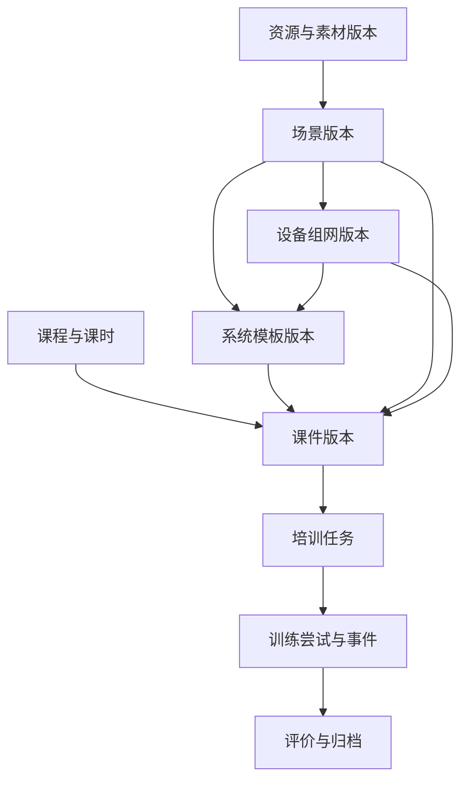

# 三子系统业务重构：Codex 代码修改执行指南 V1.0

> 日期：2026-09-22。用途：将本文件提供给能够访问项目仓库的 Codex，作为代码优化的执行规格、阶段划分和验收依据。本文是修改指导，不代表其中新增功能已实现或测试通过。
>
> 分析基线：仓库 `lizhao013216-prog/peixun`，提交 `ed0a5fc4b8f35bfba10b56b78ccfd57c0105b4b8`（`cash0922`）。执行时必须重新检查实际工作区和当前分支；不得用本文覆盖基线之后的用户修改。

## 0. 如何交给 Codex 执行

### 0.1 推荐使用方式

1. 将本文件放在本地项目根目录，或者作为文件附加给 Codex。
2. 在 Codex 中打开实际仓库。先执行 P0、P1，验收后再逐阶段推进，不要要求一次性完成整份文档。
3. 每个阶段都要求有真实代码、可运行入口、实际测试结果和遗留问题。不得只提交计划、截图或前端静态页面。
4. 本文使用 Markdown 编写；后续实施记录、迁移说明、操作手册和验收记录也使用 Markdown。

### 0.2 第一次执行提示词——可直接复制

```text
请完整阅读《三子系统业务重构_Codex代码修改执行指南_V1.0.md》，按其中的目标架构、数据契约和验收标准改造当前仓库。

本次只执行 P0 和 P1。先检查 AGENTS.md、当前分支、未提交变更、源码根目录和实际运行方式，核对文档基线与当前代码差异，再实施；不要停留在分析或建议。

要求：
1. 保留当前 UI 配色、字体和视觉风格，重点调整业务结构、领域归属和导航，不做整体换肤。
2. 保护原有数据库、历史训练、已发布版本、筹划和演练数据；先补兼容和测试，再调整入口。
3. 公共能力复用，但三个子系统都要有自己完整的业务上下文。严禁把所有任务继续挂在维修培训下，也不能仅复制菜单伪装成功能完整。
4. 先按本文 P0/P1 交付。尚未实现的能力明确标注，不得放置无效按钮或虚假成功反馈。
5. 在 source/docs/业务重构实施进度.md 记录范围、实际修改、测试命令、结果、页面入口、剩余事项。阶段未完成就如实标注。
6. 工作期间给出简短进度更新，每个阶段结束提供可复现操作路径。遇到权限、数据迁移、破坏性变更或重要产品选择的阻碍时停止并说明。
7. 不自行重置数据库，不强推，不改写历史提交，不自动向远端提交或发布；未经明确授权，不引入付费服务或外部平台依赖。

完成 P0/P1 的验收后停止，提供结果与下一阶段建议，等待我确认。
```

### 0.3 后续阶段提示词——可直接复制

```text
继续按《三子系统业务重构_Codex代码修改执行指南_V1.0.md》执行下一阶段。
先读取 source/docs/业务重构实施进度.md，核对上次完成内容与当前代码，不重复重构已完成部分。
本次只完成一个阶段；阶段完成后运行相关后端测试、前端构建和浏览器流程测试，更新实施记录并停止。
不能为了测试通过删除断言、绕过权限、改动金标预期或重置用户数据库。
```

当前源码目录是仓库根目录下的 `source/`，以上 `source/docs/` 指该目录中的 `docs/`，不是要求额外建立另一层 `source`。

## 1. 任务目标与不可变约束

### 1.1 产品目标

系统由以下三个平行的业务子系统构成：

| 领域标识 | 正式业务名称 | 主要业务内容 |
| --- | --- | --- |
| `OPERATION` | 装备使用及作战运用 | 装备认知、使用操作、系统协同、运用流程的教学、训练与考核 |
| `MAINTENANCE` | 装备维修保障 | 维修认知、检查诊断、维修操作、维修保障协同的教学、训练与考核 |
| `SUPPORT` | 保障任务筹划及行为演练 | 保障任务分析、方案编制、资源配置、行为演练、评价复盘，以及这些能力的教学、训练与考核 |

每个子系统必须能够独立完成：资源准备 → 场景/设备组网配置 → 课程与课件制作 → 审核发布 → 培训任务分配 → 训练/考核 → 评价归档与改进。

第三子系统保留现有保障任务、预案、准备、演练、模拟施工、对比、归档主线，同时补齐自己的课程与培训链，不是删除原业务后替换成普通课程。

### 1.2 必须保留

- 现有蓝白配色、清晰字号、卡片/按钮/状态样式；新增页面复用现有设计变量和组件。
- Vue 3、TypeScript、Vue Router、Java 17、Spring Boot、现有 H2 存储与运行方式。除非证实存在阻碍，不升级框架，不引入微服务、消息中间件或新数据库。
- 虚拟现实能力继续模拟。场景可以用现有 SVG/二维示意表现，但资源绑定、规则判断、状态变化和业务记录必须真实贯通。
- 命令幂等、工作区隔离、版本冲突、审计、旧轮次拒绝、技术失败不扣分、已发布版本不可变。
- 现有保障排程、费用、演练分支、施工检查、三级归档的已验证行为；不得顺带重写业务算法。
- 不引入真实作战参数、真实装备敏感信息或真实维修操作规程；示例继续使用合成设备和模拟场景。

### 1.3 本轮不做

- 不建设真实三维引擎、物理求解器、VR/AR 头显适配、原生 EXE/APK 打包器。
- 不接真实外设协议、真实生产工单系统，不把模拟异常当成真实装备故障。
- 不实现任意脚本执行、通用 BPMN 引擎、复杂循环/并行教学图。
- 不把 Demo 改造成正式多租户平台；但是领域范围、角色权限和对象归属必须由后端检查，不能只有前端过滤。
- 不要求每一门课都重新制作场景或组网；允许选择既有资源，也允许声明“不需要外设”“单设备无连接”。

### 1.4 成功标准

用户在任意一个子系统中，都能回答：当前属于哪个系统、正在处理什么对象、它引用了哪些版本、现在应做什么、操作如何完成、结果保存在哪里、下一步由谁处理。

不得以“所有菜单能打开”“原有 34 个路由检查通过”代替上述业务验收。

## 2. 已核实的现状与缺陷定位

### 2.1 仓库与运行目录

当前实际开发根目录是：仓库根目录下的 `source/`。

| 位置 | 用途 |
| --- | --- |
| `source/frontend/src/` | Vue 页面、组件、状态和路由 |
| `source/backend/src/main/java/cn/peixun/demo/` | 业务命令、状态、算法和平台适配 |
| `source/backend/src/main/resources/schema.sql` | H2 表结构 |
| `source/scripts/` | 案例生成、浏览器验证 |
| `backend/peixun-demo.jar` | 根目录预编译运行程序，不是源码 |
| `frontend/dist/` | 根目录预编译前端 |
| 仓库根 `.github/workflows/ci.yml` | 实际 GitHub CI；路径必须适配嵌套源码 |

本文后续 `frontend/...`、`backend/...`、`scripts/...` 均相对开发根目录，不是仓库根目录。

### 2.2 当前问题清单

| 编号 | 当前实际实现 | 修改目标 |
| --- | --- | --- |
| F01 | 课程领域只允许 `OPERATION/MAINTENANCE` | 增加 `SUPPORT`，三个领域都具备完整课程与培训链 |
| F02 | `S203/S204` 挂在维修培训下，却承载两类课程任务及评价 | 三系统各自入口及范围，公共总览另设且显式标识 |
| F03 | 工作区只有一个 `scene` 和一个 `topology` | 场景库、组网库及独立对象版本；编辑上下文按对象ID隔离 |
| F04 | `C03/S101/S201` 共用编辑器且编辑同一份场景 | 组件可共用，但不得共用单例业务对象 |
| F05 | `template.save` 固定为操作类型，复用会覆盖当前全局配置 | 分领域系统模板，显式实例化，返回新对象而非覆盖其他草稿 |
| F06 | `course.create/save` 隐式复制全局场景及组网 | 创建时显式选择；普通保存不得重绑依赖 |
| F07 | 默认 8/10 步，页面不能增删排序 | 预置模板可选，步骤可自由编排 |
| F08 | 对象和资源依赖固定为四设备 | 从实际绑定场景、设备动作定义动态生成 |
| F09 | 学员运行没有完整消费课程保存的场景/组网 | 冻结版本驱动运行，状态和反馈来自规则执行 |
| F10 | 训练问题可直接生成固定维修任务 | 分类、核实和人工分流；普通课件问题优先形成修订 |
| F11 | `courses` 同时承担课程信息和课件版本 | 增加课程组织对象，兼容已有课件版本集合 |
| F12 | 前端全局 `selectedCourse` 等可能跨领域残留 | 路由中的对象ID优先；按工作区/领域维护选择状态 |
| F13 | 命令权限大量依赖前缀和默认筹划员分支 | 新命令显式注册权限，未知命令拒绝；支持训练上下文权限 |
| F14 | 课程保存遇到全局版本冲突会自动刷新并重发旧表单 | 内容编辑增加对象编辑版本，冲突不得静默覆盖他人内容 |

基线另有交付问题：外层 `dist/index.html` 引用的 JS/CSS 文件未全部进入 Git；根 CI 配置与嵌套源码路径也需核对。这些在 P0 处理，但不能用发布修复代替业务重构。

### 2.3 不可误判的地方

- 当前操作课程可以分配培训任务，缺陷是入口、领域范围和数据表达不一致，不是后台完全没有分配功能。
- 后端 `steps` 数组并未限制只能 8/10 步；主要是前端编排能力不足、动作判断过于固定。
- 当前保存了课程场景快照，但运行组件并未完整使用它。不能以“数据库有字段”宣称已打通。
- 系统模板与保障预案模板是不同对象。现有 `templates` 中有 `type=PLAN`；迁移时不能把它们当场景模板处理。

## 3. 业务概念与目标关联

### 3.1 统一术语

| 概念 | 含义 | 不应混淆为 |
| --- | --- | --- |
| 资源库 | 资源的管理集合，包含归属、分类、版本、审核、共享范围 | 单一页面或一个固定数组 |
| 素材 | 模型、动画、音视频、文档、环境、特效等基础材料 | 已可直接执行的课程 |
| 素材工程 | 围绕某教学用途组织资源引用、处理配置和可用动作的编辑工作 | 工作区唯一场景 |
| 场景 | 对象实例、空间/布局、环境、视角、初始状态的配置 | 保障演练中的“延迟到货情景” |
| 设备组网 | 场景对象之间的类型化信号连接、联动和约束 | 仅IP地址或网络部署图 |
| 系统模板 | 场景、组网、默认参数等可复用组合 | UI样式模板、步骤模板、保障预案模板 |
| 课程 | 教学目标、受众、章节/课时、组织关系 | 某一次学员操作记录 |
| 课件 | 某课时可运行的内容版本，绑定场景、行为、步骤及考核规则 | 培训任务 |
| 培训任务 | 对人员/班组分配确定课件版本、模式、时间和完成要求 | 保障任务 |
| 保障任务 | 某项保障工作的对象、范围、约束、工序和成果目标 | 补训通知、课程反馈 |
| 培训评价 | 学员操作、掌握情况、教师评价、学习效果 | 保障方案工期/成本/资源指标 |
| 训练归档 | 课件版本、任务、过程、成绩、反馈的证据集合 | 自动创建保障任务 |

### 3.2 对象关系



系统模板是复用入口，不是强制中间步骤。课件也可以直接选择场景及匹配组网。一个课程可以有多个课时，每个课时可有多个课件版本；培训任务必须固定具体版本。

### 3.3 共享原则

- 三系统共享底层服务和编辑器，不复制三份实现。
- 对象具有明确归属和共享范围；普通业务页面默认只显示本系统对象。
- “共享资源”是显式筛选项；使用其他领域已共享资源时记录来源及引用版本。
- 不跨工作区共享数据。本轮跨系统共享仅发生在同一工作区内。
- 模板复用创建独立草稿实例，不修改源模板及其他引用者。
- 基础素材可共享；课程、培训任务、成绩不因切换菜单而自动共享给其他学员。

## 4. 信息架构、菜单及路由

### 4.1 三级结构

顶层保留公共工作台、演示中心、公共管理；将业务入口统一为三个正式子系统。第三系统下的“保障筹划”“保障演练”“执行归档”成为其内部业务分组，不再与三个子系统并列。

每个子系统至少包含下列能力分组：

| 分组 | 菜单/页面 | 入口意图 |
| --- | --- | --- |
| 本系统工作台 | 教员待办、学员任务、业务流程进度 | 进入即知道现在做什么 |
| 资源准备 | 资源库、素材工程、场景库、设备组网、系统模板 | 形成可用于课件的明确资源 |
| 教学制作 | 课程管理、课件制作、审核发布 | 从教学目标形成可运行内容 |
| 培训组织 | 培训任务、台位与外设 | 分配人员、内容和运行条件 |
| 训练评价 | 我的训练、培训评价、训练归档、问题与改进 | 完成与追踪学习闭环 |

菜单名称可以适度合并以减少层级，但不得省掉能力或把操作训练引导到维修任务页。台位“无外设”是合法配置，不制造空连接步骤。

第三系统另外保留：保障任务、履历资料、保障资源、预案库/编制、各类准备与专项计划、导调、演练、指标与敏感性、模拟施工、对比改进、成果归档。

### 4.2 路由规则

采用三个领域前缀，复用组件：

| 前缀 | 系统 |
| --- | --- |
| `/operation` | `OPERATION` |
| `/maintenance` | `MAINTENANCE` |
| `/support` | `SUPPORT` |

共同子路由建议：`overview`、`assets`、`projects`、`scenes`、`topologies`、`templates`、`curricula`、`coursewares`、`releases`、`assignments`、`stations`、`training-evaluations`、`training-records`、`issues`。

不要覆盖第三系统已有 `/support/tasks`、`/support/plans`、`/support/evaluations/:id` 等保障业务路由；培训评价使用 `training-evaluations` 与方案评价区分。

页面元数据显式增加 `system`、`feature`、`view`、`scope`，禁止继续从中文 `group` 推断领域。页面名称、面包屑、返回链接、创建默认领域均来自这组元数据。

兼容规则：

- 旧 `/operation/courses/:id`、`/maintenance/courses/:id` 重定向至对应领域课件页面，保留对象ID。
- 公共 `/sessions/:id` 可以保留，先加载尝试对象，从其领域生成面包屑和返回路径，不默认返回维修培训。
- 旧公共资源和记录页可作为跨系统汇总，但必须标明“全部系统”，提供领域筛选与来源标签。
- 旧页面ID被演示指引使用，迁移时建立别名映射，更新 `guide.ts` 和自动化脚本，不能无声删除。
- 用户切换系统时，不带入其他系统的选中课程、场景或草稿；有未保存内容时提示保存/放弃/取消。

## 5. 后端数据模型与兼容策略

### 5.1 存储策略

本轮沿用 `workspace_state.content` 的 JSON 快照和现有命令事务，不强制改成几十张关系表。可通过类型化 DTO、校验器和服务抽取控制复杂度。

增加工作区 `schemaVersion`，新模型首次升级使用 `2`；后续阶段需要再次变更持久化结构时递增并新增迁移步骤。迁移前版本未设置时按旧版处理。根 `revision` 继续表示工作区版本，不能拿 `schemaVersion` 替代。

### 5.2 基础字段约定

| 字段 | 要求 |
| --- | --- |
| `id` | 当前对象/版本行的唯一标识；已存在ID保持不变 |
| `familyId` | 同一资源或课件版本族标识，用于修订关联 |
| `version` | 发布内容版本；新版本创建独立ID，不覆盖旧记录 |
| `editRevision` | 草稿编辑版本，每次保存递增，用于检测覆盖冲突 |
| `domain` | 教学/任务对象领域：`OPERATION/MAINTENANCE/SUPPORT` |
| `ownerSystem` | 资源归属：三个领域之一或 `SHARED`；`SHARED`不是第四个业务子系统 |
| `visibility` | `SYSTEM_ONLY`或`SHARED`；共享不等于可修改源对象 |
| `sharedWith` | 可引用的目标领域列表，空列表不得解释为默认全部公开 |
| `status` | 对象生命周期，不同对象按各自状态机处理 |
| `createdBy/updatedBy` | 从服务端身份取得，不信任前端传入 |
| `sourceRef` | 派生/复用/迁移来源，不可用名称代替ID |

新模型使用 `{ id, version }` 引用具体版本行；服务端同时验证ID存在且版本匹配。不能仅存“名称”或使用“取列表最后一个”解析引用。

### 5.3 集合与职责

| 集合 | 调整方式 | 关键内容 |
| --- | --- | --- |
| `assets` | 扩展现有 | 归属、分类、版本、审核状态、组件能力/动作定义、上传来源 |
| `assetProjects` | 新增 | 素材工程、资源引用、编辑说明；不用它替代场景版本 |
| `scenes` | 新增 | 对象实例、资源版本、布局、视角、初始状态、可选环境 |
| `topologies` | 新增 | 绑定场景版本、节点端口、连接、联动规则、默认参数 |
| `systemTemplates` | 新增 | 场景/组网引用、参数默认值、来源、发布状态 |
| `curricula` | 新增 | 课程目标、受众、章节/课时、所属领域 |
| `courses` | 保留兼容 | 作为课件版本集合，补 `curriculumId/unitId`、依赖和规则，暂不整体改名 |
| `assignments` | 扩展 | 领域、课件版本、对象、模式、截止时间、台位策略、完成要求 |
| `attempts` | 扩展 | 领域、冻结快照引用、独立运行状态、事件、计分规则版本 |
| `stations` | 扩展 | 归属、能力、类型化映射、连接状态、模拟模式 |
| `trainingArchives` | 新增 | 引用任务/尝试/课件/评价版本的归档包，不复制并改写原成绩 |
| `issues` | 扩展 | 分类、来源、核实状态、处理方式、关联结果和确认人 |
| `tasks/plans/runs`等 | 保留 | 保障业务对象；补领域和业务/教学上下文，但不改原算法 |
| 原 `templates` | 保留必要兼容 | `type=PLAN`继续用于保障预案；原操作系统模板迁入 `systemTemplates` |

`courses` 保留名称只是降低迁移风险：前端明确展示为“课件”，新增 `curricula` 才是课程组织。禁止同一个页面既叫课程管理又直接替代所有课件版本概念。

### 5.4 场景模型最低要求

```json
{
  "id": "SCENE-OP-01-V1",
  "familyId": "SCENE-OP-01",
  "version": 1,
  "editRevision": 1,
  "ownerSystem": "OPERATION",
  "name": "泵组操作示例场景",
  "status": "DRAFT",
  "objects": [
    {
      "instanceId": "PUMP-01",
      "assetRef": { "id": "ASSET-PUMP", "version": 1 },
      "label": "通用泵组",
      "layout": { "x": 160, "y": 120 },
      "initialState": { "status": "READY" }
    }
  ],
  "cameras": [{ "id": "overview", "name": "总览" }],
  "environment": { "light": "DAY", "weather": "CLEAR" }
}
```

- 对象列表不能再写死在 Vue 文件中；至少支持添加、移除、重命名、选择素材、编辑示意位置和初始状态。
- 对象 `instanceId` 在同一场景版本内唯一；完整对象定位由场景版本和实例ID构成。
- 删除对象前检查组网端口、课件步骤和台位映射；有引用时提示具体依赖，不能静默留下悬空引用。
- 不具备真实模型文件的资源可显示占位模型，但必须使用对应资源身份、对象名称和动作定义。

### 5.5 组网模型最低要求

组网对象包含：`sceneRef`、`nodes`、`connections`、`rules`、`parameters`。节点指向场景对象，端口声明 `direction` 与 `valueType`。

需要支持：

1. 从已选场景对象中添加组网节点，不从全工作区任取设备。
2. 增删连接，验证输出端口到输入端口、值类型和对象存在性。
3. 编辑最小联动规则：满足前置状态时允许动作；输入值变化触发状态更新/告警。
4. 预览模拟信号，看到具体输入、规则命中、输出与状态变化。
5. 单设备教学允许空连接，但明确标识“无组网联动”，不伪造四设备图。

Demo 首版可以限制组合逻辑为无环、确定性执行；循环连接应校验拒绝并说明。不得用无限循环或任意脚本补齐所谓通用能力。

### 5.6 系统模板与实例化

模板记录场景/组网版本及可配置参数，不包含学员成绩；课程步骤模板另行维护，不能混入系统模板。

`systemTemplate.instantiate` 必须：

- 验证模板可用、可被目标领域引用。
- 原子创建新的场景及组网草稿版本，重写二者的相互引用，保留来源。
- 返回新对象ID给当前编辑页，由用户选择是否绑定当前课件。
- 不覆盖工作区中任何“当前场景”、其他课程、源模板或已发布对象。

“直接引用已发布模板”与“复制后修改”是两个明确操作；前者锁定引用版本，后者生成独立草稿。

### 5.7 课件版本模型

```json
{
  "id": "COURSEWARE-OP-01-V1",
  "familyId": "COURSEWARE-OP-01",
  "curriculumId": "CURRICULUM-OP-01",
  "unitId": "UNIT-01",
  "domain": "OPERATION",
  "version": 1,
  "editRevision": 1,
  "status": "DRAFT",
  "name": "泵组启动与状态识别",
  "sceneRef": { "id": "SCENE-OP-01-V1", "version": 1 },
  "topologyRef": { "id": "TOPO-OP-01-V1", "version": 1 },
  "systemTemplateRef": null,
  "interactionSchemaVersion": 3,
  "stationPolicy": { "required": false },
  "scoreRule": { "total": 100, "errorPenalty": 5, "helpPenalty": 2 },
  "steps": [],
  "publishedSnapshot": null
}
```

说明：空步骤仅可用于未完成草稿，不能提交审核；上例是结构示意，不是可直接发布的数据。`interactionSchemaVersion=3` 用来区别现有 `interactionVersion=2`，不能把旧字段直接改值后假装已完成行为升级。

关键规则：

- `course.save` 只修改明确传入的允许字段，不再读取工作区全局 `scene/topology`。
- 改绑依赖使用独立操作或明确的绑定字段；UI展示更换前后的对象与受影响步骤。
- 提交审核时：依赖必须处于可发布状态、对象/动作/端口有效、步骤完整、计分合法。
- 发布时生成规范化且可校验的 `publishedSnapshot`，冻结资源、场景、组网、步骤、评分和平台契约版本。
- 学员运行读发布快照，不读最新编辑草稿或“当前工作区配置”。
- 被停用资源阻止新发布/新引用；历史快照仍可追溯。历史运行是否允许重开应给出明确策略，本轮默认允许按既有快照复训并显示停用提示，不改历史成绩。
- 新版本修订生成独立ID；已有任务继续指向旧版本，只有重新分配才使用新版本。

### 5.8 培训任务与尝试

- 任务拥有 `domain`、课件引用、分配对象、截止时间、训练模式、台位要求和完成标准。
- Demo 可采用“一个学习对象一条任务”；支持多选分配时返回批次ID和多条任务，不必立刻建立复杂班级组织。
- 多课时课程分配可创建带 `batchId` 的多条课时任务；完成统计按批次聚合，不重写已有单课件尝试。
- 开始训练时生成尝试独立状态，复制/引用冻结快照，初始化组网与场景状态。
- 同一任务有进行中或暂停尝试时提供继续入口，不重复启动。
- 已完成训练可显式新建补训；补训生成新尝试，不能覆盖旧分数和旧证据。
- 已完成和教员已确认证据分开表达。确认操作指向准确 `attemptId`，不能仅用“任务曾确认过”判断所有尝试。

## 6. 课件制作与业务交互规格

### 6.1 教员制作工作区

保留现有编辑、预览、审核、发布、分配的连续体验，增加可见的配置分区：

1. 课程与课时：名称、目标、受众、所属系统。
2. 仿真环境：场景、组网、模板来源及版本；依赖验证结果。
3. 教学步骤：新增、复制、删除、上移/下移、拖动排序、逐项编辑。
4. 运行与考核：训练模式、计分、必要外设、故障模拟说明。
5. 学员预览：用同一业务规则试运行，不创建正式成绩。
6. 审核与发布：阻断项、审核意见、构建状态、版本依赖清单。
7. 任务分配：人员、时间、模式，完成后进入当前系统的任务管理。

可以使用分栏、页签或步骤条，但不能要求用户先到其他页面修改某个“当前配置”再回来保存课件。

### 6.2 步骤自由编排

每步最低包含：稳定步骤ID、名称、说明、目标对象、动作、参数、前置条件、完成条件、成功/失败反馈、分值和帮助说明。

最低可交付操作：

- 从空白创建，或选择操作8步、维修10步、保障筹划示例等步骤模板；模板不是数量限制。
- 新增、复制、删除、排序步骤。复制生成新ID；排序只改顺序，不改变原步骤ID。
- 从已绑定场景选择对象，从对象能力选择动作；动作按钮文字允许定制，但不能用文字替代动作编码。
- 动作所需参数提供相应控件，如数值、枚举、对象、资源或检查结论。
- 提供步骤完整性校验、悬空引用提示、分值合计和未保存提示。
- 已发布版本只读；修改引导至“创建修订版”。

默认本轮采用线性步骤：成功进入下一步、失败停留本步；步骤内部允许条件判断。不承诺任意分支/循环教学图。若后续扩展分支，需要单独定义路径可达性与计分规则。

### 6.3 动作与条件不是一段可随便执行的代码

建议建立类型化动作目录：`CONFIRM`、`SET_PARAMETER`、`READ_VALUE`、`CHANGE_STATE`、`SELECT_RESOURCE`、`RECORD_CHECK`、`SUBMIT_PLAN`、`ADVANCE_EXERCISE` 等。

实际动作编码以被引用的对象能力为准。参数采用显式类型、枚举和上下限；条件使用安全的结构化表达式，例如：

```json
{
  "all": [
    { "objectId": "VALVE-01", "field": "ready", "operator": "EQ", "value": true },
    { "objectId": "SENSOR-01", "field": "value", "operator": "GTE", "value": 0.4 }
  ]
}
```

禁止 `eval`、任意 JavaScript/Groovy、任意 SQL 和前端提交任意状态覆盖补丁。后端校验对象、字段、运算符与类型，依据命令计算状态变化。

`expectedResult` 是用于解释的文案，不是成功条件。不能因为发送了文字为“启动成功”的按钮就直接记为成功。

### 6.4 预览与正式运行

- 预览和正式训练复用动作校验、条件计算、模拟状态更新逻辑，避免“预览能通过，正式课不能通过”。
- 预览建立临时运行实例，允许重置；不写入正式任务、成绩、证据或培训完成率。
- 正式运行实例和其他学员、其他课件、场景编辑状态相互独立。
- “保存课件”“预览”“发布”“开始训练”是不同动作；不能借预览触发正式任务或修改课程状态。

### 6.5 学员页面必须持续回答四个问题

| 问题 | 必须展示的内容 |
| --- | --- |
| 当前做什么？ | 系统、课程目标、当前步骤、完成进度和具体任务 |
| 怎么做？ | 操作对象、可执行动作、参数、前置条件；自由/考核模式按规则隐藏提示 |
| 做得怎样？ | 实际输入、对象状态变化、成功/失败原因、分值变化、记录已保存提示 |
| 接下来做什么？ | 重试、请求帮助、继续下一步、暂停/恢复、提交结果或查看评价 |

动作成功后保留反馈，用户确认后继续，不静默切换到另一步。技术失败提示重试且不扣分；前置条件不满足与设备模拟异常要区分显示。

任务卡明确展示“待开始/进行中/已暂停/已完成/待教员确认/已确认”，不要只给一个含义模糊的“完成”。

### 6.6 草稿校验与发布校验分开

- 草稿保存检查结构、标识、类型、编辑版本和字段安全；允许暂未选择场景、未完成步骤说明等编辑中状态，并展示待完善项。
- 审核提交/发布执行完整依赖、对象、动作、参数、条件和评分校验，缺项时阻止进入下一状态。
- 预览只允许运行当前已通过预览校验的内容；不完整步骤应定位提示，不能默默跳过后显示全课成功。
- 不要继续复用一个“所有字段必填”的校验器，导致教员连半成品都无法保存；也不能因为允许存草稿就放宽发布校验。

### 6.7 评分口径

- 新课件每步可配置权重/分值；本轮默认总分100，发布前要求步骤分值合计等于总分，禁止负值和非数值。
- 基础分为已通过步骤分值之和，再减去按冻结规则计算的错误/帮助扣分，最终限制在0到总分之间。每步只计一次通过分，同一命令只记一次扣分。
- 正确率默认沿用“已通过步骤数 ÷（已通过步骤数 + 业务错误次数）”；帮助与技术故障不计入分母，界面明确这个口径。分母为0时显示未形成结果。
- 演示模式不计分；团队成绩与个人成绩分别标识，不能自动作为每个成员的个人证据。
- 旧课件继续使用原规则，不对历史权重或已完成成绩做归一化改写。
- 本轮示例优先使用可自动核对的客观评分。确需主观评分时增加明确的“待教员评分”状态、评分依据和审计，不能随机或默认满分。

## 7. 虚拟平台模拟与教学规则联动

### 7.1 平台适配边界

保留 `VirtualPlatformPort` 和 `MockVirtualPlatformAdapter`，扩展为可携带场景快照、动作参数、执行结果和状态变化的标准接口。

建议职责，不要求机械照抄方法名：

| 能力 | 输入 | 输出 |
| --- | --- | --- |
| 场景校验 | 场景、对象能力、组网、动作引用 | 阻断错误、警告、依赖摘要 |
| 创建实例 | 冻结课件快照、运行ID | 独立实例初始状态 |
| 执行动作 | 实例状态、对象、动作、参数、幂等标识 | 平台执行状态、前后状态、事件 |
| 读取状态 | 实例ID | 可展示的设备及资源状态 |
| 销毁/恢复实例 | 运行ID、持久化状态 | 已关闭/已恢复状态 |

教学引擎判断是否满足本步要求和得分；模拟平台负责可确定的设备/环境状态变更。不能把所有成功判断交给前端，也不能把采购厂家的SDK类型直接泄漏到课程数据结构。

### 7.2 标准动作结果

结果至少区分：

- `SUCCESS`：平台动作已执行，教学引擎再判断本步完成条件。
- `BUSINESS_REJECTED`：对象、动作、参数或业务前置条件不允许，按课件规则提示及计分。
- `TECHNICAL_FAILURE`：平台超时/故障，保留记录，可重试，不作为操作错误扣分。

事件包含：`eventId/commandId/attemptId/stepId/actorId/objectId/actionId/parameters/beforeState/afterState/result/reason/scoreDelta/sequence/at`。

同一命令重试不能重复推进或扣分；迟到/重复回调不能覆盖较新的运行状态。

### 7.3 必须证明配置在生效

至少提供如下自动化用例：

1. 同样课程绑定场景A和场景B，对象名称/数量或布局发生相应变化。
2. 阈值从0.4改为0.6，新版本在相同输入0.5下得到不同告警结果；旧任务仍用0.4。
3. 阀门未就绪时模拟启动被拒绝；就绪后启动改变泵组状态。
4. 新增第五个对象能出现在编辑、组网、步骤选择和学员运行中。
5. 学员A的启动、暂停、参数修改不改变学员B的实例或制作端草稿。

UI只显示“参数已保存”，但运行结果不变，不算通过。

## 8. 第三子系统的两条完整业务线

### 8.1 保障业务线——保留并整理

保障任务 → 需求/资料分析 → 预案编制 → 资源与准备 → 导调/演练 → 指标评估 → 模拟施工 → 对比改进 → 成果归档。

原有 `PlanningModule`、`ScheduleEngine`、`ExecutionModule` 的逻辑可以复用，现有金标结果保持不变。

### 8.2 教学训练线——新增但必须连到实际业务

课程/课件制作 → 选择教学场景及保障案例 → 配置任务约束和考核点 → 审核发布 → 分配学员 → 学员编制方案/选择资源/处理演练事件 → 评价与归档。

禁止简单给第三系统复制一套“点击泵组、点击阀门”的课件。其学员动作应体现筹划与演练能力。

最低示例课件为“泵组保障方案编制与延迟事件处置”：

| 教学阶段 | 学员实际操作 | 可检查结果 | 示例分值 |
| --- | --- | --- | ---: |
| 理解任务 | 阅读对象、范围、时限与目标并确认 | 任务确认记录 | 10 |
| 配置资源 | 选择人员、物料与设施 | 能力、数量、可用性满足规则 | 20 |
| 编制方案 | 配置工序、先后依赖及资源引用 | 必需工序完整、无环、资源合法 | 20 |
| 计算方案 | 提交排程和费用计算，检查约束 | 后端计算结果及约束判断 | 20 |
| 处理演练 | 接收预置延迟事件，选择处置并推进 | 保留处置前后差异与实际演练事件 | 20 |
| 提交复盘 | 完成演练并填写结论 | 结果、依据和反馈完整 | 10 |

分值是新教学示例规则，不得拿它覆盖现有保障方案指标评价算法。

### 8.3 教学沙箱隔离与权限

- 课件引用已发布案例/预案版本作为教学输入，开始训练时创建独立练习副本。
- 可在现有 `tasks/plans/runs` 集合中增加 `purpose=TRAINING/BUSINESS`、`attemptId`、`ownerLearnerId`；所有查询和修改必须使用这些字段隔离。
- 学员通过训练专用命令修改自己的练习副本，不获得全局筹划员或导调员权限。
- 正常保障业务命令不能通过传入教学对象ID绕过权限；教学命令也不能修改正式业务对象。
- 案例原版本、其他学员副本、正式任务和预案不能被修改。
- 方案指标与学习成绩分别保存：工期/费用评价方案，学习分值评价学员决策和操作。
- 归档保存案例版本、个人方案、模拟事件、计算结果、学习成绩、教员意见的关联关系。

## 9. 训练归档、问题分流与跨系统协作

### 9.1 归档主线

训练完成 → 查看结果 → 反馈/教师评价 → 确认证据 → 形成训练归档。问题单是可选入口，不得要求没有问题也创建保障任务。

归档至少引用：领域、课程/课件版本、任务、尝试、事件摘要、计分规则、成绩、评价、确认人及时间。导出 Markdown 报告的内容必须来自这些记录。

### 9.2 问题分类和处理

| 类型 | 默认处理 | 不允许的处理 |
| --- | --- | --- |
| `CONTENT` 课件内容问题 | 内容改进单/课程修订 | 未核实就创建维修保障任务 |
| `LEARNING` 学习掌握不足 | 补训/复训建议及任务 | 修改原成绩掩盖错误 |
| `PLATFORM` 平台交互问题 | 技术问题记录与状态跟踪 | 当作学员错误扣分 |
| `EQUIPMENT_SUPPORT` 疑似保障问题 | 核实、确认后关联/创建保障任务 | 从模拟异常直接判定真实故障 |

状态建议：`OPEN → TRIAGED → IN_PROGRESS → RESOLVED/CLOSED`。其中转保障任务必须记录核实意见、确认人、装备/对象、范围和目标。

仅 `EQUIPMENT_SUPPORT` 且已确认的问题可调用 `issue.convertToSupportTask`。先显示确认表单，不能沿用固定“维修/270/80/泵组工序”直接转换所有问题。

### 9.3 后端必须校验

- 来源尝试存在、属于当前工作区，满足创建问题的完成状态与角色条件。
- 问题必须关联真实来源记录；装备/对象从来源或人工选择取得，不统一写死 `EQ-DEMO-01`。
- 转换时校验类型、核实状态和权限，任务创建与问题关联在同一事务内完成。
- 同一问题重复转换返回既有任务或明确拒绝，不能只依赖按钮禁用。
- 训练来源链至少保留：`supportTask.sourceIssueId → issue.sourceAttemptId → attempt.courseId/version`。
- 课件改进、补训和技术问题也应有处理结果引用与关闭依据，不是换一个问题标签就结束。

### 9.4 合理的跨系统接口

允许：共享资源引用、保障准备提出培训需求、培训证据回传、经确认的保障问题转任务、方案复盘产生内容改进建议。

不允许：必须经过其他子系统才能完成本系统正常教学流程；或训练自动改变真实装备状态、正式资质、生产任务和库存。

## 10. 命令接口、并发和权限

### 10.1 保留现有命令信封

继续使用 `POST /api/demo/commands?workspace=...`，身份来自 `Authorization` 对应的服务端会话。

```json
{
  "action": "course.save",
  "commandId": "client-generated-unique-id",
  "runEpoch": 1,
  "expectedRevision": 42,
  "payload": {
    "id": "COURSEWARE-OP-01-V1",
    "expectedEditRevision": 3,
    "name": "修改后的课件名称"
  }
}
```

`expectedRevision` 检查工作区快照，`expectedEditRevision` 检查当前编辑对象。两者不可互相替代。

自动刷新重试只适用于不会覆盖用户内容且对象版本仍一致的命令；编辑保存发生对象冲突时，应显示最新版本与本地未保存内容，要求用户选择，不自动重发旧表单覆盖服务器。

现有幂等键重复时应继续返回原结果，即使全局版本已变化；不要将版本检查移动到幂等查询之前。

### 10.2 命令清单

以下是建议命令契约；可以做合理命名调整，但必须在实施记录中列明映射，并同步前端、权限、脚本和测试。

| 命令族 | 最低命令 | 核心约束 |
| --- | --- | --- |
| 资源 | 现有 `asset.*`，补归属/共享 | 引用版本可用；上传必须明确领域或共享范围 |
| 素材工程 | `assetProject.create/save` | 显式资源引用，不修改其他工程 |
| 场景 | `scene.create/save/validate/publish/revise` | 多对象、多版本，禁止发布后原地编辑 |
| 组网 | `topology.create/save/validate/simulate/publish/revise` | 绑定场景、类型化端口、连接和规则校验 |
| 系统模板 | `systemTemplate.create/save/publish/instantiate/revise` | 与保障预案模板分离；实例化原子且不改源 |
| 课程 | `curriculum.create/save/addUnit` | 领域、课程目标和课时归属 |
| 课件 | 兼容 `course.create/save/submit/approve/return/publish/revise`，增加 `course.bindEnvironment/validate/preview` | 保存不隐式重绑、独立审核、冻结依赖 |
| 培训任务 | `training.assign/start/pause/resume/action/feedback/confirm` | 领域与人员归属、已发布版本、尝试隔离 |
| 保障教学 | `training.support.savePlan/evaluatePlan/advanceExercise/submitReview` | 只作用于本人尝试的练习副本，不提升全局角色 |
| 台位 | 扩展 `station.save/connect/signal` | 显式实例目标和类型化映射，不改全局组网 |
| 归档 | `trainingArchive.create/export`或等价查询 | 来源完整、记录只读、不得伪造完成状态 |
| 问题 | `issue.create/triage/resolve/convertToSupportTask` | 分类、核实、人工确认、转换幂等 |

场景/模板发布可采用轻量审批或明确的制作确认，不必照搬课程审核链；但状态必须区分草稿与可引用版本，且不能默认所有新建对象都已发布。

### 10.3 命令处理顺序

统一处理身份、工作区、轮次和幂等；进入对象业务后进行对象存在性、领域范围、角色、编辑版本、状态机和依赖校验；全部通过后再写入业务对象、事件、审计及回执，保持事务原子性。

必须返回可定位的信息，例如“第3步引用了已删除的阀门对象”“组网V2不是基于当前场景V1”“课件已有新编辑版本”。不要全部合并为“操作失败”。

建议错误码：`DOMAIN_MISMATCH`、`DEPENDENCY_MISSING`、`DEPENDENCY_NOT_READY`、`OBJECT_EDIT_CONFLICT`、`PUBLISHED_VERSION_IMMUTABLE`、`INVALID_ACTION`、`INVALID_CONNECTION`、`ASSIGNMENT_FORBIDDEN`、`ISSUE_NOT_VERIFIED`。原有 `STALE_EPOCH/REVISION_CONFLICT/IDEMPOTENCY_CONFLICT` 保留。

### 10.4 权限基准

| 角色 | 可以做 | 不可以做 |
| --- | --- | --- |
| 制作教员 `AUTHOR` | 编辑获授权领域资源、课程、课件；预览；提交审核 | 审核自己的课件，替学员伪造训练完成 |
| 教员 `INSTRUCTOR` | 审核他人课件、分配任务、查看授权范围结果、确认证据、分流问题 | 把模拟异常直接改为真实装备故障 |
| 学员 `LEARNER` | 查看分配任务和对应发布内容、操作本人/授权团队尝试、反馈 | 修改制作端内容、操作他人任务、调用正式筹划/导调命令 |
| 筹划员 `PLANNER` | 保障任务和预案、经确认的问题转任务 | 直接修改课件历史成绩或越过课件审批 |
| 导调员 `DIRECTOR` | 既有业务演练导调；授权的教学导调 | 因角色名相似获取全部编辑或学员身份 |
| 管理员 `ADMIN` | 演示管理、授权配置和维护 | 绕过发布版本不可变、数据隔离与审计不变量 |

业务角色检查使用 `DemoService.role(actor)` 或等价能力，不写死 `actor == "INSTRUCTOR"`；现有独立审核教员 `REVIEW_TEACHER` 必须正确识别。

团队训练必须校验显式成员关系、运行主持人及已有对象控制权租约；不能仅看到 `scope=TEAM` 就允许任意学员操作。原评审/控制权规则需要保留回归。

课程审核“不能审核本人制作内容”应同时约束通过与退回等审核动作。Demo可提供两个教员账号，不允许静默切换身份完成审批。

新增命令须进入显式注册表/路由和权限表，未知命令返回拒绝，不能默认派给 `PlanningModule` 并赋予筹划权限。

### 10.5 查询范围

现有 `/state` 会返回工作区整份状态。重构不能声称只做前端筛选就具备数据隔离。

- 增加领域/用途/身份范围投影，或使用必要的对象查询接口。即便暂时保留 `/state`，服务端也应按身份裁剪学员可见任务、记录和练习对象。
- 相同投影规则应用到命令成功响应中的 `state`、幂等回执返回、工作区列表和相关导出；不能仅裁剪 `/state`，却从一次动作响应泄漏完整工作区。存储层可以保留完整快照，响应层返回裁剪副本。
- 学员看得到完成任务所需的发布快照，但不能获得其他学员成绩、制作草稿和正式业务编辑对象。
- 教员跨系统查看需明确使用“全部系统”视图，并受分配范围控制。
- 报告导出、资源下载和按ID访问也要应用同样的权限，不能列表隐藏而直链可读。
- 保留全局 `revision` 作为命令版本基础；服务端投影不改变真实工作区版本。

## 11. 旧数据迁移与历史保护

### 11.1 必须有可验证的迁移过程

建议新增 `WorkspaceMigration`，以纯函数/明确迁移步骤处理 JSON，再由现有事务保存。初始化、加载、克隆工作区均使用一致的迁移入口。

要求：

1. 首先在测试夹具上实现旧版→新版迁移；实际用户数据库先备份，不直接试错。
2. 提供只读预检/`dry-run`，报告旧对象数量、领域缺失、悬空引用和待人工处理项。
3. 正式迁移具备版本门禁和幂等性，重复运行不重复创建课程、场景或任务。
4. 迁移失败事务回滚，不能一部分数据已迁移、一部分仍使用旧语义。
5. 记录迁移版本、时间、数量和警告；保存完成才更新 `schemaVersion`。
6. 后续阶段再变更结构时新增迁移版本，不修改已经执行过的迁移含义。

### 11.2 对象迁移映射

| 旧数据 | 新数据处理 | 必须保留 |
| --- | --- | --- |
| 两类旧 `courses` | 保留原课件行和ID，按版本族建立课程/课时组织，补明确领域 | 名称、版本、原步骤、发布状态、创建人、历史引用 |
| 课件中的 `scene/topology` 快照 | 按“领域+内容摘要”建立只读兼容版本，课件引用自己的快照 | 不能替换为工作区最新配置 |
| 工作区全局 `scene/topology` | 转为可识别的旧编辑草稿/模板来源；新制作流程要求显式选择 | 不强行绑定到所有课程 |
| 旧操作系统模板 | 迁入 `systemTemplates`，标记来源；兼容旧ID映射 | 原场景、组网及创建者 |
| `templates.type=PLAN` | 留在原保障预案逻辑或有明确兼容映射 | 预案匹配、复用和归档关系 |
| 缺少领域的 `assignments` | 从关联课件推导 | 分配对象、状态、确认尝试ID |
| `attempts/feedback` | 从关联课件/尝试推导领域，补快照引用 | 事件、分数、错误次数、反馈原文 |
| 旧公共资源 | 明确登记为共享来源资源，保留已有ID和版本 | 原引用可解析，不能无理由改为未审核 |
| 旧问题单 | 原文与来源保留；分类无法确认时标记待分流 | 已生成任务关系，不倒推伪造核实意见 |
| `tasks/plans/runs/executions/archives` | 归入 `SUPPORT` 业务用途，补上下文 | 原排程、成本、事件、审核轮次和发布历史 |

处理旧数据缺失时，不能随机补一个最新场景或假装原本有完整动作规则；应明确标记 `LEGACY` 兼容能力和限制。

### 11.3 旧训练继续可用

- 旧发布课件继续使用旧交互契约。未完成的旧尝试可继续，旧报告可导出。
- 旧课件修订时生成新草稿，允许引导升级动作/条件和环境绑定，但不改原发布内容。
- 旧分数不重新计算，迁移前后关键业务记录内容摘要应一致（允许增加兼容元数据）。
- 原命令 `course.*`、`training.*` 在兼容期保留；旧省略新字段的请求必须能被识别为旧契约，不静默降低新课件校验。
- 新课件不得借 `LEGACY` 模式绕过新的发布校验。

### 11.4 回滚和备份

- 停止占用 H2 的程序后备份明确的数据库文件及上传资源，记录备份位置。不得把正在写入的数据库文件随意复制当作可靠备份。
- 不执行 `reset` 来替代迁移；不删除仓库或宽泛目录；不把旧数据库覆盖到新结构后直接启动而无兼容检查。
- 数据已升级后，不假设旧JAR能读新结构。回滚使用配套旧程序和迁移前备份，并告知会失去回滚点之后的新数据。
- 实施记录说明本次是否实际迁移了用户数据库；只测试夹具时必须明确写“用户数据库未迁移”。

## 12. 具体代码修改地图

### 12.1 前端

| 文件 | 修改要求 |
| --- | --- |
| `frontend/src/catalog.ts` | 正式三系统、显式领域元数据、共用功能路由、第三系统原业务子分组、旧ID别名 |
| `frontend/src/main.ts` | 旧路径兼容重定向，非法领域/对象入口反馈，不把未知对象静默定位为最后一条 |
| `frontend/src/App.vue` | 系统上下文、菜单分组、面包屑、领域切换；保留现有外观 |
| `frontend/src/store.ts` | 领域范围请求、选中对象命名空间、对象编辑冲突、学员查询投影；保留幂等和旧轮次保护 |
| `frontend/src/views/Workbench.vue` | 三系统角色入口；任务与制作入口带领域；不默认只进入维修 |
| `frontend/src/views/AssetsView.vue` | 本系统资源、共享资源、归属/版本/审核状态、引用关系 |
| `frontend/src/views/AuthoringView.vue` | 拆除全局场景编辑和混合分支；按对象ID挂载场景、组网、模板、台位组件 |
| `frontend/src/components/CourseBuilder.vue` | 保留连续制作流程，加入课程/课时、环境绑定、依赖清单、自由步骤编排 |
| `frontend/src/lesson.ts` | 固定四对象退为旧课件兼容；新课件从发布快照解析对象和动作 |
| `frontend/src/components/LessonStep.vue` | 接收运行快照、状态、动作参数及条件反馈，不独立决定正式成绩 |
| `frontend/src/components/SceneView.vue` | 数据驱动对象渲染/选择；现有精细泵组图可以保留为一种渲染器，但必须支持其他对象的通用示意 |
| `frontend/src/components/TrainingAssignments.vue` | 显式领域输入、对应系统入口、角色范围、批量分配/补训与续训 |
| `frontend/src/components/TrainingPlayer.vue` | 使用冻结课件与独立运行实例；正确返回来源系统；支持第三系统的业务操作组件 |
| `frontend/src/views/TrainingView.vue` | 三系统培训评价、领域过滤、与方案指标评价分开、准确尝试证据确认 |
| `frontend/src/views/RecordsView.vue` | 训练归档与保障成果归档分离；问题分类和人工分流表单 |
| `frontend/src/views/PlanningView.vue`、`ExerciseView.vue` | 保持原正式业务能力，抽取可用于教学沙箱的表单/结果组件，禁用跨用途修改 |
| `frontend/src/guide.ts`、`components/DemoGuide.vue`、`views/GuideView.vue` | 更新三系统完整演示路线和域内返回，不再依赖旧错位菜单 |
| `frontend/src/lib/seed-demo.mjs` | 案例通过真实命令生成，不直接往状态数组塞已完成数据；增加三系统独立案例 |
| `frontend/src/style.css` | 仅补必要布局/状态/响应式；沿用字体、配色与间距体系 |

建议新增 `domain.ts`、`types/`、`services/`、`composables/useSystemContext.ts`，以及场景、组网、模板、课程管理和步骤编辑组件。具体文件数由 Codex 根据现有结构决定，不以“拆成很多文件”作为完成标准。

### 12.2 后端

| 文件/建议组件 | 修改要求 |
| --- | --- |
| `DemoService.java` | 显式命令注册/分发、迁移入口、服务端领域/对象授权、幂等及版本检查顺序 |
| `DemoController.java` | 带领域的资源上传与查询、学员数据范围、导出/下载权限；保留现有路径兼容 |
| `TrainingModule.java` | 去掉新课件固定设备/全局快照依赖，承接兼容；逐步拆出清晰服务 |
| `Seed.java` | 初始化三个领域、资源/场景/组网和可选步骤模板，不把新课件数量固定为8/10 |
| `VirtualPlatformPort.java` | 标准实例、动作与状态结果契约，避免厂商类型耦合 |
| `MockVirtualPlatformAdapter.java` | 确定性状态变化、联动输入输出、失败/重复/迟到处理，不只返回成功布尔值 |
| `PlanningModule.java` | 保障业务保持，补训练副本隔离和从经核实问题创建任务的显式参数 |
| `ScheduleEngine.java` | 原算法和金标保持；向教学评估提供纯计算结果，不混入学员总分 |
| `ExecutionModule.java` | 保留模拟施工与归档行为，明确业务用途边界 |
| 建议 `WorkspaceMigration` | 版本化、幂等、安全迁移和只读预检 |
| 建议 `DomainPolicy/DependencyValidator` | 统一领域共享与引用版本检查，避免前端/各命令重复规则漂移 |
| 建议 `CoursewareService/TrainingRuntimeService` | 发布快照、步骤校验、运行实例、规则判断、计分与预览复用 |
| 建议 `TrainingIssueService` | 来源校验、分类、人工核实、分流转换和幂等 |

新增服务应按业务职责拆分，不引入不必要的框架。继续用 Jackson JSON 也可以，但新契约应有明确类型/校验，不能到处使用无校验的 `path().asText()` 默认值掩盖缺失数据。

## 13. 分阶段实施任务与交付门槛

所有阶段均须：检查变更 → 实施 → 构建/测试 → 更新MD记录 → 提供页面路径和实际结果。只有明确完成上一阶段门槛，才进入依赖它的下一阶段。

### P0：基线、运行和交付路径核对

工作：

- 检查仓库、`AGENTS.md`、当前分支、未提交变更、实际源码根目录；列明与本文基线差异。
- 记录现有数据位置，准备测试工作区，禁止对用户演示数据执行清空或重置。
- 运行现有前端构建、后端测试、两套浏览器验证；记录真实通过/失败及环境障碍。
- 核对根CI的工作目录、缓存路径、测试与产物路径；修正与嵌套源码不一致的配置。
- 修复预编译运行包缺静态文件的问题，明确“源码构建运行”和“外层交付包运行”两条路径。
- 建立 `docs/业务重构实施进度.md` 和本次修改范围，不展开业务大改。

门槛：本地有可运行基线；缺陷与已有失败被记录；没有改动用户业务数据；运行产物来源可追踪。环境阻断必须说明，不伪报测试通过。

### P1：领域上下文与导航归位

工作：

- 增加三个领域常量及显式路由元数据，整理顶层三系统与第三系统内部业务分组。
- 为操作、维修建立各自的任务、训练评价和记录入口；页面与后端查询按领域和身份限制。
- 补课程、任务、记录的领域数据及兼容读取；建立迁移基础和自动测试。
- 修复创建、返回、空状态、首页快捷入口、深链接刷新后的领域保持。
- 建立第三系统教学入口和范围说明；尚未实现的第三系统完整课件流程明确标记，不能假装已完成。
- 消除 `selectedCourse` 跨领域覆盖；带ID路由优先，找不到返回明确提示。

门槛：操作学员不必进入维修菜单；维修不显示操作任务；第三系统原业务全部可用；公共总览与域内页面区分清晰；新入口不存在虚假完成按钮。

本阶段可以复用尚未重构的旧课件运行机制，但不得宣称已完成新资源绑定和第三系统教学能力。

### P2：资源、场景、组网、模板独立化

工作：

- 新增多场景、多组网及系统模板对象、版本和页面，扩展素材归属与共享。
- 实现资源工程最小管理；场景对象增删、引用和布局；组网连接增删及规则编辑。
- 支持模板实例化、复制来源、依赖校验及发布/修订。
- 迁移旧模板及课件环境快照，不改历史内容。
- 更新台位领域和类型化映射数据结构；暂未接入训练时明确显示“配置预览”，不能宣称已控制学员实例。

门槛：三个系统能各建两套独立配置；模板复制后互不影响；第五对象可被选择；跨系统共享有显式授权；原保障预案模板仍正常。

### P3：课程/课件与自由步骤编排

工作：

- 新增课程和课时组织，兼容现有 `courses` 课件版本。
- 在课件页显式选择场景、组网、模板；展示版本与阻断问题。
- 实现步骤新增、复制、删除、上移/下移、拖动排序、参数/条件/评分配置。
- 删除 `course.save` 的全局配置重绑定；添加对象编辑冲突控制。
- 实现预览、依赖校验、审核及发布快照；修订不影响旧版本。

门槛：能创建非8/10步课件；保存说明不改环境；切换环境检测悬空引用；草稿未完成可保存但不能发布；已发布课件能明确分配到正确系统。

### P4：训练运行、联动与评价贯通

工作：

- 发布快照驱动对象、动作、参数、组网规则、状态和教学判断。
- 操作与维修两系统完整走通任务分配、开始、错误/帮助、成功反馈、暂停续训、完成、评价和归档。
- 台位模拟信号指向明确尝试实例，断开/无映射给出原因，不改全局组网。
- 同规则预览和正式运行；技术失败不扣分；服务端权威计分。
- 保持旧契约课件继续可运行，旧记录不重新评分。

门槛：第7.3节五个“配置生效”用例全部通过；两个浏览器/身份相互隔离；训练结果可从事件复核。

### P5：第三系统独立教学闭环

工作：

- 开放 `SUPPORT` 课程/课件制作，绑定保障教学案例、约束、操作阶段和评分点。
- 建立每个尝试的独立练习任务/方案/演练实例。
- 学员能实际配置资源、编制方案、运行计算、处理延迟事件、提交复盘。
- 分离方案指标与学习成绩；关联归档和教员评价。
- 原保障正式业务和模拟施工/归档链保持可用，学员不能越权进入其写操作。

门槛：教员从新课件到分配，学员从接收任务到复盘，教员从结果检查到归档均在第三系统内完成；不是仅展示预生成结果。

### P6：问题分流、改进与可选跨系统协作

工作：

- 完成内容、学习、平台、保障问题四类分流和处理结果关联。
- 内容问题产生修订入口，学习问题产生补训任务，平台问题有处理状态。
- 保障问题需核实表单和授权确认才创建任务，保持来源链与重复转换保护。
- 保留现有保障培训需求回流和证据确认；界面解释“本次培训证据”而非正式资质认证。

门槛：普通提示文案问题不会进入维修保障工单；未核实/越权/重复转任务均被后端拦截；不跨系统协作也可完成正常训练。

### P7：完整回归与可运行交付

工作：

- 更新案例生成、三系统讲解路线、手动演示脚本和所有受影响自动化测试。
- 在空测试工作区分别运行三条完整教学链，以及原保障业务金标。
- 对旧数据夹具进行迁移和兼容测试，核对原记录摘要与来源关系。
- 验证桌面/常用笔记本/窄屏布局、中文字体、刷新和返回逻辑。
- 更新构建、运行、数据迁移、业务流程与已知限制MD文档；生成同版本前后端运行包。

门槛：下节全部必须验收项通过；未通过项明确列出，不能把阶段工作笼统宣布为“全部完成”。

## 14. 可执行验收清单

以下 AC 编号是本轮新增的重构验收编号，不替代原始需求文档的验收项。实现时将编号映射到测试文件/测试名和手动演示路径。

### 14.1 系统、资源与课件

| 编号 | 操作 | 预期 |
| --- | --- | --- |
| AC-R01 | 从首页分别进入三个系统 | 名称、菜单、面包屑、创建默认领域一致 |
| AC-R02 | 同一学员各有操作、维修任务 | 各系统只显示本系统；公共任务总览显式显示领域 |
| AC-R03 | 操作课件分配后进入任务/评价 | 不跳到维修菜单或默认制作维修课件 |
| AC-R04 | 直接刷新具体课件/训练链接 | 保持对象和系统，不选列表最后一个替代 |
| AC-R05 | 三个系统各创建两套场景 | 互相独立，保存一套不改变其余场景 |
| AC-R06 | 使用未共享的其他领域资源 | 服务端拒绝；显式共享并满足审核状态后才可引用 |
| AC-R07 | 场景添加第五对象并配置步骤 | 编辑、组网、预览、运行都可使用该对象 |
| AC-R08 | 添加错误方向/类型的端口连接 | 指出具体连接问题并阻止保存有效版本/发布 |
| AC-R09 | 从模板复制实例并编辑 | 源模板和已引用课件不变，新实例有来源记录 |
| AC-R10 | 新建空白课件，增删复制排序为5步 | 步骤稳定ID唯一、顺序正确、保存刷新一致 |
| AC-R11 | 只修改教学说明后保存 | 场景、组网、模板引用与版本完全不变 |
| AC-R12 | 更换为缺少原步骤对象的场景 | 列出受影响步骤，阻止发布而非自动替换对象 |
| AC-R13 | 制作人审核自己的课件 | 通过/退回等审核动作均受自审规则约束 |
| AC-R14 | 两个教员同时编辑同一草稿 | 后保存者收到冲突，本地内容保留，不静默覆盖 |
| AC-R15 | 发布V1、分配任务，再修订V2 | 旧任务使用V1；新分配才使用V2 |
| AC-R16 | 直接修改已发布资源/课件 | 服务端拒绝，要求创建修订版 |

### 14.2 运行、评分、台位与隔离

| 编号 | 操作 | 预期 |
| --- | --- | --- |
| AC-R17 | 进入任务且未选择动作所需对象/参数 | 明确提示缺失项，不提交空动作 |
| AC-R18 | 选择错误对象或错误参数 | 本步不前进，反馈原因，按版本规则计分 |
| AC-R19 | 正确对象但前置条件未满足 | 不误判成功，提示状态与恢复动作 |
| AC-R20 | 正确执行动作 | 设备状态、事件、成绩和反馈一致；等待继续下一步 |
| AC-R21 | 同一输入0.5分别运行阈值0.4/0.6版本 | 告警结果不同，旧任务不受新版本影响 |
| AC-R22 | 预览同动作再正式训练 | 规则结果一致；预览不增加任务或成绩 |
| AC-R23 | 平台模拟超时后重试 | 技术事件可追溯，不扣分、不重复推进 |
| AC-R24 | 重复提交同一命令/迟到回调 | 只记录有效结果一次，状态不回退 |
| AC-R25 | 暂停、刷新、关闭后再继续 | 同一尝试、步骤与状态恢复，不能重复创建进行中尝试 |
| AC-R26 | 两个学员同时运行同一课件 | 状态/记录互不干扰，不能操作他人尝试 |
| AC-R27 | 外设未连接、点位未映射、选错实例 | 明确拒绝，不修改任何全局或其他实例状态 |
| AC-R28 | 完成后补训 | 新建尝试，旧成绩和原证据不被覆盖 |
| AC-R29 | 未完成/非个人证据按不允许规则确认 | 服务端拒绝，前端解释确认条件 |

### 14.3 第三系统、问题与兼容

| 编号 | 操作 | 预期 |
| --- | --- | --- |
| AC-R30 | `SUPPORT`新建课程、课件、分配并训练 | 完整领域内闭环，不借维修任务页 |
| AC-R31 | 学员调整教学副本工序/资源 | 后端重新计算，结果可追溯，不改原预案 |
| AC-R32 | 学员处理预置延迟事件 | 保存处置前后演练记录、方案指标及独立学习分数 |
| AC-R33 | 学员调用正式`plan.*`/`run.*`修改业务对象 | 拒绝；训练专用命令只允许本人练习副本 |
| AC-R34 | 内容问题和学习问题分流 | 分别生成修订/补训，不生成保障任务 |
| AC-R35 | 未核实的保障问题转任务 | 拒绝；核实后记录确认人与来源，允许创建 |
| AC-R36 | 重复转同一问题为任务 | 不生成重复保障任务，即使更换commandId也有业务防重 |
| AC-R37 | 正常训练不创建问题 | 仍可完成评价与归档 |
| AC-R38 | 旧快照迁移执行两次 | 对象不重复，来源/版本/分数不变 |
| AC-R39 | 旧发布课件、旧进行中尝试 | 能读取/继续/导出，使用兼容规则且标明限制 |
| AC-R40 | 迁移错误或缺失引用 | 回滚或明确隔离待处理，不用当前场景自动填补 |
| AC-R41 | 原保障业务金标回归 | 与原测试预期一致，不因教学重构改变算法 |
| AC-R42 | 外层运行包冷启动 | HTML引用的JS/CSS/字体存在、API连通、无需开发服务器 |
| AC-R43 | 导出或直链访问其他学员记录 | 服务端拒绝，不仅从菜单隐藏 |
| AC-R44 | 宽屏、笔记本及390px布局检查 | 正文和主按钮可读，无关键操作被遮挡或整体横向溢出 |

### 14.4 必须保留的原业务金标

以下来自既有实现与验证记录，改动前先运行原测试确认；若当前工作区已有经过确认的需求变更，以可追溯的新基线为准，不随意改值。

| 案例 | 原预期 |
| --- | --- |
| 操作训练8步全正确 | 100分；技术故障不增加业务错误 |
| 维修训练10正确、2错误、1帮助 | 88分，正确率83.33% |
| 维修训练10正确、1错误、1帮助 | 93分 |
| 正常保障演练 | 工期240，总费用965 |
| 到货延迟180 | 工期300，总费用965 |
| 加急到货135 | 工期255，总费用1005；原延迟分支保持300 |
| P2追加10分钟检查、到货120 | 工期250，总费用1025 |
| 模拟施工与检查返工 | 工期270，总费用1070 |
| 三级归档 | 保留退回和再次审核轮次，禁止跳级 |

新课件允许配置不同评分规则；以上分数通过原课件版本和原规则保证，不将新规则强行套到旧记录。

## 15. 测试实施和运行命令

### 15.1 测试分层

1. 单元：领域策略、依赖校验、条件求值、计分、迁移幂等、模板实例化。
2. 后端集成：命令权限、状态机、发布快照、动作执行、对象冲突、第三系统教学隔离和问题转换事务。
3. 浏览器：三系统分别从空测试工作区走通教员制作到学员归档，不能只加载预生成完成数据。
4. 回归：已有业务金标、原路由兼容、旧数据与报告、运行包完整性。
5. 视觉：实际截图核查任务、操作、反馈、下一步四项信息是否清晰；不以截图代替业务断言。

建议新增测试文件（名称可调整）：

- `WorkspaceMigrationTest.java`
- `DomainIsolationTest.java`
- `CoursewareBindingTest.java`
- `TrainingRuntimeTest.java`
- `SupportTrainingFlowTest.java`
- `TrainingIssueFlowTest.java`
- `scripts/verify-three-systems.mjs`
- `scripts/verify-release-package.mjs`

迁移夹具应从已知旧结构创建，不复制用户真实业务数据库进测试或提交到Git。

### 15.2 当前基线命令

在开发根目录执行，先确认 Java、Node、Maven 实际可用。当前 CI 使用 Node 24、Java 17；以项目锁文件安装依赖，不顺便升级包。

```bash
cd source
npm --prefix frontend ci
npm --prefix frontend run build
mvn -B -ntp -f backend/pom.xml verify
node scripts/verify-browser.mjs
node scripts/verify-training-workflow.mjs
```

上述脚本依赖 Playwright 浏览器可用。需要安装时在 `frontend` 下执行 `npx playwright install chromium`；CI可按现有环境使用 `--with-deps`。网络/安装权限受限时说明阻碍，不下载不明可执行文件或把未运行结果记为通过。

原脚本支持通过 `CHROMIUM_EXECUTABLE` 指定已有浏览器时，可使用已验证的本地路径；不要把本次分析环境中的绝对路径写进项目。

新增脚本创建并实现后，再执行：

```bash
node scripts/verify-three-systems.mjs
node scripts/verify-release-package.mjs
```

不得在脚本尚未实现时写“上述检查全部通过”。并行跑浏览器服务时使用不同端口与独立测试数据库，并确保退出时关闭自己启动的进程。

### 15.3 测试脚本调整原则

- 旧脚本不能仍将所有训练对象固定为 `PUMP-01`；从课件版本读取目标与动作。
- 三系统共用组件时，用领域路由、页面标题和稳定可访问名称定位，不只按重复按钮文字取第一个。
- 对异步发布、版本冲突、暂停恢复等使用明确状态等待，不堆叠固定长时间sleep。
- 用真实浏览器填写、选择、提交业务表单；API造数仅用于前置夹具，不能替代全部制作流程验证。
- 更新用例应加强断言，不因流程变化删掉关键结果核对。

## 16. 运行包、CI和交付

### 16.1 一致的发布产物

- 明确源码位置、构建位置和运行位置，不创建 `source/source` 或把新版本目录再次嵌套进仓库。
- 外层JAR与前端静态目录必须来自同一次已验证构建，版本信息一致。
- 打包脚本使用专门的暂存目录，不覆盖用户运行中的 `.data`、上传资源和日志。
- 对 `dist/index.html` 引用的JS/CSS、字体、图标逐项检查存在，启动后请求返回正常内容类型。
- 如继续使用中文字体子集，新增页面的中文字符必须被覆盖；不为解决缺字引入必须联网的字体依赖。
- 运行包不能依赖本机 `node_modules`、Maven缓存或临时Chrome路径。
- 交付包不携带用户数据库、测试会话令牌、开发缓存和个人凭据。

### 16.2 Git及CI处理

- 根 `.github/workflows/ci.yml` 必须以实际嵌套源码路径运行；源码内的独立CI配置可保留，但说明两者适用场景。
- 将三系统流程和运行包检查加入实际CI，路径对应测试报告目录。
- 推荐构建产物由CI生成并作为artifact交付。若继续保留当前仓库中的预编译目录，则必须提交完整产物，注意Git忽略规则可能遗漏新hash文件。
- 是否跟踪二进制采用明确的现有交付策略，不在本轮擅自清理Git历史或删除用户已跟踪数据库。
- 未获授权不自动commit/push/创建PR/发布；可以交付本地变更和建议命令。遇到403或凭据问题即说明，不反复尝试绕过。

### 16.3 必须提交的说明文档

全部使用Markdown，至少包含：

| 文档 | 内容 |
| --- | --- |
| `docs/业务重构实施进度.md` | 每阶段状态、实际代码、测试、入口、剩余事项 |
| `docs/三子系统业务流程说明.md` | 领域边界、角色、对象关系、完整流程和跨系统协作 |
| `docs/数据迁移与兼容说明.md` | 迁移版本、映射、旧课运行、备份和回滚 |
| `docs/三系统演示操作手册.md` | 三条可逐步复现的教员/学员路线、输入和预期结果 |
| `docs/本轮验收记录.md` | AC编号到测试/截图/实测结果映射，已知缺口 |

### 16.4 每阶段交付摘要格式

```markdown
## Pn 阶段交付

- 实际基线：
- 本阶段目标：
- 已修改文件与关键行为：
- 可运行入口及操作步骤：
- 实际执行的测试命令和结果：
- 数据迁移情况（是否触及用户数据库）：
- 未完成/未验证项：
- 已知风险及下一阶段：
```

不要把“代码已写”“本地构建通过”“浏览器验证通过”“远端已推送”混为同一个完成状态。

## 17. 三条最终人工演示路线

### 17.1 装备使用及作战运用

1. 教员进入本系统，选择本系统或授权共享的素材，建立场景A、组网A。
2. 保存系统模板，复制为另一配置并展示互不影响。
3. 建立课程、课时及5步课件；配置对象、动作、状态条件、反馈与评分。
4. 预览错误和正确操作，独立审核后发布V1，分配学员A。
5. 学员从本系统任务入口开始，执行前置检查、信号操作、参数读取等模拟动作。
6. 展示错误原因、实际设备状态、成功反馈、主动继续、暂停和刷新续训。
7. 完成后查看本系统成绩与过程，教员确认并归档。
8. 修订V2，更改一个阈值，证明新版本运行结果变化且V1历史不变。

上述为合成装备的通用交互例子，不包含真实作战方案或装备操作参数。

### 17.2 装备维修保障

1. 在本系统建立不同于操作系统的维修场景，增加工具或示例检测对象。
2. 建立课程及6步课件，至少有一步使用新对象，而非所有步骤都选择泵组。
3. 完成预览、审核、发布和任务分配。
4. 学员完成对象识别、模拟检查/拆装状态、记录和提交；展示帮助及错误扣分。
5. 教员在本系统评价与归档；内容问题进入课件修订，学习问题进入补训。
6. 全程不需要先去操作系统保存一份全局配置。

### 17.3 保障任务筹划及行为演练

1. 在本系统准备教学资源/场景、组网或明确的无联动配置，并选择保障案例。
2. 教员制作“方案编制与延迟事件处置”课件，设置约束、操作阶段和评分点。
3. 审核发布，分配学员A和B，分别生成独立练习副本。
4. 学员A配置资源与工序，运行排程，处理预置延迟，选择处置并推进演练。
5. 同时展示原案例、学员B副本未改变。
6. 展示方案工期/费用与学员成绩的不同含义，提交复盘后教员评价归档。
7. 返回本系统原保障业务入口，确认原预案/演练/施工/归档仍然可用。

## 18. 禁止采用的“看似完成”做法

1. 复制三个相同菜单，却继续读写同一个全局场景、组网和课程选择状态。
2. 前端显示领域标签，后端允许跨领域/跨学员任意按ID读写。
3. 只让教员改动作文字，运行仍只检查固定四对象。
4. 把场景/组网选择框做出来，但保存时继续读取工作区默认配置。
5. 修改模板立即改变已发布课件或既有培训任务。
6. 用静态提示“已完成”替代平台状态、事件记录与后端计算。
7. 把所有训练问题转换为维修任务，以此宣称跨系统闭环。
8. 给学员临时切换到筹划员/导调员来完成第三系统教学操作。
9. 删除旧数据库、全部重建新案例，以此回避迁移和兼容。
10. 仅运行路由截图脚本就宣布三系统业务验收通过。
11. 为让测试通过修改原金标、放宽权限或屏蔽页面异常。
12. 交付只有MD说明或截图，没有本阶段代码和可复现入口。

## 19. 执行决策原则与最后检查

- 本文明确的产品目标优先于旧方案里不一致的菜单划分；既有原始需求仍用于功能追踪，不据此随意扩大当前阶段。
- 技术实现可调整，但业务不变量不能省略。合理调整文件/命令名要登记，不要为了满足文字命名制造无用代码。
- 若发现本文基线后用户已实现某项能力，先验证再复用，禁止重做覆盖。
- 小阶段结束即交付可见结果；阶段内也应定期简短报告实际进度。不要长时间大规模改动后只给笼统总结。
- 发生权限阻碍、存在不可安全迁移的数据、需要不可逆删除或实质改变产品边界时，停止并请求方向。
- 最终结论必须按“已实现、已验证、未验证、未实现”分别说明。

最终交付前逐项回答：

1. 三个系统能否各自完成从资源准备到训练归档？
2. 用户是否明确知道课件选择了哪些场景、组网和资源版本？
3. 编辑与运行是否真正使用这些配置，而不是仅保存字段？
4. 课件是否可自由增删排序步骤，并配置实际动作、条件与结果？
5. 第三系统是否让学员实际完成筹划与演练，而非只看现成数据？
6. 旧数据、旧版本、原金标和领域/人员隔离是否被保护？
7. 交付包是否能在不依赖开发环境的情况下启动并完成演示？

只有有代码、数据和测试证据支持时，才能回答“是”。

## 附录：关键代码依据

以下为分析时的固定提交链接。执行者以当前仓库为准，对差异进行核对。

- [菜单与路由：catalog.ts](https://github.com/lizhao013216-prog/peixun/blob/ed0a5fc4b8f35bfba10b56b78ccfd57c0105b4b8/peixun-demo-v1.0/source/frontend/src/catalog.ts)
- [课件制作：CourseBuilder.vue](https://github.com/lizhao013216-prog/peixun/blob/ed0a5fc4b8f35bfba10b56b78ccfd57c0105b4b8/peixun-demo-v1.0/source/frontend/src/components/CourseBuilder.vue)
- [运行步骤：LessonStep.vue](https://github.com/lizhao013216-prog/peixun/blob/ed0a5fc4b8f35bfba10b56b78ccfd57c0105b4b8/peixun-demo-v1.0/source/frontend/src/components/LessonStep.vue)
- [场景、模板、课件、训练命令：TrainingModule.java](https://github.com/lizhao013216-prog/peixun/blob/ed0a5fc4b8f35bfba10b56b78ccfd57c0105b4b8/peixun-demo-v1.0/source/backend/src/main/java/cn/peixun/demo/TrainingModule.java)
- [事务、版本与权限：DemoService.java](https://github.com/lizhao013216-prog/peixun/blob/ed0a5fc4b8f35bfba10b56b78ccfd57c0105b4b8/peixun-demo-v1.0/source/backend/src/main/java/cn/peixun/demo/DemoService.java)
- [保障筹划：PlanningModule.java](https://github.com/lizhao013216-prog/peixun/blob/ed0a5fc4b8f35bfba10b56b78ccfd57c0105b4b8/peixun-demo-v1.0/source/backend/src/main/java/cn/peixun/demo/PlanningModule.java)
